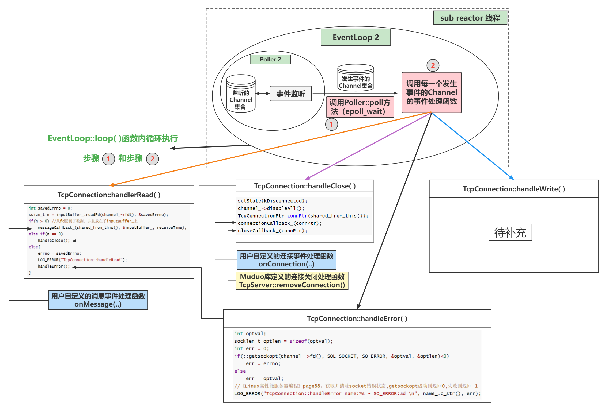

# muduo网络库源码学习


> 源码参考：[Muduo](https://github.com/Cui-Jiang-Tao/large_concurrency/tree/master/muduo)

第二部分：Muduo网络库
=

## 10. 初探EventLoop

### 10.1 什么都不做的EventLoop
一个EventLoop就是一个事件循环，下面将通过一个"什么都不做的EventLoop"来大致描述下muduo中EventLoop的功能。

"什么都不做的EventLoop"有如下几个特点：

* one loop per thread意思是说每个线程最多只能有一个EventLoop对象。
* EventLoop对象构造的时候，会检查当前线程是否已经创建了其他EventLoop对象，如果已创建，终止程序(LOG_FATAL)
* EventLoop构造函数会记住本对象所属线程(threadId_)。
* 创建了EventLoop对象的线程称为IO线程，其功能是运行事件循环(EventLoop::loop)

###  10.2 one loop per thread

这里指的是一个EventLoop只属于一个线程(但一个线程可以拥有多个EventLoop)，在muduo中，如果EventLoop一旦被创建，EventLoop会保持所属线程的一份tid拷贝，作为标识。如果该EventLoop被其他线程调用则会报错，muduo中使用EventLoop::assertInLoopThread()函数来判断该EventLoop对象是否是在所属线程中执行。

###  10.3 事件循环

一个EventLoop里其实是调用了poll/epoll来跟踪所关注的文件描述符的，当有文件描述符上有事件发生时，EventLoop会得到那些发生事件的文件描述符信息。

## 11. Channel

Channel，可以理解为是一个"通道"，该"通道"中绑定了一个文件描述符及其所关注事件、注册的读写事件等信息。

### 11.1 Channel与文件描述符

一个Channel管理一个文件描述符，在创建Channel时需要指定：

```c++
Channel::Channel(EventLoop* loop, int fd__)
  : loop_(loop),
    fd_(fd__),
    ... {

}
```

该文件描述符的关注事件可以用如下代码表示：

```c++
const int Channel::kNoneEvent = 0;                //没有事件：0
const int Channel::kReadEvent = POLLIN | POLLPRI; //可读事件：3
const int Channel::kWriteEvent = POLLOUT;         //可写事件：4
```

这些宏定义在poll.h头文件中：

```c++
/* Event types that can be polled for.  These bits may be set in `events'
   to indicate the interesting event types; they will appear in `revents'
   to indicate the status of the file descriptor.  */
#define POLLIN		0x001		/* There is data to read.  */
#define POLLPRI		0x002		/* There is urgent data to read.  */
#define POLLOUT		0x004		/* Writing now will not block.  */
```

在Channel内部也定义了events_和revents_来标记文件描述符所关注的事件以及实际发生的事件，该方法和struct pollfd 结构体类似：

```c++
int events_;  // 关注的事件
int revents_; // poll/epoll返回的事件，即实际监听到发生的事件类型
```

muduo提供了下面这些函数来设置文件描述符关注事件：

```c++
void enableReading() { events_ |= kReadEvent; update(); }
void enableWriting() { events_ |= kWriteEvent; update(); }
void disableWriting() { events_ &= ~kWriteEvent; update(); }
void disableAll() { events_ = kNoneEvent; update(); }
```

其中update函数的作用就是将该Channel及其绑定的文件描述符和EventLoop中的poll/epoll关联起来。

muduo也提供了下面函数来获取和设置文件描述符及其事件的状态，其中需要注意的是set_revents函数，该函数是被poll/epoll类中调用的：

```c++
int fd() const { return fd_; }
int events() const { return events_; }
void set_revents(int revt) { revents_ = revt; } // used by pollers
// int revents() const { return revents_; }
bool isNoneEvent() const { return events_ == kNoneEvent; }
```

### 11.2 设置监听回调函数

Channel中可以设置读、写、错误和关闭事件的回调函数，通过函数模板的方式：

```c++
typedef boost::function<void()> EventCallback;
typedef boost::function<void(Timestamp)> ReadEventCallback;

ReadEventCallback readCallback_;
EventCallback writeCallback_;
EventCallback closeCallback_;
EventCallback errorCallback_;

void setReadCallback(const ReadEventCallback &cb) { readCallback_ = cb; }
void setWriteCallback(const EventCallback &cb) { writeCallback_ = cb; }
void setCloseCallback(const EventCallback &cb) { closeCallback_ = cb; }
void setErrorCallback(const EventCallback &cb) { errorCallback_ = cb; }
```

### 11.3 Channel与EventLoop关系

一个Channel一定会关联一个EventLoop，和文件描述符一样，在构造函数中需要传入。一旦关联该EventLoop，EventLoop就可对该Channel操作。

### 11.4 响应事件

muduo中定义了该函数来响应Channel所绑定的文件描述符发生事件及其回调函数：

```c++
//处理绑定的事件
void Channel::handleEvent(Timestamp receiveTime) {
  boost::shared_ptr<void> guard;
  if (tied_) {
    guard = tie_.lock(); //确定shared_ptr指针还存在
    if (guard) {
      handleEventWithGuard(receiveTime);
    }
  } else {
    handleEventWithGuard(receiveTime);
  }
}

/**
 * poll函数的事件标志符值：
*    常量	                 说明
    POLLIN	        普通或优先级带数据可读
    POLLRDNORM    	普通数据可读
    POLLRDBAND    	优先级带数据可读
    POLLPRI	        高优先级数据可读
    POLLOUT	        普通数据可写
    POLLWRNORM	    普通数据可写
    POLLWRBAND	    优先级带数据可写
    POLLERR	        发生错误
    POLLHUP	        对方描述符挂起
    POLLNVAL	    描述字不是一个打开的文件
 *
 */
//开始选择性处理Channel对象绑定的事件
void Channel::handleEventWithGuard(Timestamp receiveTime) {
  eventHandling_ = true; //处于处理事件中

  // close
  if ((revents_ & POLLHUP) && !(revents_ & POLLIN)) {
    if (logHup_) {
      LOG_WARN << "Channel::handle_event() POLLHUP";
    }
    //符合关闭套接字的事件，回调close函数
    if (closeCallback_)
      closeCallback_();
  }

  //Invalid polling request.
  if (revents_ & POLLNVAL) {
    LOG_WARN << "Channel::handle_event() POLLNVAL";
  }

  // error
  if (revents_ & (POLLERR | POLLNVAL)) {
    if (errorCallback_)
      errorCallback_();
  }

  // read
  if (revents_ & (POLLIN | POLLPRI | POLLRDHUP)) {
    if (readCallback_)
      readCallback_(receiveTime);
  }

  // write
  if (revents_ & POLLOUT) {
    if (writeCallback_)
      writeCallback_();
  }

  eventHandling_ = false; //事件已处理完成
}
```

该函数会根据revents_判断该文件描述符上实际发生的事件类型，然后调用相关的注册的回调函数。例如如果是有POLLIN(读事件)产生，那么将调用readCallback_回调函数。

那么什么时候handleEvent函数会执行呢，在poll/epoll返回时，EventLoop对象在loop循环中会拿到有事件发生的Channel集合，并逐一执行它们的handleEvent函数。

## 12. Poller

### 12.1 Poller

Poller是一个抽象类，指的是muduo封装的PollPoller、EPollPoller及其父类Poller的总称。在muduo中定义了一个Poller类，该类中定义了一些PollPoller和EPollPoller必须要实现的函数：

```c++
virtual Timestamp poll(int timeoutMs, ChannelList* activeChannels) = 0;
virtual void updateChannel(Channel* channel) = 0;
virtual void removeChannel(Channel* channel) = 0;
```

一个Channel管理一个文件描述符fd的所有信息与操作，但如果要将文件描述符和poll/epoll关联和注册事件监听，Poller也需要关联Channel并提供相关操作的函数。但是由于poll/epoll的poll函数和操作的方法及其数据结构不同，所以这些具体的实现还是要放在PollPoller和EPollPoller中。

muduo提供了两种事件循环的类PollPoller和EPollPoller，同时也提供了该函数来选择使用哪一个：

```c++
Poller *Poller::newDefaultPoller(EventLoop *loop) {
  if (::getenv("MUDUO_USE_POLL")) {
    return new PollPoller(loop);
  } else {
    return new EPollPoller(loop);
  }
}
```

### 12.2 Poller分析

#### 12.2.1 PollPoller和EventLoop关系

一个EventLoop关联一个PollPoller，Channel的update会调用EventLoop的update函数，而EventLoop又调用Poller相关的函数。EventLoop之所以能够"事件循环"也是其内部调用Poller的poll函数。

#### 12.2.2 PollPoller和Channel的关系

Channel管理了一个文件描述符，在muduo中，一个Channel可以看作是一个文件描述符的"代表"，如果要操作一个文件描述符，则必须是通过该文件描述符对应的Channel。PollPoller需要监听和返回这些文件描述符上注册和实际发生的事件，所以必须提供操作Channel的函数和数据结构。下面这两个数据结构用于保存文件描述符及其Channel：

```c++
typedef std::vector<struct pollfd> PollFdList;
typedef std::map<int, Channel*> ChannelMap;

PollFdList pollfds_;
ChannelMap channels_;
```

* pollfds_的作用非常明显，因为poll函数需要一个struct pollfd的数组地址，所以该结构是用于poll函数参数。
* channels_则是用于管理注册的Channel的，key是Channel对应的文件描述符fd，value就是该Channel的地址，使用map数据结构可以很方便地对Channel进行查找和删除。

#### 12.2.3 update 和 remove Channel

**1. updateChannel 函数**

由于需要更新一个Channel，所以该函数的参数只有Channel的一份指针：

```c++
/**
 * 主要时将Channel负责的文件描述符(fd)注册到Poller对象中, 或更新Poller对象
 */
void PollPoller::updateChannel(Channel *channel) {
  Poller::assertInLoopThread();
  LOG_TRACE << "fd = " << channel->fd() << " events = " << channel->events();

  if (channel->index() < 0) {
    // index < 0说明是一个新的通道
    // a new one, add to pollfds_
    assert(channels_.find(channel->fd()) == channels_.end());

    struct pollfd pfd;
    pfd.fd = channel->fd();
    pfd.events = static_cast<short>(channel->events());
    pfd.revents = 0; // channel->revents()
    pollfds_.push_back(pfd);

    int idx = static_cast<int>(pollfds_.size()) - 1;
    channel->set_index(idx);
    channels_[pfd.fd] = channel; //通过文件描述符(fd) 映射 Channel
  } else {
    // update existing one
    //已存在的Channel
    assert(channels_.find(channel->fd()) != channels_.end());
    assert(channels_[channel->fd()] == channel);

    // index的取值必定在channels_.size()内
    int idx = channel->index();
    assert(0 <= idx && idx < static_cast<int>(pollfds_.size()));

    /**
     * 更新pollfds_容器的信息(struct pollfd)
     */
    struct pollfd &pfd = pollfds_[idx];

    // pfd.fd == -1 代表此Chanel不需被Poller::poll检测
    assert(pfd.fd == channel->fd() || pfd.fd == -channel->fd() - 1);

    pfd.events = static_cast<short>(channel->events());
    pfd.revents = 0;

    //如果不再关注该Channel中文件描述符事件，则直接将该文件描述符赋值为其相反数减一。
    // 将一个通道暂时更改为不关注事件，但不从Poller中移除该通道
    if (channel->isNoneEvent()) {
      // ignore this pollfd
      // 暂时忽略该文件描述符的事件
      // 这里pfd.fd 可以直接设置为-1
      pfd.fd = -channel->fd() - 1; // 这样子设置是为了removeChannel优化
    }
  }
}
```

`channel->index() < 0`分支：

* 当一个Channel创建后默认设置自身的index_为-1，所以对于新创建的Channel如果被更新，那么一定是走`channel->index() < 0`分支的。既然该Channel是刚创建并且是第一次和PollPoller关联，那么PollPoller中一定不会存在该Channel的信息，所以使用了该断言。
* 再接下来就是构造一个pollfd结构体并将该结构体的文件信息通过Channel保存起来，供下次poll函数调用。
* 需要注意的是，上面Channel的index_被设置为当前pollfds_的实际长度减一，这也是为了方便快速获取到pollfds_向量中的对应的文件描述符，有了该文件描述又可以很快从channels_中获取到该Channel，这个过程的代价很小，几乎不需要遍历。

接下来分析`channel->index() > 0` 的情况：
* 发生这种情况也意味着该Channel之前已经注册到该PollPoller中了，但是由于一些原因需要修改该文件描述符的关注事件，对于这种情况的Channel将调用else分支代码。
* 代码中两个assert断言该Channel是否已经和PollPoller关联，如果关联则取出该pollfd数组中的该Channel对应的文件描述符及其结构体，更新该结构体中文件描述符监听事件。如果不再关注该Channel中文件描述符事件，则直接将该文件描述符赋值为其相反数减一。

**2. removeChannel 函数**

使用该函数之前一般需要调用 updateChannel 函数设置不再关注该Channel对应的文件描述符上的事件。

该函数定义如下：

```c++
void PollPoller::removeChannel(Channel *channel) {
  Poller::assertInLoopThread();
  LOG_TRACE << "fd = " << channel->fd();

  assert(channels_.find(channel->fd()) != channels_.end());
  assert(channels_[channel->fd()] == channel);
  assert(channel->isNoneEvent());

  int idx = channel->index();

  assert(0 <= idx && idx < static_cast<int>(pollfds_.size()));

  const struct pollfd &pfd = pollfds_[idx];
  (void)pfd;
  assert(pfd.fd == -channel->fd() - 1 && pfd.events == channel->events());

  size_t n = channels_.erase(channel->fd());
  assert(n == 1);
  (void)n;
  
  if (implicit_cast<size_t>(idx) == pollfds_.size() - 1) {
    pollfds_.pop_back();
  } else {
    // 这里移除的算法复杂度是O(1)，将待删除元素与最后一个元素交换再pop_back
    int channelAtEnd = pollfds_.back().fd;
    iter_swap(pollfds_.begin() + idx, pollfds_.end() - 1);

    //不再关注该Channel中文件描述符事件，通过这种方式获取原有的下标(key)位置
    if (channelAtEnd < 0) {
      channelAtEnd = -channelAtEnd - 1;
    }
    channels_[channelAtEnd]->set_index(idx);
    pollfds_.pop_back();
  }
}
```

* 首先三个断言确认该Channel已经和PollPoller关联而且确认该Channel上的文件描述符事件不再关注，然后找到该Channel文件描述符在pollfds_数组中的位置，将该Channel从Channels_中去除，将该文件描述符对应的pollfd从pollfds_数组中去除。
* 从pollfs_数组中去除一个pollfd，Muduo使用了一个技巧，如果要去除的pollfd结构是数组中的最后一个元素，则调用pop_back函数直接弹出，否则将该元素和数组中最后一个元素交换位置，然后弹出最后一个元素，这样保证了pollfds_数组元素是连续的，不存在中间缺失的情况。

#### 12.2.4 poll

poll函数是在EventLoop中调用的，EventLoop希望通过该函数获取到当前的活动Channel(文件描述符上有事件发生)集合，所以会传入一个ChannelList* activeChannels作为poll的参数，该结构是一个vector集合，保存Channel的地址，定义如下：

```c++
typedef std::vector<Channel*> ChannelList;
```

poll函数定义如下：

```c++
/**
 * poll机制与select机制类似，通过管理文件描述符来进行轮询，效率更高，并且处理的连接个数不受内核的限制。
 * 通过poll的方式进行轮询，通过Poller::fillActiveChannels得到活跃事件
 */
Timestamp PollPoller::poll(int timeoutMs, ChannelList *activeChannels) {
  // XXX pollfds_ shouldn't change
  int numEvents = ::poll(&*pollfds_.begin(), pollfds_.size(), timeoutMs);

  Timestamp now(Timestamp::now());

  if (numEvents > 0) {
    LOG_TRACE << numEvents << " events happended";
    fillActiveChannels(numEvents, activeChannels);
  } else if (numEvents == 0) {
    LOG_TRACE << " nothing happended";
  } else {
    LOG_SYSERR << "PollPoller::poll()";
  }

  return now;
}
```

* 该函数的第一个参数是超时时间，第二个参数是EventLoop中需要的活动通道集合。该函数的内部也是调用了poll函数，当poll返回时，该函数会获取当前时间戳，作为函数返回值使用。

poll的返回值：

* 如果poll返回为0，则说明poll超时但没有发生任何事件；
* 如果poll为负值，则说明poll系统调用失败；
* 如果poll正常返回一个整数，则说明当前有文件描述符活动，需要获取这些文件描述符对应的Channel，并返回给EventLoop，这里使用了fillActiveChannels来获取这些活跃的通道；

fillActiveChannels函数定义如下：

```c++
/**
 * struct pollfd {
    int fd;         	  // 用于检测的文件描述符
    short events;         // 等待的事件类型
    short revents;        // 实际发生的事件类型
  } ;

  通过fd 获得发生事件的Chanel集合
**/
void PollPoller::fillActiveChannels(int numEvents,
                                    ChannelList *activeChannels) const {
  for (PollFdList::const_iterator pfd = pollfds_.begin();
       pfd != pollfds_.end() && numEvents > 0; ++pfd) {
    if (pfd->revents > 0) {
      --numEvents;
      ChannelMap::const_iterator ch = channels_.find(pfd->fd);
      assert(ch != channels_.end());

      Channel *channel = ch->second;
      assert(channel->fd() == pfd->fd);

      channel->set_revents(pfd->revents);
      // pfd->revents = 0;
      activeChannels->push_back(channel);
    }
  }
}
```

需要注意的是Channel的index_，在PollPoller中，如果index_为-1，则说明该Channel是新的需要加入的通道；如果index_>0，则说明该Channel已经和PollPoller关联了，index_的值用于在pollfds_数组中查找文件描述符对应的pollfd如果index_为其他负值，则说明该文件描述符将不被关注，该Channel也将被移除。

### 12.3 EPollPoller 分析

#### 12.3.1 EPollPoller和EventLoop关系

一个EventLoop关联一个EPollPoller，Channel的update会调用EventLoop的update函数，而EventLoop又调用Poller相关的函数。EventLoop之所以能够"事件循环"也是其内部调用Poller的poll函数。

#### 12.3.2 EPollPoller和Channel的关系

Channel管理了一个文件描述符，在muduo中，一个Channel可以看作是一个文件描述符的"代表"，如果要操作一个文件描述符，则必须是通过该文件描述符对应的Channel。EPollPoller需要监听和返回这些文件描述符上注册和实际发生的事件，所以必须提供操作Channel的函数和数据结构。下面这两个数据结构用于保存文件描述符及其Channel：

```c++
typedef std::vector<struct epoll_event> EventList;
typedef std::map<int, Channel*> ChannelMap;

EventList events_;
ChannelMap channels_;
```

EventList events_的作用非常明显，因为epoll函数需要一个struct epoll_event的数组地址，所以该结构是用于epoll_wait函数参数。ChannelMap channels_则是用于管理注册的Channel的，key是Channel对应的文件描述符fd，value就是该Channel的地址，使用map数据结构可以很方便的对Channel进行查找和操作。

#### 12.3.3 update 和 remove Channel

**1. updateChannel 函数**

```c++
//将Channel加入epoll中管理，updateChannel方法一定是I/O线程调用的
void EPollPoller::updateChannel(Channel *channel) {
  Poller::assertInLoopThread();
  LOG_TRACE << "fd = " << channel->fd() << " events = " << channel->events();

  const int index = channel->index();
  if (index == kNew || index == kDeleted) {
    // a new one, add with EPOLL_CTL_ADD
    int fd = channel->fd();

    if (index == kNew) {
      assert(channels_.find(fd) == channels_.end());
      channels_[fd] = channel;
    } else // index == kDeleted
    {
      //也就是说，当Channel对象的无事件，可以通过index_来标识为删除状态，并不会从channels_容器中移除
      assert(channels_.find(fd) != channels_.end());
      assert(channels_[fd] == channel);
    }
    channel->set_index(kAdded);     //设置Channel对象为添加状态
    update(EPOLL_CTL_ADD, channel); //添加到epoll中监视
  } else {
    // update existing one with EPOLL_CTL_MOD/DEL
    //更新已存在的Channel描述符，修改或删除
    int fd = channel->fd();
    (void)fd;

    assert(channels_.find(fd) != channels_.end());
    assert(channels_[fd] == channel);
    assert(index == kAdded);

    //当Channel对象不绑定事件，那么就从epoll的监视中移除，并设置Channel对象为删除状态
    if (channel->isNoneEvent()) {
      update(EPOLL_CTL_DEL, channel);
      channel->set_index(kDeleted);
    } else { //更新epoll中监视的Channel对象的信息
      update(EPOLL_CTL_MOD, channel);
    }
  }
}
```

这个函数的作用和PollPoller函数作用是一样的。当一个Channel的index_为-1时则说明这个Channel并没有和EPollPoller关联，如果index_为2，则说明该通道被取消过关注，如果为1则说明该Channel已经和EPollPoller关联，需要更新相关文件描述符的一些监听事件：

```c++
namespace {
const int kNew = -1;        //还没有和EPollPoller关联
const int kAdded = 1;       //该Channel已经和EPollPoller关联
const int kDeleted = 2;     //该通道被取消关注
}
```

如果index_是kNew或者kDeleted，则说明需要将该通道和该EPollPoller关联，设置index_为kAdded，然后调用update函数将该通道和EPollPoller关联：

```c++
//更新Channel对象绑定的事件
void EPollPoller::update(int operation, Channel *channel) {
  struct epoll_event event;
  bzero(&event, sizeof event);
  event.events = channel->events();
  event.data.ptr = channel;

  int fd = channel->fd();
  if (::epoll_ctl(epollfd_, operation, fd, &event) < 0) {
    if (operation == EPOLL_CTL_DEL) {
      LOG_SYSERR << "epoll_ctl op=" << operation << " fd=" << fd;
    } else {
      LOG_SYSFATAL << "epoll_ctl op=" << operation << " fd=" << fd;
    }
  }
}
```

update函数内部也是调用了epoll_ctl函数。需要注意的是，epoll_event里并没有设置文件描述符，而是用了event.data.ptr指针保存了Channel，毕竟Channel中包含的文件描述符信息更加丰富。

如果index_已经是added状态，那么判断该Channel中文件描述符是否被设置为"不关注"，如果是的话，直接调用updata函数将该文件描述符移除epoll事件监听，否则更新该文件描述符结构的events监听事件。

**2. removeChannel 函数**

```c++
// 将Channel对象从channels_容器和epoll监控中移除，此操作必须是I/O线程调用的
void EPollPoller::removeChannel(Channel *channel) {
  Poller::assertInLoopThread();

  int fd = channel->fd();
  LOG_TRACE << "fd = " << fd;

  assert(channels_.find(fd) != channels_.end());
  assert(channels_[fd] == channel);
  assert(channel->isNoneEvent()); //要移除的Channel对象本身一定是无事件的

  int index = channel->index();

  // 要移除的Channel对象应该就可能处于关联状态、也可能处于被取消关注状态(kDeleted)
  assert(index == kAdded || index == kDeleted);

  size_t n = channels_.erase(fd);
  (void)n;
  assert(n == 1);

  // 处于关联状态，说明epoll还在监视它
  if (index == kAdded) {
    update(EPOLL_CTL_DEL, channel);
  }

  // 重新设置Channel为未被管理的初始状态
  channel->set_index(kNew);
}
```

该函数将取消对Channel对应的文件描述的事件监听，然后将该Channel从channels_中删除。

#### 12.3.4 poll

poll函数是在EventLoop中调用的，EventLoop希望通过该函数获取到当前的活动Channel(文件描述符上有事件发生)集合，所以会传入一个ChannelList* activeChannels作为poll的参数，该结构是一个vector集合，保存Channel的地址，定义如下：

```c++
typedef std::vector<Channel*> ChannelList;
```

poll函数定义如下：

```c++
Timestamp EPollPoller::poll(int timeoutMs, ChannelList *activeChannels) {
  //活跃的事件数量
  int numEvents = ::epoll_wait(epollfd_, &*events_.begin(),
                               static_cast<int>(events_.size()), timeoutMs);

  Timestamp now(Timestamp::now());

  if (numEvents > 0) {
    LOG_TRACE << numEvents << " events happended";
    fillActiveChannels(numEvents, activeChannels);

    //活跃的事件数量太多了，扩容，动态调整
    if (implicit_cast<size_t>(numEvents) == events_.size()) {
      events_.resize(events_.size() * 2);
    }
  } else if (numEvents == 0) {
    LOG_TRACE << " nothing happended";
  } else {
    // numEvents < 0 的情况
    LOG_SYSERR << "EPollPoller::poll()";
  }
  return now;
}
```

该函数的第一个参数是超时时间，第二个参数是EventLoop中需要的活动通道集合。该函数的内部也是调用了epoll_wait函数，该函数需要一个额外的文件描述符作为epollfd_，该文件描述符在构造函数初始化参数中中已经初始化了。

当epoll_wait返回时，获取当前时间戳，作为EPollPoller::poll函数返回值使用。

* 如果epoll_wait返回为0，则说明epoll_wait超时且没有发生任何事件；
* 如果poll为负值，则说明poll系统调用失败；
* 如果poll正常返回一个整数，则说明当前有文件描述符活动，需要获取这些文件描述符对应的Channel，并返回给EventLoop，这里使用了fillActiveChannels来获取这些活跃的通道，当活跃的文件描述达到events_数组大小时，该数组将会扩容一倍，以满足更多需求，也减少了vector动态扩张的次数。

fillActiveChannels函数定义如下：

```c++
void EPollPoller::fillActiveChannels(int numEvents,
                                     ChannelList *activeChannels) const {
  //活跃的事件数量不可能比装所有事件的容器的元素数量多
  assert(implicit_cast<size_t>(numEvents) <= events_.size());

  for (int i = 0; i < numEvents; ++i) {
    Channel *channel = static_cast<Channel *>(events_[i].data.ptr);

// NDEBUG模式
#ifndef NDEBUG
    int fd = channel->fd();
    ChannelMap::const_iterator it = channels_.find(fd);
    assert(it != channels_.end());
    assert(it->second == channel);
#endif

    channel->set_revents(events_[i].events);
    activeChannels->push_back(channel);
  }
}
```

需要注意的是EPollPoller的文件描述符epollfd_，由于EPollPoller是采用RAII技法编写的，在构造函数中创建了文件描述符epollfd_，那么在析构函数中也应该关闭epollfd_并释放资源：

```c++
EPollPoller::~EPollPoller() { ::close(epollfd_); }
```

## 13. 定时器

muduo的定时器由三个类实现，TimerId、Timer、TimerQueue，用户只能看到第一个类，其它两个都是内部实现细节。

### 13.1 timerfd_*系列定时器

muduo选择了timerfd_*系列作为定时器。

下面这组函数便是操作timerfd的系统调用：

```c++
#include <sys/timerfd.h>

int timerfd_create(int clockid, int flags);

int timerfd_settime(int fd, int flags, const struct itimerspec *new_value, struct itimerspec *old_value);

int timerfd_gettime(int fd, struct itimerspec *curr_value)
```

**timerfd_create**，它是用来创建一个定时器描述符timerfd

* 第一个参数：clockid指定时间类型，有两个值：
    * CLOCK_REALTIME :Systemwide realtime clock. 系统范围内的实时时钟
    * CLOCK_MONOTONIC:以固定的速率运行，从不进行调整和复位 ,它不受任何系统time-of-day时钟修改的影响
* 第二个参数：flags可以是0或者O_CLOEXEC/O_NONBLOCK。
* 返回值：timerfd(文件描述符)

**timerfd_settime**，该函数作用是用来启动或关闭有fd指定的定时器。在讲解该函数前，先理解两个相关结构体：

```c++
struct timespec {
    time_t tv_sec;      /* Seconds */
    long   tv_nsec;     /* Nanoseconds */
};

struct itimerspec {
    struct timespec it_interval;  /* Interval for periodic timer */
    struct timespec it_value;     /* Initial expiration */
};
```

第二个结构体itimerspec就是timerfd要设置的超时结构体，它的成员it_value表示定时器第一次超时时间，it_interval表示之后的超时时间即每隔多长时间超时

下面正式分析该函数的参数和返回值：

参数：

* fd：timerfd，有timerfd_create函数返回
* flags：1代表设置的是绝对时间；为0代表相对时间
* fnew_value：指定新的超时时间，设定new_value.it_value非零则启动定时器，否则关闭定时器，如果new_value.it_interval为0，则定时器只定时一次，即初始那次，否则之后每隔设定时间超时一次
* old_value：不为null，则返回定时器这次设置之前的超时时间

**timerfd_gettime**，此函数用于获得定时器距离下次超时还剩下的时间。如果调用时定时器已经到期，并且该定时器处于循环模式(设置超时时间时struct itimerspec::it_interval不为0)，那么调用此函数之后定时器重新开始计时。

### 13.2 Timer 分析

一个定时器会在某一个时刻执行某个任务，而且有可能是"定时执行"，所以，一个Timer里封装了该Timer的超时时间(定时时间)、任务的执行周期等信息：

```c++
const TimerCallback callback_;  //定时执行函数
Timestamp expiration_;          // 超时时间
const double interval_;         // 执行间隔
const bool repeat_;             // 是否重复定时执行任务
const int64_t sequence_;        // 序列号，每个Tmier的序列号都不一样
```

其中sequence_是通过对一个静态变量的原子增加来保证独一无二的：

```c++
static AtomicInt64 s_numCreated_;
```

该原子操作会在Timer构造函数初始化列表中完成初始化：

```c++
Timer(const TimerCallback& cb, Timestamp when, double interval)
  : callback_(cb),
    expiration_(when),
    interval_(interval),
    repeat_(interval > 0.0),
    sequence_(s_numCreated_.incrementAndGet()) {

}
```

Timer也提供了一些列函数来操作和获取这些变量值：

```c++
  void run() const { callback_(); }

  //触发事件的时间戳
  Timestamp expiration() const { return expiration_; }

  bool repeat() const { return repeat_; }

  int64_t sequence() const { return sequence_; }

  void restart(Timestamp now);

  static int64_t numCreated() { return s_numCreated_.get(); }
```

如果要重新设置该Timer的超时时间，可以通过下面这个函数：

```c++
/**
 * 如果是重复的累加的，加入累加的时间重新设置到期时间，否则设置为失效时间
 */
void Timer::restart(Timestamp now) {
  if (repeat_) {
    // 重新计算下一个超时时刻
    expiration_ = addTime(now, interval_);
  } else {
    //设置无效的时间
    expiration_ = Timestamp::invalid();
  }
}
```

### 13.3 TimerId 分析

TimerId 中保存了一个Timer，以及该TimerId的序列号，同时将TimerQueue 设置为友元类：

```c++
class Timer;

///
/// An opaque identifier, for canceling Timer.
///
class TimerId : public muduo::copyable {
public:
  TimerId() : timer_(NULL), sequence_(0) {}

  TimerId(Timer *timer, int64_t seq) : timer_(timer), sequence_(seq) {}

  // default copy-ctor, dtor and assignment are okay

  friend class TimerQueue;

private:
  Timer *timer_;
  int64_t sequence_;
};
```

### 13.4 TimerQueue

#### 13.4.1 TimerQueue 设计原理

一个TimerQueue 会关联一个EventLoop，一个TimerQueue中会绑定一个文件描述符timerfd以及Channel。该TimerQueue中保存众多的Timer，并且将这些Timer根据其超时时间从小到大放入一个集合中，其中最近超时时间将设置为timerfd的超时时间(也就是说将最近超时时间关联到timerfd上)，到了该时间，timerfd上会有读事件发生，然后定时器会将定时在该超时时间到真正处理该读事件之间的Timer获取到，执行这些Timer的定时函数。

```c++
// FIXME: use unique_ptr<Timer> instead of raw pointers.
// unique_ptr是C++ 11标准的一个独享所有权的智能指针
// 无法得到指向同一对象的两个unique_ptr指针
// 但可以进行移动构造与移动赋值操作，即所有权可以移动到另一个对象(而非拷贝构造)
typedef std::pair<Timestamp, Timer *> Entry;
typedef std::set<Entry> TimerList;
typedef std::pair<Timer *, int64_t> ActiveTimer;
typedef std::set<ActiveTimer> ActiveTimerSet;

EventLoop *loop_; // 所属EventLoop
const int timerfd_;
Channel timerfdChannel_;
// Timer list sorted by expiration
// set中的元素都是排好序的, 用于存储Timer，同时将Timer的到期时间戳作为key
TimerList timers_; // timers_是按到期时间排序

// for cancel()
// timers_与activeTimers_保存的是相同的数据 =》 利于操作，空间换效率吧？？？
// timers_是按到期时间排序，activeTimers_是按对象地址排序
ActiveTimerSet activeTimers_;
bool callingExpiredTimers_;      //用来确定是否正在调用回调函数的定时器/* atomic */
ActiveTimerSet cancelingTimers_; // 保存的是被取消的定时器
```

TimerQueue 的构造函数如下：

```c++
/**
 * 一个TimerQueue只对应一个Eventloop和一个内部构造的Channel(构造对象时，默认绑定一个定时器对象timerfd_)
 * 同时设置Channel的回调函数TimerQueue::handleRead
 */
TimerQueue::TimerQueue(EventLoop *loop)
    : loop_(loop), timerfd_(createTimerfd()), timerfdChannel_(loop, timerfd_),
      timers_(), callingExpiredTimers_(false) {
  timerfdChannel_.setReadCallback(boost::bind(&TimerQueue::handleRead, this));
  // we are always reading the timerfd, we disarm it with timerfd_settime.
  timerfdChannel_.enableReading();
}
```

构造函数中使用了createTimerfd来创建一个定时器文件描述符，该函数定义如下：

```c++
/**
 * 创建定时器，生成一个定时器对象，返回与之关联的文件描述符timerfd。
 */
int createTimerfd() {
  int timerfd = ::timerfd_create(CLOCK_MONOTONIC, TFD_NONBLOCK | TFD_CLOEXEC);
  if (timerfd < 0) {
    LOG_SYSFATAL << "Failed in timerfd_create";
  }
  return timerfd;
}
```

构造函数中Channel绑定的"读事件"回调函数是TimerQueue::handleRead，该函数定义如下：

```c++
/**
 * I/O线程才可调用
 * 用来设置关联的Channel的回调函数
 */
void TimerQueue::handleRead() {
  loop_->assertInLoopThread();

  Timestamp now(Timestamp::now());
  // 清除该事件，避免一直触发，并记录触发TimerQueue::handleRead回调函数的时间
  readTimerfd(timerfd_, now);

  // 获取该时刻之前所有的定时器列表(即超时定时器列表)
  std::vector<Entry> expired = getExpired(now);

  callingExpiredTimers_ = true;
  cancelingTimers_.clear();
  // safe to callback outside critical section
  for (std::vector<Entry>::iterator it = expired.begin(); it != expired.end();
       ++it) {
    // 这里回调定时器处理函数
    it->second->run();
  }
  callingExpiredTimers_ = false;

  // 不是一次性定时器，需要重启
  reset(expired, now);
}
```

如果定时器超时，那么将执行该回调函数，该回调函数会调用readTimerfd函数先处理文件描述符事件，readTimerfd 函数定义如下：

```c++
// 清除定时器，避免一直触发，并记录传入的时间戳
void readTimerfd(int timerfd, Timestamp now) {
  uint64_t howmany;
  ssize_t n = ::read(timerfd, &howmany, sizeof howmany);
  LOG_TRACE << "TimerQueue::handleRead() " << howmany << " at "
            << now.toString();

  if (n != sizeof howmany) {
    LOG_ERROR << "TimerQueue::handleRead() reads " << n
              << " bytes instead of 8";
  }
}
```

在处理完文件描述符读事件后调用getExpired函数获取从文件描述符事件发生到当前时间内超时的Timer，然后遍历该集合，获取到Timer并执行其run函数(run函数中执行的是Timer真正的定时函数)。处理完这些超时的Timer后调用reset函数来重置这些Timer的定时任务，因为有些Timer是设置为循环执行的，所以还要重新设置它们的下一次执行时间。

#### 13.4.2 向TimerQueue 中添加一个Timer

TimerQueue使用addTimer函数来向队列中添加一个Timer：

```c++
/**
 * 添加一个新Timer，并及时更新；
 * 如果TimerList中元素只有一个或插入的Timer最快到期，马上重新设置TimerQueue对象绑定的timerfd的超时时间
 */
TimerId TimerQueue::addTimer(const TimerCallback &cb, Timestamp when,
                             double interval) {
  /**
   * 该对象将存储到TimerList中
   * => std::set<std::pair<Timestamp, Timer*>> TimerList;
   */
  Timer *timer = new Timer(cb, when, interval);

  loop_->runInLoop(boost::bind(&TimerQueue::addTimerInLoop, this, timer));

  // addTimerInLoop(timer);
  return TimerId(timer, timer->sequence());
}
```

该函数需要传入一个定时回调函数，一个超时时间戳和定时周期，TimerCallback的原型如下所示：

```c++
typedef boost::function<void()> TimerCallback;
```

创建一个Timer，然后通过EventLoop调用TimerQueue::addTimerInLoop函数，最后TimerQueue::addTimer返回一个TimerId。runInLoop的实现细节在后面章节会解释，addTimerInLoop函数的定义如下：

```c++
/**
 * I/O线程才可调用
 */
void TimerQueue::addTimerInLoop(Timer *timer) {
  loop_->assertInLoopThread();
  // 插入一个定时器，有可能会使得最早到期的定时器发生改变
  bool earliestChanged = insert(timer);

  if (earliestChanged) {
    // 重置定时器的超时时刻(timerfd_settime)
    resetTimerfd(timerfd_, timer->expiration());
  }
}
```

该函数又调用了insert函数，insert定义如下：

```c++
/**
 * 返回值，插入的Timer是否是最早到期的时间;说明：插入的Timer元素是有序timers_(set集合)的第一个元素或唯一的元素为true
 * 功能：插入一个std::pair<Timestamp，Timer*>对象，将参数timer的到期时间戳作为std::pair的first，Timner对象作为sencond
 * activeTimers_ 和 timers_两个容器保存的Timer对象是一样的，仅仅内存分布不同而已
 */
bool TimerQueue::insert(Timer *timer) {
  loop_->assertInLoopThread();
  assert(timers_.size() == activeTimers_.size());

  // 最早到期时间是否改变
  bool earliestChanged = false;
  Timestamp when = timer->expiration();
  TimerList::iterator it = timers_.begin();

  // 如果timers_为空或者when小于timers_中的最早到期时间(这个插入的Timer是集合第一个到期的时间戳)
  if (it == timers_.end() || when < it->first) {
    earliestChanged = true;
  }

  {
    // 插入到timers_中
    std::pair<TimerList::iterator, bool> result =
        timers_.insert(Entry(when, timer));

    // result.first代表插入的元素的iterator，result.second代表元素是否插入成功
    assert(result.second);
    (void)result;
  }

  {
    // 插入到activeTimers_中
    std::pair<ActiveTimerSet::iterator, bool> result =
        activeTimers_.insert(ActiveTimer(timer, timer->sequence()));
    assert(result.second);
    (void)result;
  }

  assert(timers_.size() == activeTimers_.size());
  return earliestChanged;
}
```

insert函数会获取到该Timer的超时时间，如果该Timer的超时时间是最近的(比之前从小到大排列的超时集合最小的还小)，说明该Timer的定时函数是最早执行的，所以设置标志earliestChanged = true，然后将该Timer加入到timers_和activeTimers_中，然后返回earliestChanged。

回到TimerQueue::addTimerInLoop函数，该函数在插入一个Timer后，判断earliestChanged，如果该项为true，那么也需要重新设置TimerQueue的timerfd_的定时时间，则调用resetTimerfd函数：

```c++
/**
 * 重置定时器的超时时间，重新设置Timer文件描述符(Timerfd)的超时时间，启动或停止定时器
 */
void resetTimerfd(int timerfd, Timestamp expiration) {
  // wake up loop by timerfd_settime()
  struct itimerspec newValue;
  struct itimerspec oldValue;
  bzero(&newValue, sizeof newValue);
  bzero(&oldValue, sizeof oldValue);
  newValue.it_value = howMuchTimeFromNow(expiration);

  //启动或停止定时器，依据newValue
  int ret = ::timerfd_settime(timerfd, 0, &newValue, &oldValue);
  if (ret) {
    LOG_SYSERR << "timerfd_settime()";
  }
}
```

#### 13.4.3 获取超时Timer

getExpired函数会获取到将小于传入时间戳now的Timer，将这些Timer的Entry保存到一个vector中并返回，同时删除timers_和activeTimers_中的这些和Timer相关的部分。

```c++
/**
 * rvo优化
 * 返回一个到期时间std::vector<Entry>的容器
 * =》typedef std::pair<Timestamp,Timer*> Entry;
 */
std::vector<TimerQueue::Entry> TimerQueue::getExpired(Timestamp now) {
  assert(timers_.size() == activeTimers_.size());

  std::vector<Entry> expired;
  // std::pair作为set的key时，比较pair 是先比较first, first相同再比较second
  Entry sentry(now, reinterpret_cast<Timer *>(UINTPTR_MAX));

  // 返回第一个未到期的Timer的迭代器
  // lower_bound的含义是返回第一个值>=sentry的元素的iterator
  // 即*end >= sentry，从而end->first > now
  TimerList::iterator end = timers_.lower_bound(sentry);

  // timers_的集合全是过期的时间戳，或者？？？
  assert(end == timers_.end() || now < end->first);

  // 将到期的定时器插入到expired中
  std::copy(timers_.begin(), end, back_inserter(expired));
  // 从timers_中移除到期的定时器
  timers_.erase(timers_.begin(), end);

  // 从activeTimers_中移除到期的定时器
  for (std::vector<Entry>::iterator it = expired.begin(); it != expired.end();
       ++it) {
    ActiveTimer timer(it->second, it->second->sequence());
    size_t n = activeTimers_.erase(timer);
    assert(n == 1);
    (void)n;
  }

  assert(timers_.size() == activeTimers_.size());
  return expired;
}
```

#### 13.4.4 向TimerQueue 中取消一个Timer

muduo使用cancle来取消一个Timer：

```c++
void TimerQueue::cancel(TimerId timerId) {
  loop_->runInLoop(boost::bind(&TimerQueue::cancelInLoop, this, timerId));
}
```

该函数又调用了TimerQueue::cancelInLoop：

```c++
/**
 * I/O线程才可调用
 */
void TimerQueue::cancelInLoop(TimerId timerId) {
  loop_->assertInLoopThread();
  assert(timers_.size() == activeTimers_.size());

  ActiveTimer timer(timerId.timer_, timerId.sequence_);
  // 查找该定时器
  ActiveTimerSet::iterator it = activeTimers_.find(timer);
  if (it != activeTimers_.end()) {
    size_t n = timers_.erase(Entry(it->first->expiration(), it->first));
    assert(n == 1);
    (void)n;
    delete it->first; // FIXME: no delete
                      // please,如果用了unique_ptr,这里就不需要手动删除了
    activeTimers_.erase(it);
  } else if (callingExpiredTimers_) {
    // 已经到期，并且正在调用回调函数的定时器
    cancelingTimers_.insert(timer);
  }
  assert(timers_.size() == activeTimers_.size());
}
```

该函数以TimerId的方式从TimerQueue中删除相关Timer内容，如果该当前TimerQueue已经有超时事件产生(handleRead中callingExpiredTimers_设置为true)，TimerQueue::getExpired会删除超时的Timer，那么还需要将该Timer保存到"待取消定时器队列"中：

```c++
ActiveTimerSet cancelingTimers_;
```

#### 13.4.5 重置超时Timer

handleRead函数：

```c++
/**
 * I/O线程才可调用
 * 用来设置关联的Channel的回调函数
 */
void TimerQueue::handleRead() {
  loop_->assertInLoopThread();

  Timestamp now(Timestamp::now());
  // 清除该事件，避免一直触发，并记录触发TimerQueue::handleRead回调函数的时间
  readTimerfd(timerfd_, now);

  // 获取该时刻之前所有的定时器列表(即超时定时器列表)
  std::vector<Entry> expired = getExpired(now);

  callingExpiredTimers_ = true;
  cancelingTimers_.clear();
  // safe to callback outside critical section
  for (std::vector<Entry>::iterator it = expired.begin(); it != expired.end();
       ++it) {
    // 这里回调定时器处理函数
    it->second->run();
  }
  callingExpiredTimers_ = false;

  // 不是一次性定时器，需要重启
  reset(expired, now);
}
```

如果已经去除队列中的超时定时器集合，这些集合的定时任务也处理完了之后还需要reset这些集合，因为一个定时器Timer可能设置了repeat_和interval_，需要重新设置下一次Timer的执行时间。reset函数定义如下：

```c++
/**
 * 对已经过期的队列进行处理，如果是重复调用的，重新设置新的到期时间并加入Timer队列中继续监控；重新设置TimerQueue对象绑定的fd到期时间
 */
void TimerQueue::reset(const std::vector<Entry> &expired, Timestamp now) {
  Timestamp nextExpire;

  for (std::vector<Entry>::const_iterator it = expired.begin();
       it != expired.end(); ++it) {
    ActiveTimer timer(it->second, it->second->sequence());
    // 如果是重复的定时器并且是未取消定时器，则重启该定时器
    if (it->second->repeat() &&
        cancelingTimers_.find(timer) == cancelingTimers_.end()) {
      //如果是重复的累加的，加入累加的时间重新设置到期时间，否则设置为失效时间
      it->second->restart(now);
      //将累加后新的Timer插入到Timer队列中，继续监控
      insert(it->second);
    } else {
      // 一次性定时器或者已被取消的定时器是不能重置的，因此删除该定时器
      // FIXME move to a free list
      delete it->second; // FIXME: no delete please
    }
  }

  if (!timers_.empty()) {
    // //得到队列中第一个要到期的时间，获取最早到期的定时器超时时间
    nextExpire = timers_.begin()->second->expiration();
  }

  //队列中还未到期的时间是有效的
  if (nextExpire.valid()) {
    // 重置定时器的超时时刻(timerfd_settime)，重新设置TimerQueue对象绑定的fd到期时间
    resetTimerfd(timerfd_, nextExpire);
  }
}
```

这个函数会检查这些超时的定时器Timer，如果是设置了repeat_为true并且不在"取消定时器队列"中则重置下一次定时器执行时间，否则(如一次性定时任务，或者取消了但未能避免执行)则直接删除。在执行handleRead时也会将cancelingTimers_清空。最后设置TimerQueue的timerfd_最近定时时间，准备下一次执行定时事件的到来。

#### 13.4.6 析构函数与资源销毁

关闭timerfd_文件描述符，释放管理的所有Timer资源。

```c++
TimerQueue::~TimerQueue() {
  ::close(timerfd_); //关闭关联的描述符
  // do not remove channel, since we're in EventLoop::dtor();
  for (TimerList::iterator it = timers_.begin(); it != timers_.end(); ++it) {
    delete it->second;
  }
}
```

## 14. 深入 EventLoop

已经分析过一个"什么都不做的EventLoop"，muduo中的EventLoop有如下几个特点：

* one loop per thread意思是说每个线程最多只能有一个EventLoop对象。
* EventLoop对象构造的时候，会检查当前线程是否已经创建了其他EventLoop对象，如果已创建，终止程序(LOG_FATAL)
* EventLoop构造函数会记住本对象所属线程(threadId_)。
* 创建了EventLoop对象的线程称为IO线程，其功能是运行事件循环(EventLoop::loop)

下面将深入具体分析muduo中的EventLoop的实现。

### 14.1 EventLoop 与 Channel

"一个Channel会关联一个EventLoop"，当Channel设置了监听文件描述符关注事件类型后会调用update函数，Channel中的update函数也是间接调用EventLoop的updateChannel函数，然后又间接调用Poller的updateChannel函数，该函数将会将该Channel及其相关文件描述符和Poller的事件监听联系起来。

```c++
//将Chanel注册到Poller对象的polldfs数组中
void Channel::update() { loop_->updateChannel(this); }

void EventLoop::updateChannel(Channel *channel) {
  assert(channel->ownerLoop() == this);
  assertInLoopThread();
  poller_->updateChannel(channel);
}
```

同样地，Channel的remove函数也是间接调用EventLoop的removeChannel函数来删除自身，Poller的removeChannel函数会取消该Channel及其文件描述符的事件监听，并不再保存该Channel及其文件描述符任何信息。

```c++
// 调用这个函数之前确保调用disableAll
void Channel::remove() {
  assert(isNoneEvent());
  loop_->removeChannel(this);
}

void EventLoop::removeChannel(Channel *channel) {
  assert(channel->ownerLoop() == this);
  assertInLoopThread();
  if (eventHandling_) {
    assert(currentActiveChannel_ == channel ||
           std::find(activeChannels_.begin(), activeChannels_.end(), channel) ==
               activeChannels_.end());
  }
  poller_->removeChannel(channel);
}
```

### 14.2 EventLoop 与 TimerQueue

EventLoop中持有一个TimerQueue，并在构造函数中完成了该TimerQueue的初始化：

```c++
boost::scoped_ptr<TimerQueue> timerQueue_;

EventLoop::EventLoop()
  : looping_(false),
    ...
    timerQueue_(new TimerQueue(this)),
    ... {
    ...
}
```

接下来是一组定时器操作函数，用于添加定时器任务：

EventLoop.h

```c++
///
/// Runs callback at 'time'.
/// Safe to call from other threads.
///
//直接回调
TimerId runAt(const Timestamp &time, const TimerCallback &cb);
///
/// Runs callback after @c delay seconds.
/// Safe to call from other threads.
///
//延期回调
TimerId runAfter(double delay, const TimerCallback &cb);
///
/// Runs callback every @c interval seconds.
/// Safe to call from other threads.
///
//以interval的频率回调
TimerId runEvery(double interval, const TimerCallback &cb);
///
/// Cancels the timer.
/// Safe to call from other threads.
///
void cancel(TimerId timerId);
```

EventLoop.cpp

```c++
TimerId EventLoop::runAt(const Timestamp &time, const TimerCallback &cb) {
  return timerQueue_->addTimer(cb, time, 0.0);
}

TimerId EventLoop::runAfter(double delay, const TimerCallback &cb) {
  Timestamp time(addTime(Timestamp::now(), delay));
  return runAt(time, cb);
}

TimerId EventLoop::runEvery(double interval, const TimerCallback &cb) {
  Timestamp time(addTime(Timestamp::now(), interval));
  return timerQueue_->addTimer(cb, time, interval);
}

void EventLoop::cancel(TimerId timerId) { return timerQueue_->cancel(timerId); }
```

本质上这些函数也是调用了TimerQueue的addTimer和cancel函数，需要关注的是addTimer和cancel函数内部都是通过EventLoop::runInLoop函数调用的：

```c++
/**
 * 添加一个新Timer，并及时更新；
 * 如果TimerList中元素只有一个或插入的Timer最快到期，马上重新设置TimerQueue对象绑定的timerfd的超时时间
 */
TimerId TimerQueue::addTimer(const TimerCallback &cb, Timestamp when,
                             double interval) {
  /**
   * 该对象将存储到TimerList中
   * std::set<std::pair<Timestamp, std::unique_ptr<Timer>>>
   */
  Timer *timer = new Timer(cb, when, interval);

  loop_->runInLoop(boost::bind(&TimerQueue::addTimerInLoop, this, timer));

  // addTimerInLoop(timer);
  return TimerId(timer, timer->sequence());
}

void TimerQueue::cancel(TimerId timerId) {
  loop_->runInLoop(boost::bind(&TimerQueue::cancelInLoop, this, timerId));

  // cancelInLoop(timerId);
}
```

使用EventLoop::runInLoop能够保证该bind函数是在EventLoop所在线程内执行的，哪怕这个函数是在别的线程里被调用，关于EventLoop::runInLoop函数，后面的章节再分析它是如何实现跨线程安全调用的。

### 14.3 EventLoop 与 Poller

一个EventLoop持有一个poller：

```c++
boost::scoped_ptr<Poller> poller_;

EventLoop::EventLoop()
  : looping_(false),
    ...
    poller_(Poller::newDefaultPoller(this)),
    ... {
    ...
}
```

Poller::newDefaultPoller会根据系统环境来选择是使用PollPoller还是EPollPoller：

```c++
Poller *Poller::newDefaultPoller(EventLoop *loop) {
  if (::getenv("MUDUO_USE_POLL")) {
    return new PollPoller(loop);
  } else {
    return new EPollPoller(loop);
  }
}
```

EventLoop的核心函数loop便是调用了Poller的loop函数：

```c++
// 事件循环，该函数不能跨线程调用
// 只能在创建该对象的线程中调用
void EventLoop::loop() {
  assert(!looping_);
  // 断言当前处于创建该对象的线程中
  assertInLoopThread();
  looping_ = true;
  quit_ = false;
  LOG_TRACE << "EventLoop " << this << " start looping";

  //::poll(NULL, 0, 5*1000);
  while (!quit_) {
    activeChannels_.clear();
    //执行完Poller::poll()的时间
    pollReturnTime_ = poller_->poll(kPollTimeMs, &activeChannels_);
    //++iteration_;
    if (Logger::logLevel() <= Logger::TRACE) {
      printActiveChannels();
    }
    // TODO sort channel by priority
    eventHandling_ = true; //标识事件正在处理
    for (ChannelList::iterator it = activeChannels_.begin();
         it != activeChannels_.end(); ++it) {
      currentActiveChannel_ = *it;
      currentActiveChannel_->handleEvent(pollReturnTime_); //事件处理
    }
    currentActiveChannel_ = NULL;
    eventHandling_ = false; //标识事件已处理完成

    // 让IO线程也能执行一些计算任务，IO不忙的时候，处于阻塞状态
    doPendingFunctors(); // 执行其他线程或者本线程添加的一些回调任务
  }

  LOG_TRACE << "EventLoop " << this << " stop looping";
  looping_ = false;
}
```

该函数通过调用Poller的poll函数，将活跃Channel保存到activeChannels_中，然后遍历这些Channel，执行它们的handleEvent函数，最后执行doPendingFunctors函数，该函数将在下一节介绍。

### 14.4 跨线程执行函数

为了实现跨线程调用函数，muduo使用了如下数据结构：

```c++
bool callingPendingFunctors_; //判断是否IO线程处理一些回调任务中=>pendingFunctors_
int wakeupFd_; // 用于eventfd
// unlike in TimerQueue, which is an internal class,
// we don't expose Channel to client.
boost::scoped_ptr<Channel> wakeupChannel_; // 该通道将会纳入poller_来管理
std::vector<Functor> pendingFunctors_; // @BuardedBy mutex_   即将发生的回调，即在IO线程中执行需要执行回调函数集合
```

TimerQueue的更新和删除Timer会用到EventLoop::runInLoop函数，该函数的实现如下：

```c++
// 在I/O线程中执行某个回调函数，该函数可以跨线程调用
void EventLoop::runInLoop(const Functor &cb) {
  if (isInLoopThread()) {
    // 如果是当前IO线程调用runInLoop，则同步调用cb
    cb();
  } else {
    // 如果是其它线程调用runInLoop，则异步地将cb添加到队列，以便让EventLoop所在的线程执行这个回调函数
    queueInLoop(cb);
  }
}
```

以更新Timer为例：

```c++
loop_->runInLoop(boost::bind(&TimerQueue::addTimerInLoop, this, timer));
```

如果该代码时是在EventLoop所在线程中执行，那么TimerQueue::addTimerInLoop会立刻执行，否则TimerQueue::addTimerInLoop将通过queueInLoop函数送入到待执行函数队列中，queueInLoop定义如下：

```c++
void EventLoop::queueInLoop(const Functor &cb) {
  {
    MutexLockGuard lock(mutex_);
    pendingFunctors_.push_back(cb);
  }

  /**
   * 1. 调用queueInLoop的线程不是IO线程需要唤醒
   * 2. 或者调用queueInLoop的线程是IO线程，并且此时正在调用任务队列(pendingFunctors_)，需要唤醒。
   *     =》 因为I/O处于callingPendingFunctors_状态，任务队列(pendingFunctors_)中的任务执行完可能会处于阻塞状态(poll没事件发生)，新加入的任务无法执行。
   * 
   * 只有I/O线程的事件回调中调用queueInLoop才不需要唤醒
   */
  if (!isInLoopThread() || callingPendingFunctors_) {
    wakeup();
  }
}
```

该函数会判断是否是在EventLoop所处线程中执行，如果不是的话则调用wakeup()函数。

先解释下跨线程调用的原理：一个EventLoop中有一个wakeupFd_文件描述符(eventfd 是一个比 pipe 更高效的线程间事件通知机制，一方面它比 pipe 少用一个 file descripor，节省了资源；另一方面，eventfd 的缓冲区管理也简单得多，全部"buffer" 只有定长8 bytes，不像 pipe 那样可能有不定长的真正 buffer)，该文件描述符在构造函数初始化列表中完成初始化：

```c++
int createEventfd() {
  int evtfd = ::eventfd(0, EFD_NONBLOCK | EFD_CLOEXEC);
  if (evtfd < 0) {
    LOG_SYSERR << "Failed in eventfd";
    abort();
  }
  return evtfd;
}

EventLoop::EventLoop()
  : looping_(false),
  ...
    wakeupFd_(createEventfd()),
  ... {
  ...
}
```

而且EventLoop也为该wakeuFd_文件描述符提供了一个Channel，该Channel的生命周期由EventLoop对象负责：

```c++
boost::scoped_ptr<Channel> wakeupChannel_;
```

该Channel也在构造函数中完成了初始化工作：

```c++
EventLoop::EventLoop()
  : looping_(false),
    ...
    wakeupFd_(createEventfd()),
    wakeupChannel_(new Channel(this, wakeupFd_)),
    ... {
  ...
  wakeupChannel_->setReadCallback(
      boost::bind(&EventLoop::handleRead, this));
  // we are always reading the wakeupfd
  //这里设置会将wakeupChannel_注册到Poller对象中，实现事件循环
  wakeupChannel_->enableReading();
}
```

该Channel也加入到了Poller事件监听中，并且设置了"读事件"回调函数为EventLoop::handleRead：

```c++
// eventfd 事件处理函数
void EventLoop::handleRead() {
  uint64_t one = 1;
  ssize_t n = sockets::read(wakeupFd_, &one, sizeof one);
  if (n != sizeof one) {
    LOG_ERROR << "EventLoop::handleRead() reads " << n << " bytes instead of 8";
  }
}
```

现在回到queueInLoop函数中，可以正式介绍wake()函数了，wakeup函数功能就是向wakeupFd_写入东西，然后促使Poller的poll函数返回：

```c++
// 唤醒，写uint64_t类型的字节就可产生可读事件，达到唤醒的目的
void EventLoop::wakeup() {
  uint64_t one = 1;
  // ssize_t n = sockets::write(wakeupFd_, &one, sizeof one);
  ssize_t n = ::write(wakeupFd_, &one, sizeof one);
  if (n != sizeof one) {
    LOG_ERROR << "EventLoop::wakeup() writes " << n << " bytes instead of 8";
  }
}

void EventLoop::loop() {
  ...
  while (!quit_)
  {
    activeChannels_.clear();
    pollReturnTime_ = poller_->poll(kPollTimeMs, &activeChannels_);
    ...
    doPendingFunctors();
  }
  ...
}
```

然后进而调用doPendingFunctors函数，在该函数中执行这些跨线程调用的"未决函数"：

```c++
//在IO线程中执行一些回调任务
void EventLoop::doPendingFunctors() {
  std::vector<Functor> functors;
  callingPendingFunctors_ = true;

  {
    MutexLockGuard lock(mutex_);
    //可以减小临界区的长度(意味着不会阻塞其它线程的queueInLoop())，另一方面，也避免了死锁(因为Functor可能再次调用queueInLoop())
    functors.swap(pendingFunctors_);
  }

  for (size_t i = 0; i < functors.size(); ++i) {
    functors[i]();
  }
  callingPendingFunctors_ = false;
}
```

这样即使是跨线程调用某些函数，这些函数也不会立刻执行，而是存入该pendingFunctors_集合中等待wake，然后在EventLoop线程中"打包"执行。

需要注意的是：

* 不是简单地在临界区内依次调用Functor，而是把回调列表swap到functors中，这样一方面减小了临界区的长度(意味着不会阻塞其它线程的queueInLoop())，另一方面，也避免了死锁(因为Functor可能再次调用queueInLoop())
* 由于doPendingFunctors()调用的Functor可能再次调用queueInLoop(cb)，这时，queueInLoop()就必须wakeup()，否则新增的cb可能就不能及时调用了
* muduo没有反复执行doPendingFunctors()直到pendingFunctors为空，这是有意的，否则IO线程可能陷入死循环，无法处理IO事件。

### 14.5 析构函数与资源销毁

整个EventLoop中创建了如下资源：

```c++
EventLoop::EventLoop()
  : looping_(false),
    ...
    poller_(Poller::newDefaultPoller(this)),
    timerQueue_(new TimerQueue(this)),
    wakeupFd_(createEventfd()),
    wakeupChannel_(new Channel(this, wakeupFd_)),
    ... {
    ...
}
```

然而这些资源除了wakeupFd_以外都是使用智能指针来管理的：

```c++
boost::scoped_ptr<Poller> poller_;
boost::scoped_ptr<TimerQueue> timerQueue_;
int wakeupFd_; // 用于eventfd
// unlike in TimerQueue, which is an internal class,
// we don't expose Channel to client.
boost::scoped_ptr<Channel> wakeupChannel_; // 该通道将会纳入poller_来管理
```

所以析构函数只需要释放wakeupFd_文件描述符即可：

```c++
EventLoop::~EventLoop() {
  //析构，EventLoop对象一定不会是looping状态
  assert(!looping_);

  ::close(wakeupFd_);
  t_loopInThisThread = nullptr;
}
```

## 15. muduo 事件监听总结

### 15.1 Channel及其文件描述符如何加入到Poller中


### 15.2 EventLoop如何获取活跃的Channel并处理相关事件


### 15.3 EventLoop如何处理定时器


### 15.4 EventLoop与跨线程调用函数


* 调用queueInLoop的线程不是当前IO线程需要唤醒
* 或者调用queueInLoop的线程是当前IO线程，并且此时正在调用pending functor，需要唤醒
* 只有IO线程的事件回调中调用queueInLoop才不需要唤醒

## 16. EventLoopThread

任何一个线程，只要创建并运行了EventLoop，都称之为IO线程，所以IO线程不一定是主线程。

muduo并发模型one loop per thread + threadpool，为了方便今后使用，定义了EventLoopThread类，该类封装了IO线程。EventLoopThread创建了一个线程，然后在线程函数中创建了一个EvenLoop对象并调用EventLoop::loop。

由于该EventLoopThread类会在一个线程中启动一个EventLoop，所以持有如下变量：

```c++
EventLoop* loop_;
Thread thread_;
```

构造函数：

```c++
EventLoopThread::EventLoopThread(const ThreadInitCallback& cb)
  : loop_(NULL),
    exiting_(false),
    thread_(boost::bind(&EventLoopThread::threadFunc, this)),
    mutex_(),
    cond_(mutex_),
    callback_(cb) {
    
}
```

从构造函数中可以看出，该EventLoop默认是没有初始化的，线程绑定的执行函数是EventLoopThread::threadFunc。除此之外，构造函数中还初始化了互斥锁和条件变量，它们作用会在后面分析。

构造函数中还传入了一个ThreadInitCallback类型的函数对象：

```c++
typedef boost::function<void(EventLoop*)> ThreadInitCallback;

ThreadInitCallback callback_;
```

这是用作线程启动初始化执行的用户函数，如果用户想在线程初始化时执行一些函数，那么就可以在EventLoopThread构造函数中传入该函数，默认情况下EventLoopThread会创建一个空函数作为线程初始化函数：

```c++
EventLoopThread(const ThreadInitCallback &cb = ThreadInitCallback());
```

那么，如何启动一个IO线程呢？使用EventLoopThread::startLoop便可以"启动"一个IO线程，这里的"启动"指的是启动IO线程，而不是线程，因为构造函数在已经初始化一个线程了，光启动该线程还不能称为"IO线程"，因为EventLoop还没有初始化，EventLoopThread::startLoop会通过条件变量一直等待，直到EventLoop被初始化，条件满足时才返回该EventLoop地址：

```c++
EventLoop *EventLoopThread::startLoop() {
  assert(!thread_.started());
  thread_.start();

  {
    MutexLockGuard lock(mutex_);
    while (loop_ == NULL) {
      cond_.wait();
    }
  }

  return loop_;
}
```

那么EventLoop在哪里初始化，条件变量又如何被通知呢？这些问题都在线程执行函数中完成：

```c++
void EventLoopThread::threadFunc() {
  EventLoop loop;

  // 线程初始化函数
  if (callback_) {
    callback_(&loop);
  }

  {
    MutexLockGuard lock(mutex_);
    // loop_指针指向了一个栈上的对象，threadFunc函数退出之后，这个指针就失效了
    // threadFunc函数退出，就意味着线程退出了，EventLoopThread对象也就没有存在的价值了。
    // 因而不会有什么大的问题
    loop_ = &loop;
    cond_.notify();
  }

  loop.loop();
  // assert(exiting_);
}
```

当EventLoopThread类创建后，会在构造函数阶段创建一个线程，而该线程便执行threadFunc函数，如果用户传入了"线程初始化函数"，那么在这里便会优先执行该函数，然后初始化所持有的EventLoop，并发让条件满足(loop_!=NULL)，然后启动EventLoop的事件循环(loop.loop())。

这一过程下来，当一个EventLoopThread 被创建后，该EventLoopThread 对象内部也创建并启动了一个EventLoop对象，用户代码需要startLoop函数来获取该EventLoop对象，然后让该EventLoop中的Poller对象和一些Channel绑定，让Channel中的文件描述符加入事件监听中。所以该EventLoop可以在其他线程里被调用，这就是为什么EventLoop中还提供了runInLoop函数的原因，也为后续的EventLoopThreadPool做出铺垫。

> 调用startLoop函数一定会发生在两个线程中，例如：main线程调用startLoop函数，那么startLoop内部会创建一个线程(可以理解为I/O线程)，startLoop函数返回EventLoop对象到调用线程main，该EventLoop对象一定是I/O线程创建的对象。

最后的析构函数则做了些收尾工作：

```c++
EventLoopThread::~EventLoopThread() {
  exiting_ = true;
  loop_->quit(); // 退出IO线程，让IO线程的loop循环退出，从而退出了IO线程
  thread_.join();
}
```

下面是一个简单的使用案例，可以帮助理解EventLoopThread的使用：

```c++
#include "EventLoop.h"
#include "EventLoopThread.h"

#include <stdio.h>

using namespace muduo;
using namespace muduo::net;

void runInThread() {
  printf("runInThread(): pid = %d, tid = %d\n", getpid(), CurrentThread::tid());
}

void threadInitFC(EventLoop *loop) {
  printf("threadInitFC(): pid = %d, tid = %d\n", getpid(),
         CurrentThread::tid());
}

int main() {
  printf("main(): pid = %d, tid = %d\n", getpid(), CurrentThread::tid());

  EventLoopThread loopThread(threadInitFC);
  EventLoop *loop = loopThread.startLoop();

  // 异步调用runInThread，即将runInThread添加到loop对象所在IO线程，让该IO线程执行
  loop->runInLoop(runInThread);

  sleep(1);

  // runAfter内部也调用了runInLoop，所以这里也是异步调用
  loop->runAfter(2, runInThread);

  sleep(3);

  loop->quit();

  printf("exit main().\n");

  return 0;
}
```

## 17. EventLoopThreadPool

该类的作用就是"事先缓存多个EventLoopThread"，所以该类中需要有保存这些EventLoopThread及其EventLoop的数据结构：

```c++
boost::ptr_vector<EventLoopThread> threads_; // IO线程列表
std::vector<EventLoop *> loops_;             // EventLoop列表
```

通过setThreadNum函数来设置需要创建多少个IO线程(创建后的调整)：

```c++
void setThreadNum(int numThreads) { numThreads_ = numThreads; }
```

如果用户传入数量为0(默认构造函数中设置为0)，那么该EventLoopThreadPool就会作为IO线程，EventLoopThreadPool内的baseLoop_持有这个EventLoop对象：

```c++
EventLoopThreadPool::EventLoopThreadPool(EventLoop* baseLoop)
  : baseLoop_(baseLoop),
    started_(false),
    numThreads_(0),
    next_(0) {

}
```

调用EventLoopThreadPool::start函数创建numThreads_个EventLoopThread。如果numThreads_为0且有线程初始化函数需要执行，那么就在EventLoopThreadPool所处线程中执行该函数。

```c++
void EventLoopThreadPool::start(const ThreadInitCallback &cb) {
  assert(!started_);
  baseLoop_->assertInLoopThread();

  started_ = true;

  for (int i = 0; i < numThreads_; ++i) {
    EventLoopThread *t = new EventLoopThread(cb);
    threads_.push_back(t);
    loops_.push_back(
        t->startLoop()); // 启动EventLoopThread线程，在进入事件循环之前，会调用cb
  }
  if (numThreads_ == 0 && cb) {
    // 只有一个EventLoop，在这个EventLoop进入事件循环之前，调用cb
    cb(baseLoop_);
  }
}
```

考虑到负载均衡，该类还实现了一个基于轮询方法来选择要使用的EventLoop(IO线程)：

```c++
EventLoop *EventLoopThreadPool::getNextLoop() {
  baseLoop_->assertInLoopThread();
  EventLoop *loop = baseLoop_;

  // 如果loops_为空(即numThreads_为0)，则loop指向baseLoop_
  // 如果不为空，按照round-robin(RR，轮叫)的调度方式选择一个EventLoop
  if (!loops_.empty()) {
    // round-robin
    loop = loops_[next_];
    ++next_;

    if (implicit_cast<size_t>(next_) >= loops_.size()) {
      next_ = 0;
    }
  }

  return loop;
}
```

## 18. 网络套接字相关

### 18.1 Endian

Endian.h头文件封装了字节序转换函数(全局函数，位于muduo::net::sockets名称空间中)。

```c++
#ifndef MUDUO_NET_ENDIAN_H
#define MUDUO_NET_ENDIAN_H

#include <endian.h>
#include <stdint.h>

namespace muduo {
namespace net {
namespace sockets {

// the inline assembler code makes type blur,
// so we disable warnings for a while.
#if __GNUC_MINOR__ >= 6
#pragma GCC diagnostic push
#endif

#pragma GCC diagnostic ignored "-Wconversion"
#pragma GCC diagnostic ignored "-Wold-style-cast"

// posix标准
// 主机字节序转换成网络字节序
inline uint64_t hostToNetwork64(uint64_t host64) { return htobe64(host64); }

inline uint32_t hostToNetwork32(uint32_t host32) { return htobe32(host32); }

inline uint16_t hostToNetwork16(uint16_t host16) { return htobe16(host16); }

// 网络字节序转换成主机字节序
inline uint64_t networkToHost64(uint64_t net64) { return be64toh(net64); }

inline uint32_t networkToHost32(uint32_t net32) { return be32toh(net32); }

inline uint16_t networkToHost16(uint16_t net16) { return be16toh(net16); }

#if __GNUC_MINOR__ >= 6
#pragma GCC diagnostic pop
#else
#pragma GCC diagnostic error "-Wconversion"
#pragma GCC diagnostic error "-Wold-style-cast"
#endif

} // namespace sockets
} // namespace net
} // namespace muduo

#endif // MUDUO_NET_ENDIAN_H
```

### 18.2 SocketsOps

#### 18.2.1 补充知识

下面是几个被封装的函数原型：

```c++
#include <arpe/inet.h>

//将点分十进制的ip地址转化为用于网络传输的数值格式 返回值：若成功则为1，若输入不是有效的表达式则为0，若出错则为-1
int inet_pton(int family, const char *strptr, void *addrptr);
//将数值格式转化为点分十进制的ip地址格式返回值：若成功则为指向结构的指针，若出错则为NULL
const char * inet_ntop(int family, const void *addrptr, char *strptr, size_t len);
```

* 这两个函数的family参数既可以是AF_INET(ipv4)也可以是AF_INET6(ipv6)。如果，以不被支持的地址族作为family参数，这两个函数都返回一个错误，并将errno置为EAFNOSUPPORT.
* 第一个函数尝试转换由strptr指针所指向的字符串，并通过addrptr指针存放二进制结果，若成功则返回值为1，否则如果所指定的family而言输入字符串不是有效的表达式格式，那么返回值为0.
* inet_ntop进行相反的转换，从数值格式(addrptr)转换到表达式(strptr)。inet_ntop函数的strptr参数不可以是一个空指针。调用者必须为目标存储单元分配内存并指定其大小，调用成功时，这个指针就是该函数的返回值。len参数是目标存储单元的大小，以免该函数溢出其调用者的缓冲区。如果len太小，不足以容纳表达式结果，那么返回一个空指针，并置为errno为ENOSPC。


```c++
#include<sys/socket.h>
int getsockname(int sockfd, struct sockaddr *localaddr, socklen_t *addrlen); //用于获取与某个套接字关联的本地协议地址
int getpeername(int sockfd, struct sockaddr *peeraddr, socklen_t *addrlen);  //用于获取与某个套接字关联的外地协议地址
```

对于这两个函数，如果函数调用成功，则返回0，如果调用出错，则返回-1。使用这两个函数，我们可以通过套接字描述符来获取自己的IP地址和连接对端的IP地址，如在未调用bind函数的TCP客户端程序上，可以通过调用getsockname()函数获取由内核赋予该连接的本地IP地址和本地端口号，还可以在TCP的服务器端accept成功后，通过getpeername()函数来获取当前连接的客户端的IP地址和端口号。

#### 18.2.2 源码分析

该类封装了socket相关系统调用(全局函数，位于muduo::net::sockets名称空间中)。它提供了众多对socket套接字操作的函数，各个函数之间也很少互相调用，基本就是将网络套接字API封装了一遍：

```c++
#ifndef MUDUO_NET_SOCKETSOPS_H
#define MUDUO_NET_SOCKETSOPS_H

#include <arpa/inet.h>

namespace muduo {
namespace net {
namespace sockets {

///
/// Creates a non-blocking socket file descriptor,
/// abort if any error.
// 创建一个非阻塞套接字，如果创建失败就终止程序abort
int createNonblockingOrDie();

int connect(int sockfd, const struct sockaddr_in &addr);
void bindOrDie(int sockfd, const struct sockaddr_in &addr);
void listenOrDie(int sockfd);
int accept(int sockfd, struct sockaddr_in *addr);
ssize_t read(int sockfd, void *buf, size_t count);
ssize_t readv(int sockfd, const struct iovec *iov, int iovcnt);
ssize_t write(int sockfd, const void *buf, size_t count);
void close(int sockfd);
void shutdownWrite(int sockfd);

void toIpPort(char *buf, size_t size, const struct sockaddr_in &addr);
void toIp(char *buf, size_t size, const struct sockaddr_in &addr);
void fromIpPort(const char *ip, uint16_t port, struct sockaddr_in *addr);

int getSocketError(int sockfd);

struct sockaddr_in getLocalAddr(int sockfd);
struct sockaddr_in getPeerAddr(int sockfd);
bool isSelfConnect(int sockfd);

} // namespace sockets
} // namespace net
} // namespace muduo

#endif // MUDUO_NET_SOCKETSOPS_H
```

接下来分析这些定义的函数源码，首先将sockaddr定义为了SA类型：

```c++
typedef struct sockaddr SA; //通用地址
```

下面这两个函数将sockaddr_in类型转换为sockaddr类型：

```c++
// 网际地址转换通用地址
const SA *sockaddr_cast(const struct sockaddr_in *addr) {
  return static_cast<const SA *>(implicit_cast<const void *>(addr));
}

SA *sockaddr_cast(struct sockaddr_in *addr) {
  return static_cast<SA *>(implicit_cast<void *>(addr));
}
```

下面这个函数设置套接字文件描述符为非阻塞close-on-exec，意思是调用套接字的进程如果创建了子进程，那么子进程将自动关闭这个拷贝的文件描述符，该文件的状态就不会带到子进程中。

```c++
void setNonBlockAndCloseOnExec(int sockfd) {
  // non-block
  int flags = ::fcntl(sockfd, F_GETFL, 0);
  flags |= O_NONBLOCK;
  int ret = ::fcntl(sockfd, F_SETFL, flags);
  // FIXME check

  // close-on-exec
  flags = ::fcntl(sockfd, F_GETFD, 0);
  flags |= FD_CLOEXEC;
  ret = ::fcntl(sockfd, F_SETFD, flags);
  // FIXME check

  (void)ret;
}
```

> [浅析open函数O_CLOEXEC模式和fcntl函数FD_CLOEXEC选项](https://blog.csdn.net/gettogetto/article/details/52263660)

接下来这个函数只是调用了socket函数返回一个文件描述符，同时也做了错误判断：

```c++
int sockets::createNonblockingOrDie() {
  // socket
#if VALGRIND // 内存泄露检测工具，还能够检测文件描述符的打开状态
  int sockfd = ::socket(AF_INET, SOCK_STREAM, IPPROTO_TCP);
  if (sockfd < 0) {
    LOG_SYSFATAL << "sockets::createNonblockingOrDie";
  }
  setNonBlockAndCloseOnExec(sockfd);
#else
  // Linux 2.6.27以上的内核支持SOCK_NONBLOCK与SOCK_CLOEXEC
  int sockfd = ::socket(AF_INET, SOCK_STREAM | SOCK_NONBLOCK | SOCK_CLOEXEC,
                        IPPROTO_TCP);
  if (sockfd < 0) {
    LOG_SYSFATAL << "sockets::createNonblockingOrDie";
  }
#endif

  return sockfd;
}
```

下面这两个函数分别绑定和监听了一个套接字：

```c++
void sockets::bindOrDie(int sockfd, const struct sockaddr_in &addr) {
  int ret = ::bind(sockfd, sockaddr_cast(&addr), sizeof addr);
  if (ret < 0) {
    LOG_SYSFATAL << "sockets::bindOrDie";
  }
}

void sockets::listenOrDie(int sockfd) {
  int ret = ::listen(sockfd, SOMAXCONN);
  if (ret < 0) {
    LOG_SYSFATAL << "sockets::listenOrDie";
  }
}
```

下面这个函数接受一个连接，如果出错则会判断错误类型，如果错误是预期错误(expected errors)，则直接退出，否则写入日志：

```c++
int sockets::accept(int sockfd, struct sockaddr_in *addr) {
  socklen_t addrlen = sizeof *addr;

#if VALGRIND
  int connfd = ::accept(sockfd, sockaddr_cast(addr), &addrlen);
  setNonBlockAndCloseOnExec(connfd);
#else
  int connfd = ::accept4(sockfd, sockaddr_cast(addr), &addrlen,
                         SOCK_NONBLOCK | SOCK_CLOEXEC);
#endif

  if (connfd < 0) {
    // 系统调用或者库函数可能会改变errno的值，所以先保存下来
    int savedErrno = errno;
    LOG_SYSERR << "Socket::accept";
    switch (savedErrno) {
    case EAGAIN:
    case ECONNABORTED:
    case EINTR:
    case EPROTO: // ???
    case EPERM:
    case EMFILE: // per-process lmit of open file desctiptor ???
      // expected errors
      errno = savedErrno;
      break;
    case EBADF:
    case EFAULT:
    case EINVAL:
    case ENFILE:
    case ENOBUFS:
    case ENOMEM:
    case ENOTSOCK:
    case EOPNOTSUPP:
      // unexpected errors
      LOG_FATAL << "unexpected error of ::accept " << savedErrno;
      break;
    default:
      LOG_FATAL << "unknown error of ::accept " << savedErrno;
      break;
    }
  }
  return connfd;
}
```

下面这些函数都是对socket相关函数的简单封装：

```c++
int sockets::connect(int sockfd, const struct sockaddr_in &addr) {
  return ::connect(sockfd, sockaddr_cast(&addr), sizeof addr);
}

ssize_t sockets::read(int sockfd, void *buf, size_t count) {
  return ::read(sockfd, buf, count);
}

// readv与read不同之处在于，接收的数据可以填充到多个缓冲区中
// iov 可以是一个缓冲区数组，第一个缓冲区写满就接着写第二个缓冲区
ssize_t sockets::readv(int sockfd, const struct iovec *iov, int iovcnt) {
  return ::readv(sockfd, iov, iovcnt);
}

ssize_t sockets::write(int sockfd, const void *buf, size_t count) {
  return ::write(sockfd, buf, count);
}

void sockets::close(int sockfd) {
  if (::close(sockfd) < 0) {
    LOG_SYSERR << "sockets::close";
  }
}
```

下面这个函数关闭传入套接字的写端：

```c++
// 只关闭写的这一半，进入半关闭状态(close SHUT_WR)
void sockets::shutdownWrite(int sockfd) {
  if (::shutdown(sockfd, SHUT_WR) < 0) {
    LOG_SYSERR << "sockets::shutdownWrite";
  }
}
```

接下来是几个地址转换函数，网络传输地址与本地点分十进制地址转换：

```c++
// 主要调用toIP函数，将sockaddr_in.sin_addr 转换成ip和端口的形式保存到buf当中
void sockets::toIpPort(char *buf, size_t size, const struct sockaddr_in &addr) {
  char host[INET_ADDRSTRLEN] = "INVALID";
  toIp(host, sizeof host, addr);
  // 网络端口转换成主机字节序端口
  uint16_t port = sockets::networkToHost16(addr.sin_port);
  snprintf(buf, size, "%s:%u", host, port);
}

// 转换ip
void sockets::toIp(char *buf, size_t size, const struct sockaddr_in &addr) {
  assert(size >= INET_ADDRSTRLEN);
  // 转换成点分十进制的形式
  ::inet_ntop(AF_INET, &addr.sin_addr, buf, static_cast<socklen_t>(size));
}

// 与上面两个函数相反，将点分十进制ip转换为一个sockaddr_in.sin_addr
void sockets::fromIpPort(const char *ip, uint16_t port,
                         struct sockaddr_in *addr) {
  addr->sin_family = AF_INET;
  addr->sin_port = hostToNetwork16(port);
  if (::inet_pton(AF_INET, ip, &addr->sin_addr) <= 0) {
    LOG_SYSERR << "sockets::fromIpPort";
  }
}
```

下面这个函数获取错误状况：

```c++
int sockets::getSocketError(int sockfd) {
  int optval;
  socklen_t optlen = sizeof optval;

  if (::getsockopt(sockfd, SOL_SOCKET, SO_ERROR, &optval, &optlen) < 0) {
    return errno;
  } else {
    return optval;
  }
}
```

下面这两个函数分别获取本地地址和连接客户端地址信息：

```c++
// 本地地址
struct sockaddr_in sockets::getLocalAddr(int sockfd) {
  struct sockaddr_in localaddr;
  bzero(&localaddr, sizeof localaddr);
  socklen_t addrlen = sizeof(localaddr);
  if (::getsockname(sockfd, sockaddr_cast(&localaddr), &addrlen) < 0) {
    LOG_SYSERR << "sockets::getLocalAddr";
  }
  return localaddr;
}

// 对等端地址
struct sockaddr_in sockets::getPeerAddr(int sockfd) {
  struct sockaddr_in peeraddr;
  bzero(&peeraddr, sizeof peeraddr);
  socklen_t addrlen = sizeof(peeraddr);
  if (::getpeername(sockfd, sockaddr_cast(&peeraddr), &addrlen) < 0) {
    LOG_SYSERR << "sockets::getPeerAddr";
  }
  return peeraddr;
}
```

最后防止自连接：

```c++
bool sockets::isSelfConnect(int sockfd) {
  struct sockaddr_in localaddr = getLocalAddr(sockfd);
  struct sockaddr_in peeraddr = getPeerAddr(sockfd);
  return localaddr.sin_port == peeraddr.sin_port &&
         localaddr.sin_addr.s_addr == peeraddr.sin_addr.s_addr;
}
```

自连接是指(sourceIP, sourcePort) == (destIP, destPort)。

自连接发生的原因:

* 客户端在发起connect的时候，没有bind(2)
* 客户端与服务器端在同一台机器，即sourceIP = destIP，
* 服务器尚未开启，即服务器还没有在destPort端口上处于监听

这些情况就有可能出现自连接，这样，服务器也无法启动了。

### 18.3 InetAddress

该类主要提供了一些地址转换的函数(例如从网络字节序到本地字节序)，调用了SocketsOps里的地址函数。

```c++
#ifndef MUDUO_NET_INETADDRESS_H
#define MUDUO_NET_INETADDRESS_H

#include "StringPiece.h"
#include "copyable.h"

#include <netinet/in.h>

namespace muduo {
namespace net {

///
/// Wrapper of sockaddr_in.
///
/// This is an POD interface class.
class InetAddress : public muduo::copyable {
public:
  /// Constructs an endpoint with given port number.
  /// Mostly used in TcpServer listening.
  // 仅仅指定port，不指定ip，则ip为INADDR_ANY(即0.0.0.0)
  explicit InetAddress(uint16_t port);

  /// Constructs an endpoint with given ip and port.
  /// @c ip should be "1.2.3.4"
  InetAddress(const StringPiece &ip, uint16_t port);

  /// Constructs an endpoint with given struct @c sockaddr_in
  /// Mostly used when accepting new connections
  InetAddress(const struct sockaddr_in &addr) : addr_(addr) {}

  string toIp() const;
  string toIpPort() const;

  // __attribute__ ((deprecated)) 表示该函数是过时的，被淘汰的
  // 这样使用该函数，在编译的时候，会发出警告
  string toHostPort() const __attribute__((deprecated)) { return toIpPort(); }

  // default copy/assignment are Okay

  const struct sockaddr_in &getSockAddrInet() const { return addr_; }
  void setSockAddrInet(const struct sockaddr_in &addr) { addr_ = addr; }

  uint32_t ipNetEndian() const { return addr_.sin_addr.s_addr; }
  uint16_t portNetEndian() const { return addr_.sin_port; }

private:
  struct sockaddr_in addr_;
};

} // namespace net
} // namespace muduo

#endif // MUDUO_NET_INETADDRESS_H
```

### 18.4 Socket

该类使用了前面两个类中的函数，主要是对socket套接字操作的进一步封装，还包括一些setsockopt的选项操作封装：

首先看Socket类的定义：

```c++
#ifndef MUDUO_NET_SOCKET_H
#define MUDUO_NET_SOCKET_H

#include <boost/noncopyable.hpp>

namespace muduo {
///
/// TCP networking.
///
namespace net {

class InetAddress;

///
/// Wrapper of socket file descriptor.
///
/// It closes the sockfd when desctructs.
/// It's thread safe, all operations are delagated to OS.
class Socket : boost::noncopyable {
public:
  explicit Socket(int sockfd) : sockfd_(sockfd) {}

  // Socket(Socket&&) // move constructor in C++11
  ~Socket();

  int fd() const { return sockfd_; }

  /// abort if address in use
  // 调用bind绑定服务器IP端口
  void bindAddress(const InetAddress &localaddr);

  /// abort if address in use
  // 调用listen监听套接字
  void listen();

  /// On success, returns a non-negative integer that is
  /// a descriptor for the accepted socket, which has been
  /// set to non-blocking and close-on-exec. *peeraddr is assigned.
  /// On error, -1 is returned, and *peeraddr is untouched.
  // 调用accept接受新客户连接请求
  int accept(InetAddress *peeraddr);

  // 调用shutdown关闭服务端写通道
  void shutdownWrite();

  /* 下面四个函数都是调用setsockopt来设置一些socket选项 */

  /// Nagle
  /// 算法是频繁发一些小的数据包，会攒在一起发送，合并包发送。一般来说这个延迟时间是200毫秒
  /// Enable/disable TCP_NODELAY (disable/enable Nagle's algorithm).
  ///
  // Nagle算法可以一定程度上避免网络拥塞
  // TCP_NODELAY选项可以禁用Nagle算法
  // 禁用Nagle算法，可以避免连续发包出现延迟，这对于编写低延迟的网络服务很重要
  void setTcpNoDelay(bool on);

  ///
  /// Enable/disable SO_REUSEADDR
  ///
  void setReuseAddr(bool on);

  ///
  /// Enable/disable SO_KEEPALIVE
  ///
  //
  // TCP keepalive是指定期探测连接是否存在，如果应用层有心跳的话，这个选项不是必需要设置的
  void setKeepAlive(bool on);

private:
  const int sockfd_; //服务器监听套接字文件描述符
};

} // namespace net
} // namespace muduo
#endif // MUDUO_NET_SOCKET_H
```

Socket类使用了RAII编程方法，通过构造函数在初始化列表接管资源，在析构函数中释放资源：

```c++
explicit Socket(int sockfd) : sockfd_(sockfd) {}

Socket::~Socket() { sockets::close(sockfd_); }
```

下来这几个函数，都是直接调用了SocketsOps中封装的socket操作函数：

```c++
void Socket::bindAddress(const InetAddress &addr) {
  sockets::bindOrDie(sockfd_, addr.getSockAddrInet());
}

void Socket::listen() { sockets::listenOrDie(sockfd_); }

int Socket::accept(InetAddress *peeraddr) {
  struct sockaddr_in addr;
  bzero(&addr, sizeof addr);
  int connfd = sockets::accept(sockfd_, &addr);
  if (connfd >= 0) {
    peeraddr->setSockAddrInet(addr);
  }
  return connfd;
}

void Socket::shutdownWrite() { sockets::shutdownWrite(sockfd_); }
```

下面这个函数选项禁用Nagle算法：

```c++
void Socket::setTcpNoDelay(bool on) {
  int optval = on ? 1 : 0;
  ::setsockopt(sockfd_, IPPROTO_TCP, TCP_NODELAY, &optval, sizeof optval);
  // FIXME CHECK
}
```

接下来这个函数设置地址复用：

```c++
void Socket::setReuseAddr(bool on) {
  int optval = on ? 1 : 0;
  ::setsockopt(sockfd_, SOL_SOCKET, SO_REUSEADDR, &optval, sizeof optval);
  // FIXME CHECK
}
```

接下来这个函数设置周期性测试连接是否存活：

```c++
void Socket::setKeepAlive(bool on) {
  int optval = on ? 1 : 0;
  ::setsockopt(sockfd_, SOL_SOCKET, SO_KEEPALIVE, &optval, sizeof optval);
  // FIXME CHECK
}
```

## 19. Buffer

Buffer类其实是封装了一个用户缓冲区，以及向这个缓冲区写数据读数据等一系列控制方法。

### 19.1 设计思想

这个缓冲区类的实现值得参考和借鉴，以前我们写的只支持一次性全部读出和写入，而这个Buffer类可以读一点，写一点，内部逻辑稳定。这个Buffer类是vector（方便动态扩容），对外表现出std::queue的特性，它的内部原理大概就是下图这样子的，用两个游标（readerIndex_和writerIndex_）标记可读缓冲区的起始位置和空闲空间的起始位置。


其中需要关注的就是，随着写入数据和读入数据，蓝色的空闲空间会越来越少，prependable空间会越来越大，当什么时候空用空间耗尽了，就会向步骤4一样，把所有数据拷贝前移，重新调整。另外当整个缓冲区的prependable空间和蓝色的空闲空间都无法装下新来的数据时，那就会调用vector的resize，实现扩容机制。

### 19.2 几个重要的成员函数

```c++
// 将data数据添加到缓冲区中
append(const char* data, size_t len);

// 获取缓冲区中长度为len的数据，并以strnig返回
string retrieveAsString(size_t len);

// 获取缓冲区所有数据，并以string返回。
string retrieveAllAsString();

// 确保缓冲区可写空间>=len，如果不足则扩充
// 当你打算向缓冲区写入长度为len的数据之前，先调用这个函数，这个函数会检查你的缓冲区可写空间能不能装下长度为len的数据，如果不能，就动态扩容。
void ensureWritableBytes(size_t len)
```

下面这个方法主要是封装了调用了上面几个方法：

```c++
/// Read data directly into buffer.
///
/// It may implement with readv(2)
/// @return result of read(2), @c errno is saved
// 客户端发来数据，readFd从该TCP接收缓冲区中将数据读出来并放到Buffer中。
ssize_t readFd(int fd, int *savedErrno);
```

值得说明的是，目前写数据通过将Buffer中的数据拷贝到TCP发送缓冲区中，以如下方式处理：

```c++
...
ssize_t n = sockets::write(channel_->fd(), outputBuffer_.peek(),
                              outputBuffer_.readableBytes());
if (n > 0) {
  outputBuffer_.retrieve(n);
  ...
}
...
```

## 20. Acceptor

套接字TCP服务器编程中，服务器需要一个监听套接字，该套接字用于监听客户端连接。

"监听套接字"也是一个文件描述符，一个文件描述符在muduo中应该和一个Channel联系。**muduo网络库将专用于监听连接的套接字操作封装成了Acceptor**。所以一个Acceptor中一定会有一个套接字socket和一个Channel，有了Channel一定会关联一个EventLoop：

```c++
EventLoop *loop_;
Socket acceptSocket_;   // listening socket(即server socket)
Channel acceptChannel_; // 用于观察acceptSocket_的readable事件，并回调Accptor::handleRead()
```

其构造函数如下：

```c++
Acceptor::Acceptor(EventLoop *loop, const InetAddress &listenAddr)
    : loop_(loop),
      acceptSocket_(sockets::createNonblockingOrDie()),
      // Channel对象都是通过EventLoop对象注册的
      acceptChannel_(loop, acceptSocket_.fd()),
      listenning_(false),
      idleFd_(::open("/dev/null", O_RDONLY | O_CLOEXEC)) {
  assert(idleFd_ >= 0);
  acceptSocket_.setReuseAddr(true); // 设置了监听套接字地址复用
  acceptSocket_.bindAddress(listenAddr);
  acceptChannel_.setReadCallback(boost::bind(&Acceptor::handleRead, this));
}
```

其中idleFd_的作用会在后面介绍。在构造函数中初始化了acceptSocket_，并将该Socket管理的监听套接字和acceptChannel_关联。然后在构造函数中设置了监听套接字地址复用，并绑定了传入参数的监听地址结构，最后设置了acceptChannel_的读事件函数Acceptor::handleRead，当监听套接字上有连接事件时将会出发该回调函数，该回调函数将在后面详细介绍。

在设置完acceptChannel_的回调函数后，即构造函数初始化结束后，acceptChannel_还是没有和EventLoop中的Poller关联，因为一个Channel如果要和Poller关联，那么必须要调用enablexxx函数，enablexxx函数内部又会调用update函数，这样才能达成关联。所以如果要达成这个目的，还需要有该函数：

```c++
void Acceptor::listen() {
  loop_->assertInLoopThread();
  listenning_ = true;
  acceptSocket_.listen();
  acceptChannel_.enableReading();
}
```

创建套接字后还需要设置套接字监听，并和Poller关联，这样一来，如果有客户连接，那么将调用Acceptor::handleRead函数：

```c++
//调用accept(2)来接受新连接，并回调用户callback
void Acceptor::handleRead() {
  loop_->assertInLoopThread();
  InetAddress peerAddr(0);
  // FIXME loop until no more
  int connfd = acceptSocket_.accept(&peerAddr);
  if (connfd >= 0) {
    // string hostport = peerAddr.toIpPort();
    // LOG_TRACE << "Accepts of " << hostport;
    if (newConnectionCallback_) {
      newConnectionCallback_(connfd, peerAddr);
    } else {
      sockets::close(connfd);
    }
  } else {
    // Read the section named "The special problem of
    // accept()ing when you can't" in libev's doc.
    // By Marc Lehmann, author of livev.
    //创建的文件描述符太多了
    if (errno == EMFILE) {
      ::close(idleFd_);
      //由于我们使用的是电频触发，这个accept会一直触发，所以采用一个空闲的文件描述符，关闭idleFd_，再用来接收这个accept的idleFd_，再关闭idleFd_
      idleFd_ = ::accept(acceptSocket_.fd(), NULL, NULL);
      ::close(idleFd_);
      idleFd_ = ::open("/dev/null", O_RDONLY | O_CLOEXEC);
    }
  }
}
```

在该函数中调用了accetp函数来接收连接，先看连接成功的情况(connfd >= 0)，在该代码分支会将该连接客户端套接字及其地址传入newConnectionCallback_处理，newConnectionCallback_可以通过如下函数来设置：

```c++
void setNewConnectionCallback(const NewConnectionCallback &cb) {
  newConnectionCallback_ = cb;
}
```

可以理解，在setNewConnectionCallback中必然会处理客户端连接套接字，至于muduo如何处理，在TcpConnection中会介绍。如果该函数没有设置，也就是默认不处理该连接套接字，那么直接关闭该套接字。

接下来再看看else分支情况。else分支中会判断errno 是否为 EMFILE，如果发生该情况则说明系统文件描述符用尽了，需要处理。由于我们使用的是电频触发，这个accept会一直触发，所以这里利用一个空闲的文件描述符来处理这个问题，它是在Acceptor初始化列表中就创建了。首先关闭idleFd_(空闲文件描述符)，再用来接收这个accept的acceptSocket_，再关闭它，最后再创建一个空闲的描述符。

最后是析构函数，在该函数中将释放监听套接字资源，去除与其相关的Channel及销毁空闲的文件描述符：

```c++
Acceptor::~Acceptor() {
  // 移除Channel需要保证它处于：kNoneEvent状态
  acceptChannel_.disableAll();
  acceptChannel_.remove();
  ::close(idleFd_);
}
```

## 21. TcpConnection

Acceptor代表了监听连接的套接字listenfd，那么TcpConnection 就代表了已连接的客户端套接字connfd。

### 21.1 设计思想

**TcpConnection 代表的是客户端连接套接字**，所以TcpConnection 内部一定会管理一个文件描述符，以及该文件描述符对应的Channel，该Channel也需要关联一个EventLoop：

```c++
EventLoop *loop_;
boost::scoped_ptr<Socket> socket_;
boost::scoped_ptr<Channel> channel_;
```

对于TcpConnection中的socket_，TcpConnection还使用了两个地址结构来分别保存本机IP地址和对等方IP地址：

```c++
InetAddress localAddr_; // 保存本机IP地址
InetAddress peerAddr_;  // 对等方IP地址
```

使用一个状态来标识当前套接字的连接状态(已断开，正在连接(三次握手)，已连接，正在断开(四次挥手)状态)：

```c++
enum StateE { kDisconnected, kConnecting, kConnected, kDisconnecting };

StateE state_;    // FIXME: use atomic variable
```

这些变量都在构造函数中被初始化了：

```c++
TcpConnection::TcpConnection(EventLoop *loop, const string &nameArg, int sockfd,
                             const InetAddress &localAddr,
                             const InetAddress &peerAddr)
    : loop_(CHECK_NOTNULL(loop)),
      name_(nameArg),
      state_(kConnecting),
      socket_(new Socket(sockfd)),
      channel_(new Channel(loop, sockfd)),
      localAddr_(localAddr),
      peerAddr_(peerAddr),
      highWaterMark_(64 * 1024 * 1024) {
  // 通道可读事件到来的时候，回调TcpConnection::handleRead，_1是事件发生时间
  channel_->setReadCallback(boost::bind(&TcpConnection::handleRead, this, _1));
  // 通道可写事件到来的时候，回调TcpConnection::handleWrite
  channel_->setWriteCallback(boost::bind(&TcpConnection::handleWrite, this));
  // 连接关闭，回调TcpConnection::handleClose
  channel_->setCloseCallback(boost::bind(&TcpConnection::handleClose, this));
  // 发生错误，回调TcpConnection::handleError
  channel_->setErrorCallback(boost::bind(&TcpConnection::handleError, this));
  LOG_DEBUG << "TcpConnection::ctor[" << name_ << "] at " << this
            << " fd=" << sockfd;
  socket_->setKeepAlive(true);
}
```

* 构造函数初始化列表中的name_指的是该TcpConnection的名字，需要传入。highWaterMark_"高水位"标识在后面会介绍。
* 构造函数将state_ 设置为了kConnecting状态，意思是还没有完成连接，当然还有kConnected和kDisconnected两种状态，这在后面会具体介绍。
* 在构造函数中设置了Channel的读、写、关闭和错误回调函数，这些回调函数的具体内容会在后续介绍。
* 构造函数中，设置了socket_->setKeepAlive(true)，设置套接字保持连接(TCP心跳)。

构造函数调用之后，该连接套接字还没有让EventLoop中的Poller监听，因为Channel还没有调用enableXXX函数，该函数会在建立连接回调TcpConnection::connectEstablished函数，这在后续会详细介绍。

**总之，一个TcpConnection代表了一个连接套接字及其Channel**。

### 21.2 TCP 网络编程的本质

TCP 网络编程最本质的是处理三个半事件：

* (1) 连接的建立，包括服务端接受(accept) 新连接和客户端成功发起(connect) 连接。TCP 连接一旦建立，客户端和服务端是平等的，可以各自收发数据。
* (2) 连接的断开，包括主动断开(close 或shutdown) 和被动断开(read(2) 返回0)。
* (3) 消息到达，文件描述符可读。这是最为重要的一个事件，对它的处理方式决定了网络编程的风格(阻塞还是非阻塞，如何处理分包，应用层的缓冲如何设计等等)。
* (3.5) 消息发送完毕，这算半个。对于低流量的服务，可以不必关心这个事件；另外，这里"发送完毕"是指将数据写入操作系统的缓冲区，将由TCP 协议栈负责数据的发送与重传，不代表对方已经收到数据。

对于这"三个半事件"，在TcpConnection中体现如下：

```c++
typedef boost::shared_ptr<TcpConnection> TcpConnectionPtr;

typedef boost::function<void(const TcpConnectionPtr &)> ConnectionCallback;
typedef boost::function<void(const TcpConnectionPtr &)> CloseCallback;
typedef boost::function<void(const TcpConnectionPtr &)> WriteCompleteCallback;
// the data has been read to (buf, len)
typedef boost::function<void(const TcpConnectionPtr &, Buffer *, Timestamp)>
    MessageCallback;

ConnectionCallback connectionCallback_;       // 连接建立或关闭后的处理函数
MessageCallback messageCallback_;             // 收到消息后的处理函数
WriteCompleteCallback writeCompleteCallback_; // 消息发送完后的处理函数
CloseCallback closeCallback_;                 // 连接关闭后的处理函数

void defaultConnectionCallback(const TcpConnectionPtr &conn);
void defaultMessageCallback(const TcpConnectionPtr &conn, Buffer *buffer,
                            Timestamp receiveTime);
```

并提供了如下函数，来供用户自定义这些回调函数：

```c++
void setConnectionCallback(const ConnectionCallback &cb) {
  connectionCallback_ = cb;
}

void setMessageCallback(const MessageCallback &cb) { messageCallback_ = cb; }

void setWriteCompleteCallback(const WriteCompleteCallback &cb) {
  writeCompleteCallback_ = cb;
}
```

而Muduo库中定义的如下函数:

```c++
/// Internal use only.
void setCloseCallback(const CloseCallback &cb) { closeCallback_ = cb; }
```

它与TcpServer::removeConnection或TcpClient::removeConnection函数进行绑定。

上面几个函数都是在TcpServer或TcpClient中传递的，所以在后续的TcpServer分析中会具体介绍这些函数。

### 21.3 发送和接收缓冲区

TcpConnection使用Buffer作为发送和接收缓冲区：

```c++
Buffer inputBuffer_;   // 应用层接收缓冲区
// FIXME: use list<Buffer> as output buffer.
Buffer outputBuffer_;  // 应用层发送缓冲区
```

### 21.4 连接事件处理

TcpConnection 中有：

```c++
void TcpConnection::connectEstablished() {
  loop_->assertInLoopThread();
  assert(state_ == kConnecting);
  setState(kConnected);
  LOG_TRACE << "[3] usecount=" << shared_from_this().use_count();
  // enable_shared_from_this是一个以其派生类为模板类型参数的基类模板，继承它，派生类的this指针就能变成一个shared_ptr。
  channel_->tie(shared_from_this());
  channel_->enableReading(); // TcpConnection所对应的通道加入到Poller关注

  connectionCallback_(shared_from_this());
  LOG_TRACE << "[4] usecount=" << shared_from_this().use_count();
}
```

该函数不是TcpConnection调用的，是在TcpServer设置调用的，现在只需要了解即可。该函数在建立连接时会被调用，该函数设置连接状态为kConnected(如果之前没有连接)，然后会调用Channel的tie和enableReading函数，让该监听套接字及其Channel和EventLoop的Poller绑定。最后调用connectionCallback_。

> [关于boost中enable_shared_from_this类的原理分析](https://www.cnblogs.com/codingmengmeng/p/9123874.html)

### 21.5 "读"事件处理

在构造函数中做过如下设置：

```c++
// 通道可读事件到来的时候，回调TcpConnection::handleRead，_1是事件发生时间
channel_->setReadCallback(boost::bind(&TcpConnection::handleRead, this, _1));
```

TcpConnection::handleRead定义如下：

```c++
void TcpConnection::handleRead(Timestamp receiveTime) {
  loop_->assertInLoopThread();
  int savedErrno = 0;
  ssize_t n = inputBuffer_.readFd(channel_->fd(), &savedErrno);
  if (n > 0) {
    messageCallback_(shared_from_this(), &inputBuffer_, receiveTime);
  } else if (n == 0) {
    handleClose();
  } else {
    errno = savedErrno;
    LOG_SYSERR << "TcpConnection::handleRead";
    handleError();
  }
}
```

具体读的过程会调用Buffer::readFd函数，该函数定义如下：

```c++
// 结合栈上的空间，避免内存使用过大，提高内存使用率
// 如果有5K个连接，每个连接就分配64K+64K的缓冲区的话，将占用640M内存，
// 而大多数时候，这些缓冲区的使用率很低
ssize_t Buffer::readFd(int fd, int *savedErrno) {
  // saved an ioctl()/FIONREAD call to tell how much to read
  // 节省一次ioctl系统调用(获取有多少可读数据)
  char extrabuf[65536];
  struct iovec vec[2];
  const size_t writable = writableBytes();
  // 第一块缓冲区
  vec[0].iov_base = begin() + writerIndex_;
  vec[0].iov_len = writable;
  // 第二块缓冲区
  vec[1].iov_base = extrabuf;
  vec[1].iov_len = sizeof extrabuf;
  const ssize_t n = sockets::readv(fd, vec, 2);
  if (n < 0) {
    *savedErrno = errno;
  } else if (implicit_cast<size_t>(n) <= writable) //第一块缓冲区足够容纳
  {
    writerIndex_ += n;
  } else // 当前缓冲区，不够容纳，因而数据被接收到了第二块缓冲区extrabuf，将其append至buffer
  {
    writerIndex_ = buffer_.size();
    append(extrabuf, n - writable);
  }
  // if (n == writable + sizeof extrabuf)
  // {
  //   goto line_30;
  // }
  return n;
}
```

该函数利用了readv函数、iovec结构体和Buffer。vec[0]指向的是Buffer的写指针地址，vec[1]指向的是extrabuf的地址。这样做是为了双保险，如果读出的数据比较小，Buffer可以容纳，那么就全部读到Buffer中了，如果读出的数据很多，Buffer不够用了，那么还有65535字节的缓冲区可以接收这些数据，读出来的一些数据就保持在了Buffer中，剩下数据在extrabuf里，所以需要将在extrabuf中的数据再次append到Buffer中，Buffer也会适当扩容，最后所有数据都在Buffer中了。

readFd巧妙的设计，可以让用户一次性把所有TCP接收缓冲区的所有数据全部都读出来并放到用户自定义的缓冲区Buffer中。用户自定义缓冲区Buffer是有大小限制的，我们一开始不知道TCP接收缓冲区中的数据量有多少，如果一次性读出来会不会导致Buffer装不下而溢出？所以在readFd()函数中会在栈上创建一个临时空间extrabuf，然后使用readv的分散读特性，将TCP缓冲区中的数据先拷贝到Buffer中，如果Buffer容量不够，就把剩余的数据都拷贝到extrabuf中，然后再调整Buffer的容量(动态扩容)，再把extrabuf的数据拷贝到Buffer中。当这个函数结束后，extrabuf也会被释放。另外extrabuf是在栈上开辟的空间，速度比在堆上开辟还要快。

> [linux ioctl()函数详解](https://blog.csdn.net/KingCat666/article/details/75269373)

现在回到TcpConnection::handleRead中，如果读取到数据，则调用messageCallback_；如果读取到数据为0，说明客户端已经断开连接，那么调用handleClose()函数来关闭连接：

```c++
void TcpConnection::handleClose() {
  loop_->assertInLoopThread();
  LOG_TRACE << "fd = " << channel_->fd() << " state = " << state_;
  assert(state_ == kConnected || state_ == kDisconnecting);
  // we don't close fd, leave it to dtor, so we can find leaks easily.
  setState(kDisconnected);
  channel_->disableAll();

  TcpConnectionPtr guardThis(shared_from_this());
  connectionCallback_(guardThis); // 调用连接建立或关闭后的处理函数
  LOG_TRACE << "[7] usecount=" << guardThis.use_count();
  // must be the last line
  closeCallback_(guardThis); // 调用TcpServer::removeConnection或TcpClient::removeConnection
  LOG_TRACE << "[11] usecount=" << guardThis.use_count();
}
```

该函数设置state_为kDisconnected，将连接套接字及其Channel从EventLoop的Poller中解除监听，然后依次调用connectionCallback_和closeCallback_函数。**断开连接也属于connectionCallback_**。(连接到来或者连接关闭都会调用ConnectionCallback回调函数)

如果读取出现错误，那么将调用handleError函数：

```c++
void TcpConnection::handleError() {
  int err = sockets::getSocketError(channel_->fd());
  LOG_ERROR << "TcpConnection::handleError [" << name_
            << "] - SO_ERROR = " << err << " " << strerror_tl(err);
}
```

将错误输出到日志中。

### 21.6 发送数据

在TcpConnection中提供了如下函数发送数据：

```c++
// void send(string&& message); // C++11
void send(const void *message, size_t len);
void send(const StringPiece &message);
// void send(Buffer&& message); // C++11
void send(Buffer *message); // this one will swap data
```

使用重载技术编写了三个send函数，这里只介绍参数为Buffer的那个，其余的大体类似：

```c++
// 线程安全，可以跨线程调用
void TcpConnection::send(Buffer *buf) {
  if (state_ == kConnected) {
    if (loop_->isInLoopThread()) {
      sendInLoop(buf->peek(), buf->readableBytes());
      buf->retrieveAll();
    } else {
      loop_->runInLoop(boost::bind(&TcpConnection::sendInLoop, this,
                                   buf->retrieveAllAsString()));
      // std::forward<string>(message)));
    }
  }
}

void TcpConnection::sendInLoop(const StringPiece &message) {
  sendInLoop(message.data(), message.size());
}
```

无论是在当前EventLoop线程还是跨线程调用，它们都最终调用了TcpConnection::sendInLoop函数：

```c++
void TcpConnection::sendInLoop(const void *data, size_t len) {
  /*
  loop_->assertInLoopThread();
  sockets::write(channel_->fd(), data, len);
  */

  loop_->assertInLoopThread();
  ssize_t nwrote = 0;
  size_t remaining = len;
  bool error = false;
  if (state_ == kDisconnected) {
    LOG_WARN << "disconnected, give up writing";
    return;
  }
  // if no thing in output queue, try writing directly
  // 通道没有关注可写事件并且发送缓冲区没有数据，直接write
  if (!channel_->isWriting() && outputBuffer_.readableBytes() == 0) {
    nwrote = sockets::write(channel_->fd(), data, len);
    if (nwrote >= 0) {
      remaining = len - nwrote;
      // 写完了，回调writeCompleteCallback_
      if (remaining == 0 && writeCompleteCallback_) {
        loop_->queueInLoop(
            boost::bind(writeCompleteCallback_, shared_from_this()));
      }
    } else // nwrote < 0
    {
      nwrote = 0;
      if (errno != EWOULDBLOCK) {
        LOG_SYSERR << "TcpConnection::sendInLoop";
        if (errno == EPIPE) // FIXME: any others?
        {
          error = true;
        }
      }
    }
  }

  assert(remaining <= len);
  // 没有错误，并且还有未写完的数据(说明内核发送缓冲区满，要将未写完的数据添加到output buffer中)
  if (!error && remaining > 0) {
    LOG_TRACE << "I am going to write more data";
    size_t oldLen = outputBuffer_.readableBytes();
    // 如果超过highWaterMark_(高水位标)，回调highWaterMarkCallback_
    if (oldLen + remaining >= highWaterMark_ && oldLen < highWaterMark_ &&
        highWaterMarkCallback_) {
      loop_->queueInLoop(boost::bind(highWaterMarkCallback_, shared_from_this(),
                                     oldLen + remaining));
    }
    outputBuffer_.append(static_cast<const char *>(data) + nwrote, remaining);
    if (!channel_->isWriting()) {
      channel_->enableWriting(); // 关注POLLOUT事件
    }
  }
}
```

在该函数中会调用：

```c++
if (!channel_->isWriting() && outputBuffer_.readableBytes() == 0)
```

判断该Channel有没有使能"写"。在第一次调用该函数时是没有使能"写"的，前面只是使能了"读"，关注读事件。而且会判断Buffer的输出缓冲区内是否有数据，如果是第一次调用了该函数，那么发送缓冲区内肯定是没有有数据的，只不过第一次调用时还没有使能"写"，所以该判断成立，直接调用write函数写入数据，如果数据写入比较少，一次性就发送完了，那么直接调用writeCompleteCallback_，结束该分支。如果一次性没有写完，那么代码会跳转到该分支执行：

```c++
if (!error && remaining > 0) {
  ...
}
```

它会继续判断，当前的Buffer缓冲区里的数据长度(oldLen)与需要发送数据长度(remaining)之和是否大于"高水位标志"highWaterMark_，而且Buffer缓冲区内的数据小于highWaterMark_，是否设置了"高水位标志"回调函数highWaterMarkCallback_，如果设置了，那么执行highWaterMarkCallback_函数。然后将发送数据中没有发送的部分拷贝到Buffer中，然后使能"写"。接下来的数据就交给Poller返回后调用TcpConnection::handleWrite函数处理了。

> 因为Tcp发送缓冲区是有大小限制的，假如达到了高水位线，就没办法把发送的数据通过send()直接拷贝到Tcp发送缓冲区，而是暂存在这个outputBuffer_中，等TCP发送缓冲区有空间了，触发可写事件了，再把outputBuffer_中的数据拷贝到Tcp发送缓冲区中。

### 21.7 "写"事件处理

在构造函数中做过如下设置：

```c++
// 通道可写事件到来的时候，回调TcpConnection::handleWrite
channel_->setWriteCallback(boost::bind(&TcpConnection::handleWrite, this));
```

当需要向连接套接字中写入数据时，TcpConnection::handleWrite将被调用：

```c++
// 内核发送缓冲区有空间了，回调该函数
void TcpConnection::handleWrite() {
  loop_->assertInLoopThread();
  if (channel_->isWriting()) {
    ssize_t n = sockets::write(channel_->fd(), outputBuffer_.peek(),
                               outputBuffer_.readableBytes());
    if (n > 0) {
      outputBuffer_.retrieve(n);
      if (outputBuffer_.readableBytes() == 0) // 发送缓冲区已清空
      {
        channel_->disableWriting(); // 停止关注POLLOUT事件，以免出现busy loop
        if (writeCompleteCallback_) // 回调writeCompleteCallback_
        {
          // 应用层发送缓冲区被清空，就回调用writeCompleteCallback_
          loop_->queueInLoop(
              boost::bind(writeCompleteCallback_, shared_from_this()));
        }
        // 发送缓冲区已清空并且连接状态是kDisconnecting，要关闭连接
        if (state_ == kDisconnecting) {
          shutdownInLoop(); // 只关闭写的这一半，进入半关闭状态(close SHUT_WR)
        }
      } else {
        LOG_TRACE << "I am going to write more data";
      }
    } else {
      LOG_SYSERR << "TcpConnection::handleWrite";
      // if (state_ == kDisconnecting)
      // {
      //   shutdownInLoop();
      // }
    }
  } else {
    LOG_TRACE << "Connection fd = " << channel_->fd()
              << " is down, no more writing";
  }
}
```

当客户端套接字变得可写时，调用write往套接字中写入Buffer内容，如果写完了，那么设置Channel，客户端套接字停止"写行为"。如果设置了writeCompleteCallback_，则调用writeCompleteCallback_函数。

> 当内核发送缓冲区有空间了，回调handleWrite函数，调用write往套接字中写入Buffer内容，如果写完了，那么设置Channel，客户端套接字停止"写行为"。那么已经取消关注了可写的事件，在什么地方又得重新设置再次关注可写事件呢？客户端每次发送数据都是通过send函数，它就在内部调用了enableWriting函数。

如果当前TcpConnection状态为kDisconnecting，说明没有连接，则调用shutdownInLoop函数，关闭该套接字的写端，但仍然可以读：

```c++
void TcpConnection::shutdownInLoop() {
  loop_->assertInLoopThread();
  if (!channel_->isWriting()) {
    // we are not writing
    socket_->shutdownWrite();
  }
}
```

当调用如下函数后，状态为kDisconnecting：

```c++
void TcpConnection::shutdown() {
  // FIXME: use compare and swap
  if (state_ == kConnected) {
    setState(kDisconnecting);
    // FIXME: shared_from_this()?
    loop_->runInLoop(boost::bind(&TcpConnection::shutdownInLoop, this));
  }
}
```

使用该函数来断开连接。

### 21.8 TcpConnection生存期管理


第5步，在TcpSever中removeConnection 移除掉TcpConnection, 正常应该在移除后销毁掉TcpConnection，但是不能销毁，如果现在销毁了TcpConnection的Channel对象也就跟着销毁了，而这时调用Channel的handleEvent() 函数，就会出现Core Dump，所以说TcpConnection 的生命期应该长于Channel对象。

当连接到来，创建一个TcpConnection对象，立刻用share_ptr 来管理，引用计数为1，

在Channel中维护一个weak_ptr(tie_)，将这个share_ptr 对象赋值给tie_，引用计数仍为1，

当连接关闭，在handleEvent()，将tie_提升，得到一个share_ptr 对象，引用计数就变成了2。

第6步TcpServer 中erase 后引用计数变为1，第七步queueInLoop 加入bind 引用计数变为2，handleEvent 执行完引用计数减1变为1，bind执行完后引用计数变为0，自动销毁。

## 22. TcpServer

TcpServer中融合了前面讲过的几乎所有东西，通过TcpServer 提供了三个成员函数来注册三个回调函数，连接成功和断开用了同一个回调函数。


### 22.1 I/O 线程

TcpServer 正如其名，是一个服务器，而且是一个可以支持多线程Reactor的服务器，所以该服务器必须要有诸多IO线程：

```c++
EventLoop *loop_;  // the acceptor loop
boost::scoped_ptr<EventLoopThreadPool> threadPool_;
```

它们在构造函数中被初始化：

```c++
TcpServer::TcpServer(EventLoop* loop,
                     const InetAddress& listenAddr,
                     const string& nameArg)
  : loop_(CHECK_NOTNULL(loop)),
    ...
    threadPool_(new EventLoopThreadPool(loop)),
    ...
    nextConnId_(1) {
    ...
}
```

可通过该函数来创建多少个IO线程：

```c++
void TcpServer::setThreadNum(int numThreads) {
  assert(0 <= numThreads);
  threadPool_->setThreadNum(numThreads);
}
```

### 22.2 Acceptor

TcpServer使用Acceptor来操作监听套接字，而且需要一个监听套接字地址和端口：

```c++
TcpServer::TcpServer(EventLoop* loop,
                     const InetAddress& listenAddr,
                     const string& nameArg)
  : loop_(CHECK_NOTNULL(loop)),
    hostport_(listenAddr.toIpPort()),
    ...
    acceptor_(new Acceptor(loop, listenAddr)),
    ... {
  // Acceptor::handleRead函数中会回调用TcpServer::newConnection
  // _1对应的是socket文件描述符，_2对应的是对等方的地址(InetAddress)
  acceptor_->setNewConnectionCallback(
      boost::bind(&TcpServer::newConnection, this, _1, _2));
}
```

此时的Acceptor还没有加入事件监听中，也就是没有调用Acceptor::listen()方法。Acceptor需要TcpServer传入一个函数来处理连接事件，因为Acceptor只负责处理连接，所以只关注读事件：

```c++
acceptChannel_.setReadCallback(
      boost::bind(&Acceptor::handleRead, this));
...
void Acceptor::handleRead() {
    ...
  if (connfd >= 0) {
    if (newConnectionCallback_) {
      newConnectionCallback_(connfd, peerAddr);
    }
    else {
      sockets::close(connfd);
    }
  }
  else {
      ...
  }
}
```

而这个函数便是TcpServer::newConnection，该函数在下面详细介绍。

### 22.3 启动服务器

调用该函数即可启动服务器：

```c++
// 该函数多次调用是无害的
// 该函数可以跨线程调用
void TcpServer::start() {
  if (!started_) {
    started_ = true;
    threadPool_->start(threadInitCallback_);
  }

  if (!acceptor_->listenning()) {
    // get_pointer：返回原生指针
    loop_->runInLoop(boost::bind(&Acceptor::listen, get_pointer(acceptor_)));
  }
}
```

该函数首先启动了IO线程池，并传入线程初始化函数，TcpServer中threadInitCallback_定义如下：

```c++
typedef boost::function<void(EventLoop *)> ThreadInitCallback;

ThreadInitCallback threadInitCallback_; // IO线程池中的线程在进入事件循环前，会回调用此函数
```

可通过该函数设置这一回调函数：

```c++
void setThreadInitCallback(const ThreadInitCallback &cb) {
    threadInitCallback_ = cb;
}
```

在初始化IO后便启动了Acceptor，Acceptor加入了事件循环。值得一提的是，如果IO线程池设置线程数量为0，那么全局只有一个EventLoop，threadPool_中的EventLoop也是指向TcpServer中的EventLoop。

### 22.4 处理客户端连接

Acceptor 绑定的"读事件"回调函数是newConnection，当有客户端连接时该函数将会被调用：

```c++
void TcpServer::newConnection(int sockfd, const InetAddress &peerAddr) {
  loop_->assertInLoopThread();
  // 按照轮叫的方式选择一个EventLoop
  EventLoop *ioLoop = threadPool_->getNextLoop();
  char buf[32];
  snprintf(buf, sizeof buf, ":%s#%d", hostport_.c_str(), nextConnId_);
  ++nextConnId_;
  string connName = name_ + buf;

  LOG_INFO << "TcpServer::newConnection [" << name_ << "] - new connection ["
           << connName << "] from " << peerAddr.toIpPort();
  InetAddress localAddr(sockets::getLocalAddr(sockfd));
  // FIXME poll with zero timeout to double confirm the new connection
  // FIXME use make_shared if necessary
  /*TcpConnectionPtr conn(new TcpConnection(loop_,
                                          connName,
                                          sockfd,
                                          localAddr,
                                          peerAddr));*/

  TcpConnectionPtr conn(
      new TcpConnection(ioLoop, connName, sockfd, localAddr, peerAddr));

  LOG_TRACE << "[1] usecount=" << conn.use_count();
  connections_[connName] = conn;
  LOG_TRACE << "[2] usecount=" << conn.use_count();
  conn->setConnectionCallback(connectionCallback_);
  conn->setMessageCallback(messageCallback_);
  conn->setWriteCompleteCallback(writeCompleteCallback_);

  conn->setCloseCallback(
      boost::bind(&TcpServer::removeConnection, this, _1)); // FIXME: unsafe

  // conn->connectEstablished();
  ioLoop->runInLoop(boost::bind(&TcpConnection::connectEstablished, conn));
  LOG_TRACE << "[5] usecount=" << conn.use_count();
}
```

该函数调用后，TcpServer将从threadPool_轮询方式获取一个EventLoop，让该EventLoop来处理新连接客户端套接字事件。接下来会创建一个TcpConnection，然后将该TcpConnection保存到connections_中，该成员变量定义如下：

```c++
typedef std::map<string, TcpConnectionPtr> ConnectionMap;

ConnectionMap connections_; // 连接列表
```

再设置该TcpConnection的对应的三个半的回调事件，其中connectionCallback_和messageCallback_在构造函数中设置了默认处理函数，这两个默认函数里没有做任何实事：

```c++
typedef boost::function<void(const TcpConnectionPtr &)> ConnectionCallback;
// the data has been read to (buf, len)
typedef boost::function<void(const TcpConnectionPtr &, Buffer *, Timestamp)>
    MessageCallback;

ConnectionCallback connectionCallback_;
MessageCallback messageCallback_;


TcpServer::TcpServer(EventLoop *loop, const InetAddress &listenAddr,
                     const string &nameArg)
    : ...
      connectionCallback_(defaultConnectionCallback),
      messageCallback_(defaultMessageCallback), started_(false),
      ... {
  ...
}
```

可以通过如下函数来设置这些回调函数：

```c++
/// Set connection callback.
/// Not thread safe.
// 设置连接到来或者连接关闭回调函数
void setConnectionCallback(const ConnectionCallback &cb) {
  connectionCallback_ = cb;
}

/// Set message callback.
/// Not thread safe.
// 设置消息到来回调函数
void setMessageCallback(const MessageCallback &cb) { messageCallback_ = cb; }

/// Set write complete callback.
/// Not thread safe.
void setWriteCompleteCallback(const WriteCompleteCallback &cb) {
  writeCompleteCallback_ = cb;
}

/// Internal use only.
void setCloseCallback(const CloseCallback &cb) { closeCallback_ = cb; }
```

需要注意的是，连接关闭回调函数绑定的是TcpServer::removeConnection：

```c++
void TcpServer::removeConnection(const TcpConnectionPtr& conn) {
  // FIXME: unsafe
  loop_->runInLoop(boost::bind(&TcpServer::removeConnectionInLoop, this, conn));
}

void TcpServer::removeConnectionInLoop(const TcpConnectionPtr &conn) {
  loop_->assertInLoopThread();
  LOG_INFO << "TcpServer::removeConnectionInLoop [" << name_
           << "] - connection " << conn->name();

  LOG_TRACE << "[8] usecount=" << conn.use_count();
  size_t n = connections_.erase(conn->name());
  LOG_TRACE << "[9] usecount=" << conn.use_count();

  (void)n;
  assert(n == 1);

  EventLoop *ioLoop = conn->getLoop();
  ioLoop->queueInLoop(boost::bind(&TcpConnection::connectDestroyed, conn));

  // loop_->queueInLoop(
  //    boost::bind(&TcpConnection::connectDestroyed, conn));
  LOG_TRACE << "[10] usecount=" << conn.use_count();
}
```

这一串函数将该TcpConnection从TcpServer的connections_中删除，TcpServer与该TcpConnection没有任何关系了，然后调用TcpConnection::connectDestroyed将该TcpConnection的连接套接字及其Channel与EventLoop及其Poller解除联系，这样一来就彻底除掉该TcpConnection了。

### 22.5 释放资源

将connections_保存的所有TcpConnection全部去除，去除方法和前面TcpServer::removeConnectionInLoop去除单个TcpConnection的方法是一样的。

```c++
TcpServer::~TcpServer() {
  loop_->assertInLoopThread();
  LOG_TRACE << "TcpServer::~TcpServer [" << name_ << "] destructing";

  for (ConnectionMap::iterator it(connections_.begin());
       it != connections_.end(); ++it) {
    TcpConnectionPtr conn = it->second;
    it->second.reset(); // 释放当前所控制的对象，引用计数减一
    conn->getLoop()->runInLoop(
        boost::bind(&TcpConnection::connectDestroyed, conn));
    conn.reset(); // 释放当前所控制的对象，引用计数减一
  }
}
```

## 23. Connector

Connector 是为TcpClient所调用的，一个客户端需要一个套接字来与服务端通信，muduo 使用Connector 来封装这个与服务端通信的套接字(如同Acceptor 封装了监听客户端连接的套接字)。

### 23.1 设计思想

前面说到，该Connector 封装了一个客户端用于连接服务器的套接字，本着muduo中 Every Fd is Channel 的精神，Connector也同样遵循这样的准测：

```c++
EventLoop *loop_;                             // 所属EventLoop
boost::scoped_ptr<Channel> channel_;          // Connector所对应的Channel
```

但是成员变量中却没有套接字，该套接字是在建立连接时才创建的，待创建成功才与channel_绑定：

```c++
void Connector::connect() {
  int sockfd = sockets::createNonblockingOrDie(); // 创建非阻塞套接字
  int ret = sockets::connect(sockfd, serverAddr_.getSockAddrInet());
  ...
}
```

而且从构造函数来看，该Channel也没有和EventLoop绑定，至于为什么这样做，在后面会详细介绍。

```c++
Connector::Connector(EventLoop* loop, const InetAddress& serverAddr)
  : loop_(loop),
    serverAddr_(serverAddr),
    connect_(false),
    state_(kDisconnected),
    retryDelayMs_(kInitRetryDelayMs) {
  LOG_DEBUG << "ctor[" << this << "]";
}
```

构造函数中需要传入一个EventLoop和一个服务端地址结构，至于初始化列表中的后三个变量，在本文后续会详细介绍。

### 23.2 连接服务端

调用Connector::start函数可启动Connector：

```c++
// 可以跨线程调用
void Connector::start() {
  connect_ = true;
  loop_->runInLoop(boost::bind(&Connector::startInLoop, this)); // FIXME: unsafe
}
```

该函数又进而调用Connector::startInLoop函数：

```c++
void Connector::startInLoop() {
  loop_->assertInLoopThread();
  assert(state_ == kDisconnected);
  if (connect_) {
    connect();
  } else {
    LOG_DEBUG << "do not connect";
  }
}
```

由于一开始构造函数对state_的设置，assert(state_ == kDisconnected)成立。在Connector::start中已经将connect_设置为true，所以直接调用connect()函数，该函数定义如下：

```c++
void Connector::connect() {
  int sockfd = sockets::createNonblockingOrDie(); // 创建非阻塞套接字
  int ret = sockets::connect(sockfd, serverAddr_.getSockAddrInet());
  int savedErrno = (ret == 0) ? 0 : errno;
  
  switch (savedErrno) {
  case 0:
  case EINPROGRESS: // 非阻塞套接字，未连接成功返回码是EINPROGRESS表示正在连接
  case EINTR:
  case EISCONN: // 连接成功
    connecting(sockfd);
    break;

  case EAGAIN:
  case EADDRINUSE:
  case EADDRNOTAVAIL:
  case ECONNREFUSED:
  case ENETUNREACH:
    retry(sockfd); // 重连
    break;

  case EACCES:
  case EPERM:
  case EAFNOSUPPORT:
  case EALREADY:
  case EBADF:
  case EFAULT:
  case ENOTSOCK:
    LOG_SYSERR << "connect error in Connector::startInLoop " << savedErrno;
    sockets::close(sockfd); // 不能重连，关闭sockfd
    break;

  default:
    LOG_SYSERR << "Unexpected error in Connector::startInLoop " << savedErrno;
    sockets::close(sockfd);
    // connectErrorCallback_();
    break;
  }
}
```

在该函数中会创建一个非阻塞的套接字，并调用sockets::connect函数，如果连接成功则调用connecting函数，如果是连接超时，非阻塞套接字返回，那么调用retry函数，其他情况下都是出现错误，直接关闭该套接字。retry这种情况会在下一节内容中介绍，这部分主要关注connecting函数的调用：

```c++
void Connector::connecting(int sockfd) {
  setState(kConnecting);
  assert(!channel_);
  // Channel与sockfd关联
  channel_.reset(new Channel(loop_, sockfd));
  // 设置可写回调函数，这时候如果socket没有错误，sockfd就处于可写状态
  channel_->setWriteCallback(
      boost::bind(&Connector::handleWrite, this)); // FIXME: unsafe
  // 设置错误回调函数
  channel_->setErrorCallback(
      boost::bind(&Connector::handleError, this)); // FIXME: unsafe

  // channel_->tie(shared_from_this()); is not working,
  // as channel_ is not managed by shared_ptr
  channel_->enableWriting(); // 让Poller关注可写事件
}
```

该函数将state_设置为kConnecting状态，重置channel_的值，绑定EventLoop和连接成功的套接字sockfd，设置Channel的"写"和"错误"回调函数，并使能"写"，这样一来，Channel及其连接套接字就在EventLoop的Poller中了。

Connector::handleWrite和Connector::handleError两个函数会在下几节介绍。

### 23.3 错误处理与重连

当连接套接字上出现错误时将调用该函数：

```c++
void Connector::handleError() {
  LOG_ERROR << "Connector::handleError";
  assert(state_ == kConnecting);

  int sockfd = removeAndResetChannel(); // 从poller中移除关注，并将channel置空
  int err = sockets::getSocketError(sockfd);
  LOG_TRACE << "SO_ERROR = " << err << " " << strerror_tl(err);
  retry(sockfd);
}
```

在该函数中会调用removeAndResetChannel函数，removeAndResetChannel会清除该连接套接字Channel和EventLoop的Poller绑定，释放channel_智能指针所管理的内存，并将该连接套接字返回：

```c++
int Connector::removeAndResetChannel() {
  channel_->disableAll();
  channel_->remove(); // 从poller移除关注
  int sockfd = channel_->fd();
  // Can't reset channel_ here, because we are inside Channel::handleEvent
  // 不能在这里重置channel_，因为正在调用Channel::handleEvent
  loop_->queueInLoop(
      boost::bind(&Connector::resetChannel, this)); // FIXME: unsafe
  return sockfd;
}

void Connector::resetChannel() {
  channel_.reset(); // channel_ 置空
}
```

回到Connector::handleError函数，在清理资源并获取到产生错误的sockfd后，该函数会再调用retry函数尝试连接：

```c++
// 采用back-off策略重连，即重连时间逐渐延长，0.5s, 1s, 2s, ...直至30s
void Connector::retry(int sockfd) {
  sockets::close(sockfd);
  setState(kDisconnected);
  if (connect_) {
    LOG_INFO << "Connector::retry - Retry connecting to "
             << serverAddr_.toIpPort() << " in " << retryDelayMs_
             << " milliseconds. ";
    // 注册一个定时操作，重连
    loop_->runAfter(retryDelayMs_ / 1000.0,
                    boost::bind(&Connector::startInLoop, shared_from_this()));
    retryDelayMs_ = std::min(retryDelayMs_ * 2, kMaxRetryDelayMs);
  } else {
    LOG_DEBUG << "do not connect";
  }
}
```

在介绍retry函数之前需要了解这两个常量：

```c++
static const int kMaxRetryDelayMs = 30 * 1000; // 30秒，最大重连延迟时间
static const int kInitRetryDelayMs = 500;      // 0.5秒，初始状态，连接不上，0.5秒后重连
```

kInitRetryDelayMs指的是过500ms便发动一次连接，尝试连接到服务器；kMaxRetryDelayMs指的是尝试超时连接总时间为30*1000ms。在retry函数中调用了runAfter定时函数来尝试连接。

### 23.4 处理"写"事件

如果socket没有错误，sockfd就处于可写状态，函数定义如下：

```c++
void Connector::handleWrite() {
  LOG_TRACE << "Connector::handleWrite " << state_;

  if (state_ == kConnecting) {
    int sockfd = removeAndResetChannel(); // 从poller中移除关注，并将channel置空
    // socket可写并不意味着连接一定建立成功
    // 还需要用getsockopt(sockfd, SOL_SOCKET, SO_ERROR, ...)再次确认一下。
    int err = sockets::getSocketError(sockfd);
    if (err) // 有错误
    {
      LOG_WARN << "Connector::handleWrite - SO_ERROR = " << err << " "
               << strerror_tl(err);
      retry(sockfd);                           // 重连
    } else if (sockets::isSelfConnect(sockfd)) // 自连接
    {
      LOG_WARN << "Connector::handleWrite - Self connect";
      retry(sockfd); // 重连
    } else           // 连接成功
    {
      setState(kConnected);
      if (connect_) {
        newConnectionCallback_(sockfd); // 回调
      } else {
        sockets::close(sockfd);
      }
    }
  } else {
    // what happened?
    assert(state_ == kDisconnected);
  }
}
```

在该函数中只是获取到连接成功套接字的文件描述符sockfd，并且将Channel清除，然后调用newConnectionCallback_函数，该函数在TcpClient中传入。为什么要将该连接Channel移除是有原因的，客户端连接套接字只有一个，而Connector中已经将该套接字与自己的Channel绑定了，只是负责连接而已，connect函数调用成功该套接字则变得可写，这时的Connector已经完成任务了，需要将该套接字的所有权转让给TcpClient，所以调用了newConnectionCallback_函数，而该函数在TcpClient中给该套接字绑定了一个新的Channel，该Channel和Connector中的Channel同属于一个EventLoop，所以转移所有权需要彻底，Connector中的Channel必须要被移除，否则将导致"串台"。

### 23.5 重置连接

"断线重连"和"重置连接"是两个概念，"断线重连"指的是在已经连接成功的情况下又断开连接，再多次尝试连接；"重置连接"指的是放弃之前的连接，从零开始连接：

```c++
// 不能跨线程调用
void Connector::restart() {
  loop_->assertInLoopThread();
  setState(kDisconnected);
  retryDelayMs_ = kInitRetryDelayMs;
  connect_ = true;
  startInLoop();
}
```

## 24. TcpClient

在Connector中说到"在该函数中只是获取到连接成功套接字的文件描述符sockfd，并且将Channel清除，然后调用newConnectionCallback_函数，该函数在TcpClient中传入"，Connector::handleWrite函数是被TcpClient调用的，那么我们先一窥newConnectionCallback_函数究竟。

在此之前，先看看TcpClient中的Connector：

```c++
typedef boost::shared_ptr<Connector> ConnectorPtr;

EventLoop *loop_;
ConnectorPtr connector_;                      // 用于主动发起连接

TcpClient::TcpClient(EventLoop* loop,
                     const InetAddress& serverAddr,
                     const string& name)
  : loop_(CHECK_NOTNULL(loop)),
    connector_(new Connector(loop, serverAddr)),
    name_(name),
    ... {
  // 设置连接成功回调函数
  connector_->setNewConnectionCallback(
      boost::bind(&TcpClient::newConnection, this, _1));
  // FIXME setConnectFailedCallback
  LOG_INFO << "TcpClient::TcpClient[" << name_
           << "] - connector " << get_pointer(connector_);
}
```

在构造函数中，Connector被设置了新连接回调函数TcpClient::newConnection，也就是前面的newConnectionCallback_，该函数定义如下：

```c++
void TcpClient::newConnection(int sockfd) {
  loop_->assertInLoopThread();
  InetAddress peerAddr(sockets::getPeerAddr(sockfd));
  char buf[32];
  snprintf(buf, sizeof buf, ":%s#%d", peerAddr.toIpPort().c_str(), nextConnId_);
  ++nextConnId_;
  string connName = name_ + buf;

  InetAddress localAddr(sockets::getLocalAddr(sockfd));
  // FIXME poll with zero timeout to double confirm the new connection
  // FIXME use make_shared if necessary
  TcpConnectionPtr conn(
      new TcpConnection(loop_, connName, sockfd, localAddr, peerAddr));

  conn->setConnectionCallback(connectionCallback_);
  conn->setMessageCallback(messageCallback_);
  conn->setWriteCompleteCallback(writeCompleteCallback_);
  conn->setCloseCallback(
      boost::bind(&TcpClient::removeConnection, this, _1)); // FIXME: unsafe
  {
    MutexLockGuard lock(mutex_);
    connection_ = conn; // 保存TcpConnection
  }
  conn->connectEstablished(); // 这里回调connectionCallback_
}
```

该函数将连接成功的socfd封装为一个TcpConnection，并设置"三个半"回调事件函数。好的，到了这里就解释了前面Connector为什么不自己持有一个sockfd、为什么要在连接成功时清空Channel等诸多问题。拿到连接成功套接字后，创建TcpConnection与服务器进行数据交换。

## 25 TCP网络编程本质

TCP网络编程最本质是的处理三个半事件：

* 连接建立：服务器accept(被动)接受连接，客户端connect(主动)发起连接
* 连接断开：主动断开(close、shutdown)，被动断开(read返回0)
* 消息到达：文件描述符可读
* 消息发送完毕：这算半个。对于低流量的服务，可不必关心这个事件;这里的发送完毕是指数据写入操作系统缓冲区，将由TCP协议栈负责数据的发送与重传，不代表对方已经接收到数据。

一个套接字有两个缓冲区，一个接收缓冲区一个发送缓冲区，当一个套接字到来的时候先被内核缓冲区接收。


当网络库事件循环中的可读事件触发，会将数据从内核缓冲区移动到应用缓冲区中。并且网络库会回调函数，如：OnMessage。由于TCP接收到的数据可能是宕包，OnMessage这个函数会根据协议判断这个数据包是否是完整的数据包，如果不是完整的数据OnMessage立刻返回，直到内核当中又有数据接收，进行下一次循环操作；如果读到完整的数据，将进行常规处理(read->decode->compute->encode->write->进行下一次事件循环)。

调用write(buf,..)函数：如果数据全部填充到了内核缓冲区，网络库回调一个函数，如：OnWriteComplete函数。如果内核缓冲区的不足以容纳buf数据，就会将buf部分的数据放入进来，不足以容纳的数据存放到应用层的发送缓冲区当中。内核的发送缓冲区的数据发送完成后会触发可写事件，继续下一次的事件循环。

### 25.1 连接建立


1. 当我们创建一个TcpServer对象，构造函数将实例化了一个Acceptor对象，并往这个Acceptor对象注册了一个回调函数TcpServer::newConnection()。
2. Acceptor的构造函数会实例化一个Channel对象，即acceptChannel_，该Channel对象封装了服务器监听套接字文件描述符（尚未注册到main EventLoop的事件监听器上）。
3. 接着Acceptor构造函数将Acceptor::handleRead()方法注册进acceptChannel_中，这也意味着，以后如果事件监听器监听到acceptChannel_发生可读事件，将会调用Acceptor::handleRead()函数。
4. 至此，TcpServer对象创建完毕，用户调用TcpServer::start()方法，启动TcpServer。
5. cpServer::start()方法主要是调用Acceptor::listen()函数（底层是调用了linux的函数listen()）监听服务器套接字，以及将acceptChannel_注册到main EventLoop的事件监听器上监听它的可读事件（新用户连接事件）。
6. 接着用户调用loop.loop()，即调用了EventLoop::loop()函数，该函数就会循环的获取事件监听器的监听结果，并且根据监听结果调用注册在事件监听器上的Channel对象的事件处理函数。
7. 当回调Acceptor::handleRead()函数，说明acceptChannel_发生可读事件，程序处理新客户连接请求。该函数首先调用了Linux的函数accept()接受新客户连接。接着调用了TcpServer::newConnection()函数，这个函数是TcpServer注册给Acceptor，并由TcpServer成员变量newConnectionCallback_保存。
8. TcpServer::newConnection()函数的主要功能就是将建立好的连接进行封装（封装成TcpConnection对象），并使用轮询的方式选择一个sub EventLoop，并调用TcpConnection::connectEstablished()将TcpConnection::channel_注册到刚刚选择的sub EventLoop上。

### 25.2 消息到达


在main EventLoop中接受新连接请求之后，将这条Tcp连接封装成TcpConnection对象。其主要封装了连接套接字的fd(socket_)、连接套接字的channel_等。在TcpConnection的构造函数中会将TcpConnection::handleRead()、TcpConnection::handleWrite()、TcpConnection::handleClose()、TcpConnection::handleError()这个四个方法注册进这个channel_内。当TcpConnection对象建立完毕之后，main EventLoop的Acceptor会将这个TcpConnection对象中的channel_注册到某一个SubEventLoop中。



如上图所示，SubEventLoop中的EventLoop::loop()函数内部会循环的执行上图中的步骤1和步骤2。

* 步骤1就是调用Poller::poll()方法获取事件监听结果，这个事件监听结果是一个Channel集合，每一个Channel封装着一个fd及fd感兴趣的事件和事件监听器监听到该fd实际发生的事件。
* 步骤2就是调用每一个Channel的Channel::HandlerEvent方法。该方法会根据每一个Channel的感兴趣事件以及实际发生的事件调用提前注册在Channel内的对应的事件处理函数（readCallback_、writeCallback_、closeCallback_、errorCallback_)。readCallback_保存的函数其实是TcpConnection::handleRead()，消息读取的处理逻辑也就是由这个函数提供的。

TcpConnection::handleRead()函数首先调用Buffer_.readFd(channel_->fd(), &saveErrno)，该函数底层调用Linux的函数readv()，将Tcp接收缓冲区数据拷贝到用户定义的缓冲区中（inputBuffer_）。如果在读取拷贝的过程中发生了什么错误，这个错误信息就会保存在savedErrno中。

* 当readFd()返回值大于0，说明从接收缓冲区中读取到了数据，那么会接着调用messageCallback_中保存的用户自定义的读取消息后的处理函数。
* 当readFd()返回值等于0，说明客户端连接关闭，这时候应该调用TcpConnection::handleClose()来处理连接关闭事件。
* 当readFd()返回值等于-1，说明发生了错误，调用TcpConnection::handleError()来处理savedErrno的错误事件。

Moduo库只支持LT模式，所以读事件不会出现EAGAIN的错误，所以一旦出现错误，说明肯定是比较不好的非正常错误了。而EAGAIN错误只不过是非阻塞IO调用时的一种常见错误而已。

### 25.3 消息发送完毕

当用户调用了TcpConnetion::send(buf)函数时，相当于要求muduo库把数据buf发送给该Tcp连接的客户端。此时该TcpConnection注册在事件监听器上的感兴趣事件中是没有可写事件的。TcpConnection::send(buf)函数内部，对持有的Channel设置"写行为"，当内核发送缓冲区有空间了，回调TcpConnection::handleWrite()，其内部就会调用了Linux的函数write()。如果TCP发送缓冲区能一次性容纳buf，那这个write()函数将buf全部拷贝到发送缓冲区中，就停止"写行为"，否则等到下一次事件循环再次回调TcpConnection::handleWrite()函数，直至清空发送缓冲区。

### 25.4 连接断开

连接断开分为：主动断开(close、shutdown)和被动断开(read返回0)。

#### 25.4.1 被动断开

服务端TcpConnection::handleRead()中read返回0感知到客户端把连接断开了。TcpConnection::handleRead()函数内部调用了Linux的函数readv()，当readv()返回0的时候，服务端就知道客户端断开连接了。然后就接着调用TcpConnection::handleClose()。


1. 在执行TcpConnection::handleClose()的时候，该函数还是在sub EventLoop线程中运行的，接着调用closeCallback_(const TcpConnectionPtr &connPtr)回调函数，该函数保存的其实是TcpServer::removeConnection()函数。
2. TcpServer::removeConnection()函数调用了removeConnectionInLoop()函数，该函数的运行是在main EventLoop线程中执行的。
3. removeConnectionInLoop()函数：TcpServer对象中有一个connections_成员变量，这是一个unordered_map，负责保存string --> TcpConnection的映射，其实就是保存着Tcp连接的名字到TcpConnection对象的映射。因为这个Tcp连接要关闭了，所以也要把这个TcpConnection对象从connections_中删掉。然后再调用TcpConnection::connectDestroyed函数。
> 为什么removeConnectionInLoop()要在main EventLoop中运行，因为该函数需要从TcpServer对象中删除某条数据。而TcpServer对象是属于main EventLoop的。这也是贯彻了One Loop Per Thread的理念。

4. TcpConnection::connectDestroyed()函数的执行是又跳回到了sub EventLoop线程中。该函数就是将Tcp连接的监听描述符从事件监听器中移除。另外sub EventLoop中的Poller类对象还保存着这条Tcp连接的channel_，所以调用channel_.remove()将这个Tcp连接的channel对象从Poller内的数据结构中删除。

#### 25.4.2 主动断开

当服务器主动关闭时，调用TcpServer::~TcpServer()析构函数。

在创建TcpConnection对象时，Acceptor都要将这个对象分发给一个sub EventLoop来管理。这个TcpConnection对象的一切函数执行都要在其管理的sub EventLoop线程中运行。再一次贯彻One Loop Per Thread的设计模式。比如要想彻底删除一个TcpConnection对象，就必须要调用这个对象的connecDestroyed()方法，**这个方法执行完后才能释放这个对象的堆内存**。每个TcpConnection对象的connectDestroyed()方法都必须在这个TcpConnection对象所属的SubEventLoop绑定的线程中执行。


不断循环的让这个TcpConnection对象所属的SubEventLoop线程执行TcpConnection::connectDestroyed()函数，同时在MainEventLoop的TcpServer::~TcpServer()函数中调用item.second.reset()释放保管TcpConnection对象的共享智能指针，以达到释放TcpConnection对象的堆内存空间的目的。

TcpConnection::connectDestroyed()函数的执行以及这个TcpConnection对象的堆内存释放操作不在同一个线程中运行，所以要考虑怎么保证一个TcpConnectino对象的堆内存释放操作是在TcpConnection::connectDestroyed()调用完后。这个析构函数巧妙利用了共享智能指针的特点，当没有共享智能指针指向这个TcpConnection对象时（引用计数为0），这个TcpConnection对象就会被析构删除（堆内存释放）。

TcpServer::~TcpServer()中的代码逻辑：

1. 首先TcpServer::connections_是一个unordered_map<string, TcpConnectionPtr>，其中TcpConnectionPtr的含义是指向TcpConnection的shared_ptr。
2. 在一开始，每一个TcpConnection对象都被一个共享智能指针TcpConnetionPtr持有，当执行了TcpConnectionPtr conn = it->second;时，这个TcpConnetion对象就被conn和这个item.second共同持有，但是这个conn的生存周期很短，只要离开了当前的这一次for循环，conn就会被释放。
3. 紧接着调用it->second.reset()释放掉TcpServer中保存的该TcpConnectino对象的智能指针。此时在当前情况下，只剩下conn还持有这个TcpConnection对象，因此当前TcpConnection对象还不会被析构。
4. 接着调用了conn->getLoop()->runInLoop(bind(&TcpConnection::connectDestroyed, conn));，是让sub EventLoop线程去执行TcpConnection::connectDestroyed()函数。当你把这个conn的成员函数传进去的时候，conn所指向的资源的引用计数会加1。因为传给runInLoop的不只有函数，还有这个函数所属的对象conn。
5. sub EventLoop线程开始运行TcpConnection::connectDestroyed()
6. main EventLoop线程当前这一轮for循环跑完，共享智能指针conn离开代码块，因此被析构，但是TcpConnection对象还不会被释放，因为还有一个共享智能指针指向这个TcpConnection对象，而且这个智能指针在TcpConnection::connectDestroyed()中，只不过这个智能指针你看不到，它在这个函数中是一个隐式的this的存在。当这个函数执行完后，智能指针就真的被释放了。到此，就没有任何智能指针指向这个TcpConnection对象了。TcpConnection对象就彻底被析构删除了。

如果TcpConnection中有正在发送的数据，怎么保证在触发TcpConnection关闭机制后，能先让TcpConnection先把数据发送完再释放TcpConnection对象的资源？

```c++
void TcpConnection::connectEstablished() {
  loop_->assertInLoopThread();
  assert(state_ == kConnecting);
  setState(kConnected);
  LOG_TRACE << "[3] usecount=" << shared_from_this().use_count();
  // enable_shared_from_this是一个以其派生类为模板类型参数的基类模板，继承它，派生类的this指针就能变成一个shared_ptr。
  channel_->tie(shared_from_this());
  channel_->enableReading(); // TcpConnection所对应的通道加入到Poller关注

  connectionCallback_(shared_from_this());
  LOG_TRACE << "[4] usecount=" << shared_from_this().use_count();
}
```

TcpConnection类继承了一个类：

```c++
class TcpConnection :public std::enable_shared_from_this<TcpConnection>
```

我们在TcpConnection对象中的成员函数中调用了shared_from_this()，该函数可以返回一个shared_ptr，并且这个shared_ptr指向的对象是TcpConnection本身。
接着这个shared_ptr就作为channel_的Channel::tie()函数的函数参数。

```c++
//Channel.h
std::weak_ptr<void> tie_; 

void Channel::handleEvent(Timestamp receiveTime) {
  boost::shared_ptr<void> guard;
  if (tied_) {
    guard = tie_.lock(); // 确定shared_ptr指针还存在
    if (guard) {
      handleEventWithGuard(receiveTime);
    }
  } else {
    handleEventWithGuard(receiveTime);
  }
}
```

当事件监听器返回监听结果，就要对每一个发生事件的Channel对象调用它们的handleEvent()函数。在这个handleEvent函数中，会先把tie_这个weak_ptr提升为强共享智能指针。这个强共享智能指针会指向当前的TcpConnection对象。就算你外面调用删除析构了其他所有的指向该TcpConnection对象的智能指针。你只要handleEventWithGuard()函数没执行完，你这个TcpConnetion对象都不会被析构释放堆内存。而handleEventWithGuard()函数里面就有负责处理消息发送事件的逻辑。当handleEventWithGuard()函数调用完毕，这个guard智能指针就会被释放。

## 26. 阶段性总结

`multiple reactors + threadpool (one loop per thread + threadpool)`：Reactor 最核心的事件就是事件分发机制，即将IO multiplexing 拿到的IO事件分发给各个文件描述符(fd)的事件处理函数(handle)。

EventLoop起到一个驱动循环的功能，Poller负责从事件监听器上获取监听结果。而Channel类则在其中起到了将fd及其相关属性封装的作用，将fd及其感兴趣事件和发生的事件以及不同事件对应的回调函数封装在一起，这样在各个模块中传递更加方便。


Muduo库是基于Reactor模式实现的TCP网络编程库。Multi-Reactor模型如下所示：


一张图总结服务/客户端调用关系：


> 白色部分是外部类，对外可见的。灰色部分是内部类，对外不可见。黑色尖头是组合关系，负责生命周期。白色是聚合关系不负责生命周期。

* EventLoop是对事件的抽象。一个EventLoop的Poller对象包含多个Channel，也就是说可以扑捉多个Channel的多个可读、可写事件。
* Poller 是对IO 复用的抽象，有两个派生类：PollPoller 对poll 的封装，EPollPoller对epoll的封装。这个地方是muduo 唯一使用面向对象封装的。
* Channel 是对IO事件的注册和响应的封装。Channel 的Update成员函数负责注册和更新IO的可读可写等事件。Channel 的handleEvent()成员函数是对所发生的IO事件进行处理。
* Channel是selectable IO channel，负责注册与响应IO 事件，它不拥有file descriptor。
* Channel是Acceptor、Connector、EventLoop、TimerQueue、TcpConnection的成员，生命期由后者控制。EventLoop 有一个特殊的Channel 用来唤醒loop实现跨线程调用，这个特殊的Channel的生命期由EventLoop负责。
* TcpConnection负责一个客户端连接成功套接字，一旦被动连接(Acceptor)或主动连接(Connector)建立，就会得到一个已连接的套接字。
* Acceptor负责一个服务器listen套接字，Accept被动连接，连接成功后都会创建一个TcpConnection对象。
* Connector负责一个客户端connect套接字，Connector主动连接，连接成功后会创建一个TcpConnection对象。
* TcpServer中持有Acceptor，通过Acceptor获取新的连接套接字，然后TcpServer会为该连接套接字建立一个TcpConnection，然后往该TcpConnection中传递用户需要TcpServer相应事件对应的函数，用户传入的函数其实是和TcpConnection中的Channel间接绑定，然后在事件触发后被Channel间接执行。
* TcpClient中持有Connector，通过Connector里的Channel绑定一个连接套接字，在连接成功后，Connector会将该套接字转让给TcpClient，TcpClient中会为该连接套接字建立一个TcpConnection，然后往该TcpConnection中传递用户需要TcpClient相应事件对应的函数，用户传入的函数其实是和TcpConnection中的Channel间接绑定，然后在事件触发后被Channel间接执行。

  EventLoop与Poller的关系是组合，一个EventLoop包含一个Poller，并且Poller的生命周期由EventLoop控制，EventLoop::loop()函数实际是通过Poller::poll()函数来实现的。

  Channel是对I/O事件的注册与响应的封装，Channel::update()函数负责注册或更新I/O的可读和可写事件，同时会调用到EventLoop::updateChannel()函数，这个函数又会调用Poller::updateChannel()函数，相当于将这个Channle这个对象注册到Poller对象中，或者说将Channel对象中的fd(文件描述符)的可读、可写事件注册到Poller对象中；Channel::handleEvent()函数负责对所发生的I/O事件进行处理。一个EventLoop对象包含多个Channel对象，也就是说EventLoop可捕获多个Channel(通道)的可读、可写事件。一对多，且是聚合的关系。也就是说EventLoop不负责Channel的生命周期。Channel的生命周期由TcpConnection、Acceptor、Connector等等这些类来控制。Channel对象不拥有fd(文件描述符)，也就是说当Channel对象销毁的时候不关闭文件描述符。Channel对象和文件描述符是关联关系，一个Chanel有一个fd，一个EventLoop有多个fd，而这个fd是被套接字(Socket)所拥有的。也就是说fd的生命周期由套接字来控制，当套接字对象销毁时，文件描述符对象就会销毁(Socket::close)。

  Chanel对象又是TcpConnection、Acceptor、Connector类的成员，它们与Channel对象之间也是组合关系，Channel的生命周期由它们来控制。

  Acceptor是对被动连接的抽象，它关心的是监听事件的可读事件，监听事件的可读事件是由Channel来注册，触发事件调用Channel::handleEvent()函数，这个函数通过回调从而调用Acceptor::handleRead()函数来响应事件。这样的手法是基于对象的编程思想。

  TcpConnection是对已连接套接字的抽象。

  一旦被动连接(Acceptor)或主动连接(Connector)建立，就会得到一个已连接的套接字。即获得TcpConnection。

  TcpServer和Acceptor是组合关系，TcpServer控制着Acceptor的生命周期。

  TcpClient和Connector是组合关系，TcpClient控制着Connector的生命周期。

  TcpServer与TcpConnection是聚合关系，一个TcpServer包含多个TcpConnection，但不控制TcpConnection的生命周期。

## Test

### EventLoop

启动两个事件循环：

```c++
#include "EventLoop.h"

#include <stdio.h>

using namespace muduo;
using namespace muduo::net;

void threadFunc() {
  printf("threadFunc(): pid = %d, tid = %d\n", getpid(), CurrentThread::tid());

  EventLoop loop;
  loop.loop();
}

int main(void) {
  printf("main(): pid = %d, tid = %d\n", getpid(), CurrentThread::tid());

  EventLoop loop;

  Thread t(threadFunc);
  t.start();

  loop.loop();
  t.join();
  return 0;
}
```

一个EventLoop存在共享于两个线程中将会触发assertInLoopThread断言：

```c++
#include "EventLoop.h"

#include <stdio.h>

using namespace muduo;
using namespace muduo::net;

EventLoop *g_loop;

void threadFunc() { g_loop->loop(); }

int main(void) {
  EventLoop loop;
  g_loop = &loop;
  Thread t(threadFunc);

  t.start();
  t.join();

  return 0;
}
```

runInLoop实现跨线程安全调用的测试：

```c++
#include "EventLoop.h"

#include <stdio.h>

using namespace muduo;
using namespace muduo::net;

EventLoop *g_loop;
int g_flag = 0;

void run4() {
  printf("run4(): pid = %d, flag = %d\n", getpid(), g_flag);
  g_loop->quit();
}

void run3() {
  printf("run3(): pid = %d, flag = %d\n", getpid(), g_flag);
  g_loop->runAfter(3, run4);
  g_flag = 3;
}

void run2() {
  printf("run2(): pid = %d, flag = %d\n", getpid(), g_flag);
  g_loop->queueInLoop(run3); // 异步地将run3方法添加到任务队列中
}

void run1() {
  g_flag = 1;
  printf("run1(): pid = %d, flag = %d\n", getpid(), g_flag);
  g_loop->runInLoop(run2);
  g_flag = 2;
}

int main() {
  printf("main(): pid = %d, flag = %d\n", getpid(), g_flag);

  EventLoop loop;
  g_loop = &loop;

  loop.runAfter(2, run1);
  loop.loop();
  printf("main(): pid = %d, flag = %d\n", getpid(), g_flag);
}
```

### TimerQueue

定时器的初步构思：

```c++
#include "Channel.h"
#include "EventLoop.h"

#include <boost/bind.hpp>

#include <stdio.h>
#include <sys/timerfd.h>

using namespace muduo;
using namespace muduo::net;

EventLoop *g_loop;
int timerfd;

void timeout(Timestamp receiveTime) {
  printf("Timeout!\n");

  uint64_t howmany;
  ::read(timerfd, &howmany, sizeof howmany);

  g_loop->quit();
}

int main(void) {
  EventLoop loop;
  g_loop = &loop;

  timerfd = ::timerfd_create(CLOCK_MONOTONIC, TFD_NONBLOCK | TFD_CLOEXEC);

  Channel channel(&loop, timerfd);
  channel.setReadCallback(boost::bind(timeout, _1));
  channel.enableReading();

  struct itimerspec howlong;
  bzero(&howlong, sizeof howlong);
  howlong.it_value.tv_sec = 1;
  ::timerfd_settime(timerfd, 0, &howlong, NULL);

  loop.loop();

  ::close(timerfd);
}
```

TimerQueue测试：

```c++
#include "EventLoop.h"
#include "EventLoopThread.h"
#include "Thread.h"

#include <boost/bind.hpp>

#include <stdio.h>
#include <unistd.h>

using namespace muduo;
using namespace muduo::net;

int cnt = 0;
EventLoop *g_loop;

void printTid() {
  printf("pid = %d, tid = %d\n", getpid(), CurrentThread::tid());
  printf("now %s\n", Timestamp::now().toString().c_str());
}

void print(const char *msg) {
  printf("msg %s %s\n", Timestamp::now().toString().c_str(), msg);
  if (++cnt == 20) {
    g_loop->quit();
  }
}

void cancel(TimerId timer) {
  g_loop->cancel(timer);
  printf("cancelled at %s\n", Timestamp::now().toString().c_str());
}

int main() {
  printTid();
  
  sleep(1);
  {
    EventLoop loop;
    g_loop = &loop;

    print("main");
    loop.runAfter(1, boost::bind(print, "once1"));
    loop.runAfter(1.5, boost::bind(print, "once1.5"));
    loop.runAfter(2.5, boost::bind(print, "once2.5"));
    loop.runAfter(3.5, boost::bind(print, "once3.5"));
    TimerId t45 = loop.runAfter(4.5, boost::bind(print, "once4.5"));
    loop.runAfter(4.2, boost::bind(cancel, t45));
    loop.runAfter(4.8, boost::bind(cancel, t45));
    loop.runEvery(2, boost::bind(print, "every2"));
    TimerId t3 = loop.runEvery(3, boost::bind(print, "every3"));
    loop.runAfter(9.001, boost::bind(cancel, t3));

    loop.loop();
    print("main loop exits");
  }

  sleep(1);
  {
    EventLoopThread loopThread;
    EventLoop *loop = loopThread.startLoop();
    loop->runAfter(2, printTid);
    sleep(3);
    print("thread loop exits");
  }

  return 0;
}
```

### EventLoopThread

```c++
#include "EventLoop.h"
#include "EventLoopThread.h"

#include <stdio.h>

using namespace muduo;
using namespace muduo::net;

void runInThread() {
  printf("runInThread(): pid = %d, tid = %d\n", getpid(), CurrentThread::tid());
}

int main() {
  printf("main(): pid = %d, tid = %d\n", getpid(), CurrentThread::tid());

  EventLoopThread loopThread;
  EventLoop *loop = loopThread.startLoop();
  // 异步调用runInThread，即将runInThread添加到loop对象所在IO线程，让该IO线程执行
  loop->runInLoop(runInThread);
  sleep(1);
  // runAfter内部也调用了runInLoop，所以这里也是异步调用
  loop->runAfter(2, runInThread);
  sleep(3);
  loop->quit();

  printf("exit main().\n");
}
```


### Acceptor

服务启动后，模拟客户端连接`telnet 127.0.0.1 8888`

```c++
#include "Acceptor.h"
#include "EventLoop.h"
#include "InetAddress.h"
#include "SocketsOps.h"

#include <stdio.h>

using namespace muduo;
using namespace muduo::net;

void newConnection(int sockfd, const InetAddress &peerAddr) {
  printf("newConnection(): accepted a new connection from %s\n",
         peerAddr.toIpPort().c_str());
  ::write(sockfd, "How are you?\n", 13);
  sockets::close(sockfd);
}

int main() {
  printf("main(): pid = %d\n", getpid());

  InetAddress listenAddr(8888);
  EventLoop loop;

  Acceptor acceptor(&loop, listenAddr);
  acceptor.setNewConnectionCallback(newConnection);
  acceptor.listen();

  loop.loop();

  return 0;
}
```

### TcpServer

服务启动后，模拟客户端连接`telnet 127.0.0.1 8888`

```c++
#include "EventLoop.h"
#include "InetAddress.h"
#include "TcpServer.h"

#include <stdio.h>

using namespace muduo;
using namespace muduo::net;

void onConnection(const TcpConnectionPtr &conn) {
  if (conn->connected()) {
    printf("onConnection(): new connection [%s] from %s\n",
           conn->name().c_str(), conn->peerAddress().toIpPort().c_str());
  } else {
    printf("onConnection(): connection [%s] is down\n", conn->name().c_str());
  }
}

void onMessage(const TcpConnectionPtr &conn, Buffer *buf,
               Timestamp receiveTime) {
  string msg(buf->retrieveAllAsString());
  printf("onMessage(): received %zd bytes from connection [%s] at %s\n",
         msg.size(), conn->name().c_str(),
         receiveTime.toFormattedString().c_str());
  conn->send(msg);
}

int main() {
  printf("main(): pid = %d\n", getpid());

  InetAddress listenAddr(8888);
  EventLoop loop;

  TcpServer server(&loop, listenAddr, "TestServer");
  server.setConnectionCallback(onConnection);
  server.setMessageCallback(onMessage);
  server.start();

  loop.loop();
}
```

```c++
#include "EventLoop.h"
#include "InetAddress.h"
#include "TcpServer.h"

#include <boost/bind.hpp>

#include <stdio.h>

using namespace muduo;
using namespace muduo::net;

class TestServer {
public:
  TestServer(EventLoop *loop, const InetAddress &listenAddr)
      : loop_(loop), server_(loop, listenAddr, "TestServer") {
    server_.setConnectionCallback(
        boost::bind(&TestServer::onConnection, this, _1));
    server_.setMessageCallback(
        boost::bind(&TestServer::onMessage, this, _1, _2, _3));
  }

  void start() { server_.start(); }

private:
  void onConnection(const TcpConnectionPtr &conn) {
    if (conn->connected()) {
      printf("onConnection(): new connection [%s] from %s\n",
             conn->name().c_str(), conn->peerAddress().toIpPort().c_str());
    } else {
      printf("onConnection(): connection [%s] is down\n", conn->name().c_str());
    }
  }

  void onMessage(const TcpConnectionPtr &conn, Buffer *buf,
                 Timestamp receiveTime) {
    string msg(buf->retrieveAllAsString());
    printf("onMessage(): received %zd bytes from connection [%s] at %s\n",
           msg.size(), conn->name().c_str(),
           receiveTime.toFormattedString().c_str());
    conn->send(msg);
  }

  EventLoop *loop_;
  TcpServer server_;
};

int main() {
  printf("main(): pid = %d\n", getpid());

  InetAddress listenAddr(8888);
  EventLoop loop;

  TestServer server(&loop, listenAddr);
  server.start();

  loop.loop();
}
```

```c++
#include "EventLoop.h"
#include "InetAddress.h"
#include "TcpServer.h"

#include <boost/bind.hpp>

#include <stdio.h>

using namespace muduo;
using namespace muduo::net;

class TestServer {
public:
  TestServer(EventLoop *loop, const InetAddress &listenAddr)
      : loop_(loop), server_(loop, listenAddr, "TestServer") {
    server_.setConnectionCallback(
        boost::bind(&TestServer::onConnection, this, _1));
    server_.setMessageCallback(
        boost::bind(&TestServer::onMessage, this, _1, _2, _3));

    message1_.resize(100);
    message2_.resize(200);
    std::fill(message1_.begin(), message1_.end(), 'A');
    std::fill(message2_.begin(), message2_.end(), 'B');
  }

  void start() { server_.start(); }

private:
  void onConnection(const TcpConnectionPtr &conn) {
    if (conn->connected()) {
      printf("onConnection(): new connection [%s] from %s\n",
             conn->name().c_str(), conn->peerAddress().toIpPort().c_str());
      conn->send(message1_);
      conn->send(message2_);
      conn->shutdown();
    } else {
      printf("onConnection(): connection [%s] is down\n", conn->name().c_str());
    }
  }

  void onMessage(const TcpConnectionPtr &conn, Buffer *buf,
                 Timestamp receiveTime) {
    muduo::string msg(buf->retrieveAllAsString());
    printf("onMessage(): received %zd bytes from connection [%s] at %s\n",
           msg.size(), conn->name().c_str(),
           receiveTime.toFormattedString().c_str());

    conn->send(msg);
  }

  EventLoop *loop_;
  TcpServer server_;

  muduo::string message1_;
  muduo::string message2_;
};

int main() {
  printf("main(): pid = %d\n", getpid());

  InetAddress listenAddr(8888);
  EventLoop loop;

  TestServer server(&loop, listenAddr);
  server.start();

  loop.loop();
}
```


```c++
#include "EventLoop.h"
#include "InetAddress.h"
#include "TcpServer.h"

#include <boost/bind.hpp>

#include <stdio.h>

using namespace muduo;
using namespace muduo::net;

class TestServer {
public:
  TestServer(EventLoop *loop, const InetAddress &listenAddr)
      : loop_(loop), server_(loop, listenAddr, "TestServer") {
    server_.setConnectionCallback(
        boost::bind(&TestServer::onConnection, this, _1));
    server_.setMessageCallback(
        boost::bind(&TestServer::onMessage, this, _1, _2, _3));
    server_.setWriteCompleteCallback(
        boost::bind(&TestServer::onWriteComplete, this, _1));

    // 生成数据
    string line;
    for (int i = 33; i < 127; ++i) {
      line.push_back(char(i));
    }
    line += line;

    for (size_t i = 0; i < 127 - 33; ++i) {
      message_ += line.substr(i, 72) + '\n';
    }
  }

  void start() { server_.start(); }

private:
  void onConnection(const TcpConnectionPtr &conn) {
    if (conn->connected()) {
      printf("onConnection(): new connection [%s] from %s\n",
             conn->name().c_str(), conn->peerAddress().toIpPort().c_str());

      conn->setTcpNoDelay(true);
      conn->send(message_);
    } else {
      printf("onConnection(): connection [%s] is down\n", conn->name().c_str());
    }
  }

  void onMessage(const TcpConnectionPtr &conn, Buffer *buf,
                 Timestamp receiveTime) {
    muduo::string msg(buf->retrieveAllAsString());
    printf("onMessage(): received %zd bytes from connection [%s] at %s\n",
           msg.size(), conn->name().c_str(),
           receiveTime.toFormattedString().c_str());

    conn->send(msg);
  }

  void onWriteComplete(const TcpConnectionPtr &conn) { conn->send(message_); }

  EventLoop *loop_;
  TcpServer server_;

  muduo::string message_;
};

int main() {
  printf("main(): pid = %d\n", getpid());

  InetAddress listenAddr(8888);
  EventLoop loop;

  TestServer server(&loop, listenAddr);
  server.start();

  loop.loop();
}
```

---

> Author: cjt  
> URL: https://cui-jiang-tao.github.io/posts/muduo%E7%BD%91%E7%BB%9C%E5%BA%93%E6%BA%90%E7%A0%81%E5%AD%A6%E4%B9%A0/  

