# TCP/IP网络编程


## 1. 理解网络编程和套接字

### 1.1 套接字概念

&emsp;&emsp;在TCP/IP协议中，“IP地址+TCP或UDP端口号”唯一标识网络通讯中的一个进程。“IP地址+端口号”就对应一个socket。欲建立连接的两个进程各自有一个socket来标识，那么这两个socket组成的socket pair就唯一标识一个连接。因此可以用Socket来描述网络连接的一对一关系。套接字通信原理如下图所示：

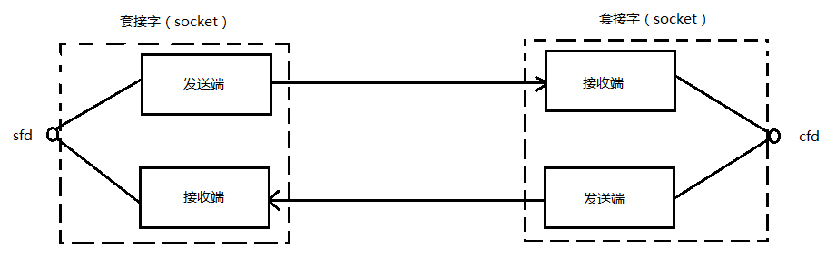

&emsp;&emsp;在网络通信中，套接字一定是成对出现的。一端的发送缓冲区对应另一端的接收缓冲区。我们使用同一个文件描述符索发送缓冲区和接收缓冲区。

## 2 网络编程和套接字

&emsp;&emsp;IP是Internet Protocol(网络协议)的简写，是为了收发网络数据而分配给计算机的值。端口号并非赋予计算机的值，而是为了区分程序中创建的套接字而分配给套接字的序号。

### 2.1 socket函数

```c
#include <sys/socket.h>
int socket (int domain, int type, int protocol);
```

调用socket函数，成功返回文件描述符，失败返回-1。

* domain：套接字中使用的协议族(Protocol Family)信息。一般使用 `PF_INET` IPv4互联网协议族。
* type： 套接字数据传输类型信息。一般使用 `SOCK_STREAM` 面向连接的套接字。
* protocol：计算机通信中使用的协议信息。一般为 `0`。

头文件sys/socket.h中声明的协议族：

| 名称     | 协议族        |
| :---          |    :----:   |
| PF_INET             | IPv4互联网协议族 |
| PF_INET6             | IPv6互联网协议族 |
| PF_LOCAL             | 本地通信的UNIX协议族 |
| PE_PACKET             | 底层套接字的协议族 |
| PF_IPX             | IPX Novell协议族 |

套接字类型:

1. 面向连接的套接字(SOCK_STREAM)
	* 传输过程中数据不会消失；
	* 按序传输数据
	* 传输的数据不存在数据边界(Boundary)

	> 可靠的、按序列传递的、基于字节的面向连接的数据传输方式的套接字。

2. 面向消息的套接字(SOCK_DGRAM)
	* 强调快速传输而非传输顺序。
	* 传输的数据可能丢失，也可能被销毁。
	* 传输的数据有边界。
	* 限制每次传输的数据大小。

	> 不可靠的、不按序传递的，以数据的高速传输为目的的套接字

### 2.2 bind函数

```c
#include <sys/socket.h>
int bind (int sockfd, struct sockaddr *myaddr, socklen_t addrlen);
```

调用bind函数，成功返回0，失败返回-1。若此函数调用成功，则将第二个参数指定的地址信息分配给第一个参数中的相应套接字。

* sockfd：要分配地址信息(IP地址和端口号)的套接字文件描述符。
* myaddr：存有地址信息的结构体变量地址值。
* addrlen：第二个结构体变量的长度。

### 2.3 listen函数

```c
#include <sys/socket.h>
int listen(int sockfd, int backlog);
```

调用listen函数，成功返回0，失败返回-1。

* sockfd：希望进入等待请求状态的套接字文件描述符，传递的描述符套接字成为服务器端套接字(监听套接字)。
* backlog：连接请求等待队列(Queue)的长度，若为5，则队列长度为5，表示最多使5个连接请求进入队列。

### 2.4 accept函数

```c
#include <sys/socket.h>
int accept(int sockfd, struct sockaddr *addr, socklen_t *addrlen);
```

调用accept函数，成功返回文件描述符，失败返回-1。

* sockfd：服务器套接字的文件描述符。
* addr：保存发起连接请求的客户端地址信息的变量地址值，调用函数后向传递来的地址变量参数填充客户端地址信息。
* addrlen：第二个参数addr结构体的长度，但是存有长度的变量地址。就是该函数调用完成后，该变量即被填入客户端地址长度。

accept函数受理连接请求等待队列中待处理的客户端连接请求。函数调用成功时，accept函数内部将产生用于数据I/O的套接字，并返回其文件描述符。需要强调的是，套接字是自动创建的，并自动与发起连接请求的客户端建立连接。

### 2.5 connect函数

```c
#include <sys/socket.h>
int connect(int sockfd, struct sockaddr *serv_addr, socklen_t addrlen);
```

调用connect函数，成功返回0，失败返回-1。

* sockfd：客户端套接字文件描述符。
* serv_addr：保存目标服务器端地址信息的变量地址值。
* addrlen：以字节为单位传递已传递给第二个结构体参数serv_addr的地址变量长度。

客户端调用connect函数后，发生以下情况之一才会返回(完成函数调用):

* 服务器端接收连接请求。
* 发生断网等异常情况而中断连接请求。

> 所谓的"接收连接"并不意味着服务器端调用accept函数，其实是服务器端把连接请求信息记录到等待队列。因此connect函数返回后并不立即进行数据交换。

基于TCP的服务端/客户端函数调用关系：

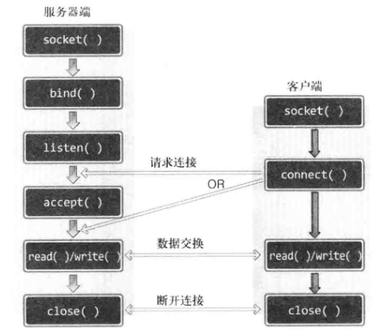

### 2.6 编写Hello world程序

hello_client.c

```c
#include <stdio.h>
#include <stdlib.h>
#include <string.h>
#include <unistd.h>
#include <arpa/inet.h>
#include <sys/socket.h>

void error_handling(char *message);

int main(int argc, char* argv[])
{
	int sock;
	struct sockaddr_in serv_addr;
	char message[30];
	int str_len;
	
	if(argc!=3){
		printf("Usage : %s <IP> <port>\n", argv[0]);
		exit(1);
	}
	
	//客户端创建一个和服务端建立连接的套接字
	sock=socket(PF_INET, SOCK_STREAM, 0);
	if(sock == -1)
		error_handling("socket() error");
	
	//设置描述的地址和端口号
	memset(&serv_addr, 0, sizeof(serv_addr));
	serv_addr.sin_family=AF_INET;
	serv_addr.sin_addr.s_addr=inet_addr(argv[1]);
	serv_addr.sin_port=htons(atoi(argv[2]));

	//与服务端建立连接，三次握手
	if(connect(sock, (struct sockaddr*)&serv_addr, sizeof(serv_addr))==-1) 
		error_handling("connect() error!");
	
	//阻塞，从服务端读取数据
	str_len=read(sock, message, sizeof(message)-1);
	if(str_len==-1)
		error_handling("read() error!");
	
	printf("Message from server: %s \n", message);  

	//断开与客户端的连接，四次挥手
	close(sock);
	return 0;
}

void error_handling(char *message)
{
	fputs(message, stderr);
	fputc('\n', stderr);
	exit(1);
}
```

hello_server.c

```c
#include <stdio.h>
#include <stdlib.h>
#include <string.h>
#include <unistd.h>
#include <arpa/inet.h>
#include <sys/socket.h>

void error_handling(char *message);

int main(int argc, char *argv[])
{
	int serv_sock;
	int clnt_sock;

	struct sockaddr_in serv_addr;
	struct sockaddr_in clnt_addr;
	socklen_t clnt_addr_size;

	char message[]="Hello World!";
	
	if(argc!=2){
		printf("Usage : %s <port>\n", argv[0]);
		exit(1);
	}
	
	//创建服务端socket，通过serv_sock创建与客户端连接的socket
	serv_sock=socket(PF_INET, SOCK_STREAM, 0);
	if(serv_sock == -1)
		error_handling("socket() error");
	
	//设置描述的地址和端口号
	memset(&serv_addr, 0, sizeof(serv_addr));
	serv_addr.sin_family=AF_INET;
	serv_addr.sin_addr.s_addr=htonl(INADDR_ANY);
	serv_addr.sin_port=htons(atoi(argv[1]));
	
	//将socket_fd 和serv_addr进行绑定
	if(bind(serv_sock, (struct sockaddr*) &serv_addr, sizeof(serv_addr))==-1 )
		error_handling("bind() error"); 
	
	//设置排队建立3次握手队列和刚刚建立3次握手队列的连接上限和
	if(listen(serv_sock, 5)==-1)
		error_handling("listen() error");
	
	//阻塞，与客户端建立连接，三次握手 =》 client_fd
	clnt_addr_size=sizeof(clnt_addr);  
	clnt_sock=accept(serv_sock, (struct sockaddr*)&clnt_addr,&clnt_addr_size);
	if(clnt_sock==-1)
		error_handling("accept() error");  
	
	//给clnt_sock客户连接发送数据
	write(clnt_sock, message, sizeof(message));

	//关闭连接，close fd
	close(clnt_sock);	
	close(serv_sock);
	return 0;
}

void error_handling(char *message)
{
	//将错误信息写入到标准错误流
	fputs(message, stderr);
	fputc('\n', stderr);
	exit(1);
}
```

## 3 基于Linux的文件操作

在Linux中，socket也被认为是文件的一种，因此在网络传输过程中可以使用文件I/O的相关函数。

文件描述符是系统分配给文件或套接字的一个整数。每当生成文件或套接字，操作系统将返回分配给它们的整数，这个整数将成为程序员与操作系统之间良好沟通的渠道。实际上，文件描述符只不过是未来方便称呼操作系统创建的文件或套接字而赋予的数值而已。

 标准输入输入及错误的文件描述符：

| 文件描述符     | 对象        |
| :---          |    :----:   |
| 0             | 标准输入: Standard Input       |
| 1             | 标准输出: Standard Output      |
| 2             | 标准错误: Standard Error       |

文件和套接字一般经过创建过程才会被分配文件描述符。而上述对象即使未经过特殊的创建过程，程序开始运行后也会被自动分配文件描述符。

### 3.1 open函数

```c
#include <sys/types.h>
#include <sys/stat.h>
#include <fcntl.h>

int open(const char *path, int flag);
```

调用open函数，成功时返回文件描述符，失败返回-1。

* path：文件名的字符串地址。
* flag：文件打开的模式信息。

文件打开模式：

| 打开模式       | 含义        |
| :---          |    :----:   |
| O_CREAT              | 必要时创建文件 |
| O_TRUNC              | 删除全部现有数据 |
| O_APPEND             | 维持现有数据，保存到其后面 |
| O_RDONLY             | 只读打开 |
| O_WRONLY             | 只写打开 |
| ORDWR                | 读写打开 |

### 3.2 close函数

```c
#include <unistd.h>

int close(int fd);
```

调用close函数，成功返回0，失败返回-1。

* fd：需要关闭的文件或套接字的文件描述符。

### 3.3 write函数

```c
#include <unistd.h>

ssize_t write(int fd, const void *buf, size_t nbytes);
```

调用write函数，成功时返回写入的字节数，失败返回-1。

* fd：数据传输对象的文件描述符
* buf：要传输数据的起始地址
* nbytes：要传输数据的字节数

### 3.4 read函数

```c
#include <unistd.h>

ssize_t read(int fd, void *buf, size_t nbytes);
```

调用read函数，成功时返回接收的字节数(**但遇到文件结尾则返回0**)，失败时返回-1。

* fd：数据接收对象的文件描述符
* buf：要接收数据的起始地址
* nbytes：要接收数据的最大字节数

## 4. 地址族与数据序列

&emsp;&emsp;端口号就是在同一操作系统内为区分不同套接字而设置的，因此无法将1个端口号分配给不同的套接字。总之，数据传输目标地址同时包含IP地址和端口号，只有这样，数据才会被传输到最终的目的应用程序(应用程序套接字)。

### 4.1 网络地址(Internet Address)

为使计算机连接到网络并收发数据，必须向其分配IP地址。IP地址分为两类。

* IPv4(Internet Protocol version 4)		4字节地址族
* IPv6(Internet Protocol version 6)		6字节地址族

IPv4地址的结构体

```c
struct sockaddr_in {
	sa_family_t sin_family;	//地址族(Address Family)
	uint16_t sin_port;	//16位TCP/UDP端口号
	struct in_addr sin_addr;	//32位IP地址
	char sin_zero[8];	//不使用，设置为0
}
```

`sockaddr_in`结构体中的另一个结构体struct in_addr，它是用来存放32位的IP地址

```c
struct in_addr {
	In_addr_t s_addr;	//32位IPv4的地址
}
```

结构体sockaddr_in的成员分析：

1. 成员sin_family

	| 地址族(Address Family)     | 含义        |
	| :---          |    :----:   |
	| AF_INET             | IPv4网络协议中使用的地址族 |
	| AF_INET6             | IPv6网络协议中使用的地址族 |
	| AF_LOCAL             | 本地通信中采用的UNIX协议的地址族 |
	> AF_LOCAL只是为了说明具有多种地址族而添加的。
2. 成员sin_port

	该成员保存16位端口号，**它以网络字节序保存**。
3. 成员sin_addr

	该成员保存32位IP地址信息，**它以网络字节序保存**。
4. 成员sin_zero

	无特殊含义。只是为了使用结构体sockaddr_in的大小与sockaddr结构体保持一致而插入的成员。**必须填充为0，否则无法得到想要的结果。**

bind函数的第二个参数期望得到sockaddr结构体变量地址值，包括地址族、端口号、IP地址等。

```c
struct sockaddr {
	sa_family_t sin_family;	//地址族(Address Family)
	char sa_data[14];	//地址信息
}
```

此结构体成员sa_data保存的地址信息中需包含IP地址和端口号，剩余部分应该填充为0，这也是bind函数要求的。而对于包含地址信息来讲非常麻烦，继而就有了新的结构体sockaddr_in。

### 4.2 网络字节序与地址转换

CPU向内存保存数据的方式有两种，这意味着CPU解析数据的方式也分为两种。

* 大端序(Big Endian)：高位字节存放地位地址。**网络字节序(Network Byte Order)，统一为大端序。**
* 小端序(Little Endian)：高位字节存放到高位地址。**主机字节序一般采取的形式。**

```txt
int n = 0x12345678;

小端存储：78 56 34 12
大端存储：12 34 56 78
```

转换字节序的函数：

* `unsigned short htons(unsigned short);` 把short型数据从主机字节序转换为网络字节序。
* `unsigned short ntohs(unsigned short);` 把short型数据从网络字节序转换为主机字节序。
* `unsigned long htonl(unsigned short);`  把long型数据从主机字节序转换为网络字节序。
* `unsigned long ntohl(unsigned short);`  把long型数据从网络字节序转换为主机字节序。

通过函数名可以了解其功能：

* 函数名中的h代表主机(host)字节序。
* 函数名中的n代表网络(network)字节序。
* 函数名中的s指的是short。
* 函数名中的l指的是long。(Linux中的long类型占用4个字节)

小端运行环境的例子：

```c
#include <stdio.h>
#include <arpa/inet.h>

int main(int argc, char *argv[])
{
	unsigned short host_port=0x1234; //该值按照小端的方式进行存储
	unsigned short net_port;
	unsigned long host_addr=0x12345678; //该值按照小端的方式进行存储
	unsigned long net_addr;
	
	net_port=htons(host_port);
	net_addr=htonl(host_addr);
	
	printf("Host ordered port: %#x \n", host_port);
	printf("Network ordered port: %#x \n", net_port);
	printf("Host ordered address: %#lx \n", host_addr);
	printf("Network ordered address: %#lx \n", net_addr);
	return 0;
}
```

对于IP地址的表示，我们熟悉的是点分十进制表示法(Dotted Decimal Notation)，而非整数型数据的表示法。

通过inet_addr函数，我们可以将字符串式的IP地址转换为32位整数型数据，而且可以检测无效的IP地址。**此函数在转换类型的同时进行网络字节序的转换。**

```c
#include <arpa/inet.h>

in_add_t inet_addr(const char *string);
```

调用`inet_addr`函数，成功返回32位**大端序整数型值**，失败时返回INADDR_NONE。

```c
#include <stdio.h>
#include <arpa/inet.h>

int main(int argc, char *argv[])
{
	char *addr1="127.212.124.78";
	char *addr2="127.212.124.256";

	unsigned long conv_addr=inet_addr(addr1);
	if(conv_addr==INADDR_NONE)
		printf("Error occured! \n");
	else
		printf("Network ordered integer addr: %#lx \n", conv_addr);
	
	conv_addr=inet_addr(addr2);
	if(conv_addr==INADDR_NONE)
		printf("Error occureded \n");
	else
		printf("Network ordered integer addr: %#lx \n\n", conv_addr);
	return 0;
}
```

inet_aton函数与inet_addr函数功能是一样的，只不过该函数利用了in_addr结构体，且使用频率更高。

```c
#include <arpa/inet.h>

int inet_aton(const char *string, struct in_addr *addr);
```

调用inet_aton函数，成功返回1，失败返回0。

```c
#include <stdio.h>
#include <stdlib.h>
#include <arpa/inet.h>
void error_handling(char *message);

int main(int argc, char *argv[])
{
	char *addr="127.232.124.79";
	struct sockaddr_in addr_inet;
	
	if(!inet_aton(addr, &addr_inet.sin_addr))
		error_handling("Conversion error");
	else
		printf("Network ordered integer addr: %#x \n", addr_inet.sin_addr.s_addr);
	return 0;
}

void error_handling(char *message)
{
	fputs(message, stderr);
	fputc('\n', stderr);
	exit(1);
}
```

inet_ntoa函数可以把网络字节序整数型IP地址转换成我们熟悉的字符串形式。

```c
#include <arpa/inet.h>

char * inet_ntoa(struct in_addr adr);
```

调用inet_ntoa函数，成功时返回转换的字符串地址值，失败时返回-1。
> 该函数的返回类型为char指针，意味着调用该函数会在内部申请了内存并保存了这个字符串。所以调用完该函数，应立即将字符串内容复制保存起来，因为下次调用inet_ntoa函数，则有可能覆盖之前保存的字符串信息。

```c
#include <stdio.h>
#include <string.h>
#include <arpa/inet.h>

int main(int argc, char *argv[])
{
	struct sockaddr_in addr1, addr2;
	char *str_ptr;
	char str_arr[20];
   
	addr1.sin_addr.s_addr=htonl(0x1020304);
	addr2.sin_addr.s_addr=htonl(0x1010101);
	
	str_ptr=inet_ntoa(addr1.sin_addr);
	strcpy(str_arr, str_ptr);
	printf("Dotted-Decimal notation1: %s \n", str_ptr);
	
	inet_ntoa(addr2.sin_addr);
	printf("Dotted-Decimal notation2: %s \n", str_ptr);
	printf("Dotted-Decimal notation3: %s \n", str_arr);
	return 0;
}

/*
root@com:/home/swyoon/tcpip# gcc inet_ntoa.c -o ntoa
root@com:/home/swyoon/tcpip# ./ntoa
Dotted-Decimal notation1: 1.2.3.4 
Dotted-Decimal notation2: 1.1.1.1 
Dotted-Decimal notation3: 1.2.3.4 

*/
```

网络地址初始化

```c
struct sockaddr_in addr;

char *serv_ip = "127.0.0.1";	//声明IP地址字符串
char *ser_port = "9190";	//声明端口号字符串
memset(&addr, 0, sizeof(addr));	结构体变量addr的所有成员初始化为0
addr.sin_family = AF_INET;	//指定IPv4协议族
addr.sin_addr.s_addr = inet_addr(serv_ip);	//基于字符串的IP地址初始化
addr.sin_port = htons(atoi(serv_port));	//基于字符串的端口号初始化
```

每次创建服务端套接字都要输入IP地址，可以利用`INADDR_ANY`分配服务端的IP地址。采用这种方式，则可以自动获取服务端的计算机IP地址。

`addr.sin_addr.s_addr = htonl(INADDR_ANY);`

## 5. 基于TCP的服务端/客户端

### 5.1 缺陷的echo版本

echo_server.c

```c
#include <stdio.h>
#include <stdlib.h>
#include <string.h>
#include <unistd.h>
#include <arpa/inet.h>
#include <sys/socket.h>

#define BUF_SIZE 1024
void error_handling(char *message);

int main(int argc, char *argv[])
{
	int serv_sock, clnt_sock;
	char message[BUF_SIZE];
	int str_len, i;
	
	struct sockaddr_in serv_adr;
	struct sockaddr_in clnt_adr;
	socklen_t clnt_adr_sz;
	
	if(argc!=2) {
		printf("Usage : %s <port>\n", argv[0]);
		exit(1);
	}
	
	serv_sock=socket(PF_INET, SOCK_STREAM, 0);   
	if(serv_sock==-1)
		error_handling("socket() error");
	
	memset(&serv_adr, 0, sizeof(serv_adr));
	serv_adr.sin_family=AF_INET;
	serv_adr.sin_addr.s_addr=htonl(INADDR_ANY);
	serv_adr.sin_port=htons(atoi(argv[1]));

	if(bind(serv_sock, (struct sockaddr*)&serv_adr, sizeof(serv_adr))==-1)
		error_handling("bind() error");
	
	if(listen(serv_sock, 5)==-1)
		error_handling("listen() error");
	
	clnt_adr_sz=sizeof(clnt_adr);

	while(1)
	{
		clnt_sock=accept(serv_sock, (struct sockaddr*)&clnt_adr, &clnt_adr_sz);
		if(clnt_sock==-1)
			error_handling("accept() error");
		else
			printf("Connected client %d \n", i+1);
	
		//接收客户端的数据，然后再原封不动的发回给客户端
		while((str_len=read(clnt_sock, message, BUF_SIZE))!=0) {
			write(clnt_sock, message, str_len);
		}

		close(clnt_sock);
	}

	close(serv_sock);
	return 0;
}

void error_handling(char *message)
{
	fputs(message, stderr);
	fputc('\n', stderr);
	exit(1);
}
```

echo_cilent.c

```c
#include <stdio.h>
#include <stdlib.h>
#include <string.h>
#include <unistd.h>
#include <arpa/inet.h>
#include <sys/socket.h>

#define BUF_SIZE 1024
void error_handling(char *message);

int main(int argc, char *argv[])
{
	int sock;
	char message[BUF_SIZE];
	int str_len;
	struct sockaddr_in serv_adr;

	if(argc!=3) {
		printf("Usage : %s <IP> <port>\n", argv[0]);
		exit(1);
	}
	
	sock=socket(PF_INET, SOCK_STREAM, 0);   
	if(sock==-1)
		error_handling("socket() error");
	
	memset(&serv_adr, 0, sizeof(serv_adr));
	serv_adr.sin_family=AF_INET;
	serv_adr.sin_addr.s_addr=inet_addr(argv[1]);
	serv_adr.sin_port=htons(atoi(argv[2]));
	
	if(connect(sock, (struct sockaddr*)&serv_adr, sizeof(serv_adr))==-1)
		error_handling("connect() error!");
	else
		puts("Connected...........");
	
	while(1) 
	{
		fputs("Input message(Q to quit): ", stdout);
		fgets(message, BUF_SIZE, stdin);
		
		if(!strcmp(message,"q\n") || !strcmp(message,"Q\n"))
			break;

		//发生数据给服务端
		write(sock, message, strlen(message));

		//阻塞接收服务端的数据
		str_len=read(sock, message, BUF_SIZE-1);
		message[str_len]=0;
		printf("Message from server: %s", message);
	}
	
	close(sock);
	return 0;
}

void error_handling(char *message)
{
	fputs(message, stderr);
	fputc('\n', stderr);
	exit(1);
}
```

上面的程序存在很大的问题，因为TCP是基于流的，但保证数据能够完整的传输。write函数的调用只是把数据放入到发送缓冲区中，至于何时发送，发送大小是多少，这些都是不确定的；read函数从接收缓存区中拿数据，每次能拿多少也是不确定的。

### 5.2 简易的echo版本

在收发数据过程中，我们可以简单规范一下应用层协议：每发送一次数据，都在数据前4字节存放数据的大小，这样接收端就能明确的知道每次的接收数据的大小(每条消息的长度)。

echo_server.c

```c
#include <stdio.h>
#include <stdlib.h>
#include <string.h>
#include <unistd.h>
#include <arpa/inet.h>
#include <sys/socket.h>

#define BUF_SIZE 1024
void error_handling(char *message);

int main(int argc, char *argv[])
{
	int serv_sock, clnt_sock;
	char message[BUF_SIZE];
	int str_len, i = 0;
	
	struct sockaddr_in serv_adr;
	struct sockaddr_in clnt_adr;
	socklen_t clnt_adr_sz;
	
	if(argc!=2) {
		printf("Usage : %s <port>\n", argv[0]);
		exit(1);
	}
	
	serv_sock=socket(PF_INET, SOCK_STREAM, 0);   
	if(serv_sock==-1)
		error_handling("socket() error");
	
	memset(&serv_adr, 0, sizeof(serv_adr));
	serv_adr.sin_family=AF_INET;
	serv_adr.sin_addr.s_addr=htonl(INADDR_ANY);
	serv_adr.sin_port=htons(atoi(argv[1]));

	if(bind(serv_sock, (struct sockaddr*)&serv_adr, sizeof(serv_adr))==-1)
		error_handling("bind() error");
	
	if(listen(serv_sock, 5)==-1)
		error_handling("listen() error");
	
	clnt_adr_sz=sizeof(clnt_adr);

	//没开启多线程，只处理一个客户端；可以通过one loop思想处理多个客户
	while(1)
	{
		clnt_sock=accept(serv_sock, (struct sockaddr*)&clnt_adr, &clnt_adr_sz);
		if(clnt_sock==-1)
			error_handling("accept() error");
		else
			printf("Connected client %d \n", ++i);
	
		int quit = 0;
		while(!quit) {
			//接收客户端的数据，然后再原封不动的发回给客户端

			//先接受数据的长度
			int size = 0;
			while(size != 4) {
				int len = read(clnt_sock, message + size, 4 - size);
				if(len == -1) {
					error_handling("read() error!");
				}
				if(len == 0) {
					quit = 1;
					break;
				}
				
				size += len;
			}

			int str_size = (message[0] << 24) + (message[1] << 16) + (message[2] << 8) + (message[3] << 0);
			// printf("%d %d %d %d\n", message[0],message[1],message[2],message[3]);
			// printf("%d\n", str_size);
			str_len = 0;
			while(str_len != str_size) {
				int len = read(clnt_sock, message + size + str_len, str_size - str_len);
				if(len == -1) {
					error_handling("read() error!");
				}
				if(len == 0) {
					quit = 1;
					break;
				}
				
				str_len += len;
			}

			if(!quit) {
				write(clnt_sock, message, str_size + 4);

				message[str_size + 4] = 0;
				printf("Send Message to client(%d): %s", clnt_sock, message + 4);
			}
		}

		close(clnt_sock);
	}

	close(serv_sock);
	return 0;
}

void error_handling(char *message)
{
	fputs(message, stderr);
	fputc('\n', stderr);
	exit(1);
}
```

echo_cilent.c

```c
#include <stdio.h>
#include <stdlib.h>
#include <string.h>
#include <unistd.h>
#include <arpa/inet.h>
#include <sys/socket.h>

#define BUF_SIZE 1024
void error_handling(char *message);

int main(int argc, char *argv[])
{
	int sock;
	char message[BUF_SIZE];
	int str_len;
	struct sockaddr_in serv_adr;

	if(argc!=3) {
		printf("Usage : %s <IP> <port>\n", argv[0]);
		exit(1);
	}
	
	sock=socket(PF_INET, SOCK_STREAM, 0);   
	if(sock==-1)
		error_handling("socket() error");
	
	memset(&serv_adr, 0, sizeof(serv_adr));
	serv_adr.sin_family=AF_INET;
	serv_adr.sin_addr.s_addr=inet_addr(argv[1]);
	serv_adr.sin_port=htons(atoi(argv[2]));
	
	if(connect(sock, (struct sockaddr*)&serv_adr, sizeof(serv_adr))==-1)
		error_handling("connect() error!");
	else
		puts("Connected...........");
	
	while(1) {
		fputs("Input message(Q to quit): ", stdout);
		fgets(message + 4, BUF_SIZE - 4 - 1, stdin);
		
		if(!strcmp(message + 4,"q\n") || !strcmp(message + 4,"Q\n"))
			break;

		// *((int *)message) = strlen(message + 4);

		int message_len = strlen(message + 4);
		message[0] = (message_len >> 24) & 0xFF;
		message[1] = (message_len >> 16) & 0xFF;
		message[2] = (message_len >> 8) & 0xFF;
		message[3] = (message_len >> 0) & 0xFF;
		
		//发生数据给服务端
		write(sock, message, message_len + 4);

		// printf("%d %d %d %d\n", message[0],message[1],message[2],message[3]);
		// printf("%s\n", message + 4);

		//先接收客户端一次发送的数据长度
		int size = 0;
		while(size != 4) {
			int len = read(sock, message + size, 4 - size);
			if(len == -1) {
				error_handling("read() error!");
			}
			size += len;
		}

		int str_size = (message[0] << 24) + (message[1] << 16) + (message[2] << 8) + (message[3] << 0);

		str_len = 0;
		while(str_len != str_size) {
			int len = read(sock, message + size + str_len, str_size - str_len);
			if(len == -1) {
				error_handling("read() error!");
			}
			str_len += len;
		}
		
		message[str_size + 4] = 0;
		printf("Message from server: %s", message + 4);
	}
	
	close(sock);
	return 0;
}

void error_handling(char *message)
{
	fputs(message, stderr);
	fputc('\n', stderr);
	exit(1);
}
```

注意：

```c
//当发生异常情况，去读数据过程中str_len超出str_size，此时就无法退出循环
while(str_len != str_size) {
	...
}

//最好这样
while(str_len < str_size) {
	...
}
```

### 5.3 简单的操作运算

* 客户端连接到服务端后以1字节整数形式转递待算数个数。
* 客户端向服务器端传递的每个整数型数据占用4个字节空间。
* 传递整数型数据后接着传递运算符。运算符信息占用1字节。
* 目前支持操作符：+、-、*。
* 服务端以4个字节整数型向客户端传回运算结果。
* 客户端得到运算结果后终止与服务端的连接。

> 调用close函数将向对方传递EOF。

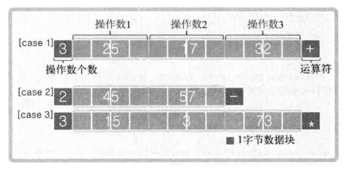

op_client.c

```c
#include <stdio.h>
#include <stdlib.h>
#include <string.h>
#include <unistd.h>
#include <arpa/inet.h>
#include <sys/socket.h>

#define BUF_SIZE 1024
#define RLT_SIZE 4
#define OPSZ 4
void error_handling(char *message);

int main(int argc, char *argv[])
{
	int sock;
	char opmsg[BUF_SIZE];
	int result, opnd_cnt, i;
	struct sockaddr_in serv_adr;
	if(argc!=3) {
		printf("Usage : %s <IP> <port>\n", argv[0]);
		exit(1);
	}
	
	sock=socket(PF_INET, SOCK_STREAM, 0);   
	if(sock==-1)
		error_handling("socket() error");
	
	memset(&serv_adr, 0, sizeof(serv_adr));
	serv_adr.sin_family=AF_INET;
	serv_adr.sin_addr.s_addr=inet_addr(argv[1]);
	serv_adr.sin_port=htons(atoi(argv[2]));
	
	if(connect(sock, (struct sockaddr*)&serv_adr, sizeof(serv_adr))==-1)
		error_handling("connect() error!");
	else
		puts("Connected...........");

	fputs("Operand count: ", stdout);
	scanf("%d", &opnd_cnt);
	opmsg[0]=(char)opnd_cnt;//先获得操作数的个数
	
	for(i=0; i<opnd_cnt; i++)
	{
		printf("Operand %d: ", i+1);
		scanf("%d", (int*)&opmsg[i*OPSZ+1]);//保存操作数
	}

	fgetc(stdin);//删掉缓冲中的字符 =》 scanf函数产生的

	fputs("Operator: ", stdout);
	scanf("%c", &opmsg[opnd_cnt*OPSZ+1]);//获取操作符
	write(sock, opmsg, opnd_cnt*OPSZ+2);

	//获取服务端计算的结果(4字节)
	int len = 0;
	while(len < RLT_SIZE) {
		len = read(sock, (char *)&result + len, RLT_SIZE - len);
	}
	
	printf("Operation result: %d \n", result);
	close(sock);
	return 0;
}

void error_handling(char *message)
{
	fputs(message, stderr);
	fputc('\n', stderr);
	exit(1);
}
```

op_server.c

```c
#include <stdio.h>
#include <stdlib.h>
#include <string.h>
#include <unistd.h>
#include <arpa/inet.h>
#include <sys/socket.h>

#define BUF_SIZE 1024
#define OPSZ 4
void error_handling(char *message);
int calculate(int opnum, int opnds[], char oprator);

int main(int argc, char *argv[])
{
	int serv_sock, clnt_sock;
	char opinfo[BUF_SIZE];
	int result, opnd_cnt, i;
	int recv_cnt, recv_len;	
	struct sockaddr_in serv_adr, clnt_adr;
	socklen_t clnt_adr_sz;
	if(argc!=2) {
		printf("Usage : %s <port>\n", argv[0]);
		exit(1);
	}
	
	serv_sock=socket(PF_INET, SOCK_STREAM, 0);   
	if(serv_sock==-1)
		error_handling("socket() error");
	
	memset(&serv_adr, 0, sizeof(serv_adr));
	serv_adr.sin_family=AF_INET;
	serv_adr.sin_addr.s_addr=htonl(INADDR_ANY);
	serv_adr.sin_port=htons(atoi(argv[1]));

	if(bind(serv_sock, (struct sockaddr*)&serv_adr, sizeof(serv_adr))==-1)
		error_handling("bind() error");
	if(listen(serv_sock, 5)==-1)
		error_handling("listen() error");	
	clnt_adr_sz=sizeof(clnt_adr);

	for(i=0; i<5; i++)
	{
		clnt_sock=accept(serv_sock, (struct sockaddr*)&clnt_adr, &clnt_adr_sz);	
		
		//先获取操作数的数量
		opnd_cnt=0;
		int len = 0;
		while(len < 1) {
			len = read(clnt_sock, (char *)&opnd_cnt + len, 1 - len);
		}

		//获取全部数据
		recv_len = len - 1;
		while((opnd_cnt*OPSZ+1)>recv_len)
		{
			//BUF_SIZE - recv_len - 1: 因为操作符已经占用一个字节了
			recv_cnt = read(clnt_sock, &opinfo[recv_len], BUF_SIZE - recv_len - 1);
			recv_len += recv_cnt;
		}

		result=calculate(opnd_cnt, (int*)opinfo, opinfo[recv_len-1]);
		write(clnt_sock, (char*)&result, sizeof(result));
		close(clnt_sock);
	}
	close(serv_sock);
	return 0;
}

int calculate(int opnum, int opnds[], char op)
{
	int result=opnds[0], i;
	
	switch(op)
	{
	case '+':
		for(i=1; i<opnum; i++) result+=opnds[i];
		break;
	case '-':
		for(i=1; i<opnum; i++) result-=opnds[i];
		break;
	case '*':
		for(i=1; i<opnum; i++) result*=opnds[i];
		break;
	}
	return result;
}

void error_handling(char *message)
{
	fputs(message, stderr);
	fputc('\n', stderr);
	exit(1);
}
```

### 5.4 TCP原理

&emsp;&emsp;TCP套接字的数据收发无边界。实际上，write函数调用后并非立即传输数据，read函数调用后也非马上接收数据。更准确地说，write函数调用瞬间，数据将移至输出缓冲；read函数调用瞬间，从输入缓冲读取数据。

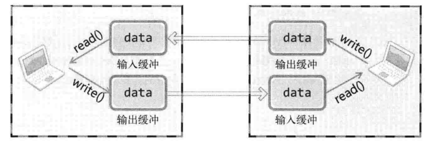

调用write函数时，数据将移动到输出缓冲，在适当的时候(不管是分别传送还是一次性传送)传向对方的输入缓冲。这时对方将调用read函数从输入缓冲读取数据。这些I/O缓冲特性可整理如下：
* I/O缓冲在每个TCP套接字中单独存在。
* I/O缓冲在创建套接字时自动生成。
* 即使关闭套接字也会继续传递输入缓冲中遗留的数据。(调用close时)
* 关闭套接字将丢失缓冲中的数据。(调用close完成后)

## 6. 基于UDP的服务器端/客户端

## 7. 优雅地断开套接字连接

&emsp;&emsp;调用Linux的close函数意味着完全断开连接。完全断开不仅指无法传输数据，而且也不能接收数据。为了解决这类问题，“只关闭一部分数据交换中使用的流”(Half-close)的方法应运而生。断开一部分连接是指，可以传输数据但无法接收，或可以接收数据但无法传输。顾名思义就是只关闭流的一半。

### 7.1 套接字和流(Stream)

&emsp;&emsp;两台主机通过套接字建立连接后进入可交换数据的状态，又称“流形成的状态”。也就是把建立套接字后可交换数据的状态看作一种流。

&emsp;&emsp;此处的流可以比作水流。水朝着一个方向流动，同样，在套接字的流中，数据也只能向一个方向移动。因此，为了进行双向通信，需要2个流。如下图所示：

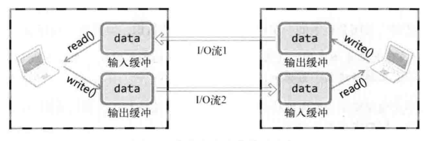

&emsp;&emsp;一旦两台主机间建立了套接字连接，每个主机就会拥有单独的输入流和输出流。当然，其中一个主机的输入流与另一主机的输出流相连，而输出流则与另一主机的输入流相连。

### 7.2 shutdown函数

```c
#include <sys/socket.h>

int shutdown(int sock, int howto);
```

调用shutdown函数，成功时返回0，失败时返回-1。
* sock：需要断开的套接字文件描述符。
* howto：传递断开方式信息。

第二个参数(howto)参数决定断开连接的方式：
* SHUT_RD：断开输入流
* SHUT_WR：断开输出流
* SHUT_RDWR：同时断开I/O流。

1. 若向shutdown的第二个参数传递SHUT_RD，则断开输入流，套接字无法接收数据。即使输入缓冲收到数据也会抹去，而且无法调用输入相关函数(read等)。
2. 如果shutdown函数的第二个参数传递SHUT_WR，则中断输出流，也就无法传输数据(write等)。**但如果输出缓冲还留有未传输的数据，则将传递至目标主机。**
3. 最后，若传入SHUT)RDWR，则同时中断I/O流(相当于调用close函数)。这相当于分2次调用shutdown，其中一次以SHUT_RD为参数，另一次以SHUT_WR为参数。

> 断开输出流时，会向对方主机传输EOF。

### 7.3 基于半关闭的文件传输程序

file_server.c
```c
#include <stdio.h>
#include <stdlib.h>
#include <string.h>
#include <unistd.h>
#include <arpa/inet.h>
#include <sys/socket.h>

#define BUF_SIZE 30
void error_handling(char *message);

int main(int argc, char *argv[])
{
	int serv_sd, clnt_sd;
	FILE * fp;
	char buf[BUF_SIZE];
	int read_cnt;
	
	struct sockaddr_in serv_adr, clnt_adr;
	socklen_t clnt_adr_sz;
	
	if(argc!=2) {
		printf("Usage: %s <port>\n", argv[0]);
		exit(1);
	}
	
	//rb：以二进制方式读入
	fp = fopen("file_server.c", "rb"); 
	serv_sd = socket(PF_INET, SOCK_STREAM, 0);   
	
	memset(&serv_adr, 0, sizeof(serv_adr));
	serv_adr.sin_family=AF_INET;
	serv_adr.sin_addr.s_addr=htonl(INADDR_ANY);
	serv_adr.sin_port=htons(atoi(argv[1]));
	
	bind(serv_sd, (struct sockaddr*)&serv_adr, sizeof(serv_adr));
	listen(serv_sd, 5);
	
	clnt_adr_sz=sizeof(clnt_adr);    
	clnt_sd=accept(serv_sd, (struct sockaddr*)&clnt_adr, &clnt_adr_sz);
	
	// while(1)
	// {
	// 	read_cnt=fread((void*)buf, 1, BUF_SIZE, fp);
	// 	if(read_cnt<BUF_SIZE)
	// 	{
	// 		write(clnt_sd, buf, read_cnt);
	// 		break;
	// 	}
	// 	write(clnt_sd, buf, BUF_SIZE);
	// }

	//将fp文件描述符指向的文件数据发送给客户端(clnt_sd描述符)
	while(read_cnt = fread((void*)buf, 1, BUF_SIZE, fp)) {
		write(clnt_sd, buf, read_cnt);
	}
	
	//关闭输出流，及发送EOF。
	shutdown(clnt_sd, SHUT_WR);

	//输入流仍然可以使用
	read(clnt_sd, buf, BUF_SIZE);
	printf("Message from client: %s \n", buf);
	
	fclose(fp);
	close(clnt_sd);
	close(serv_sd);
	return 0;
}

void error_handling(char *message)
{
	fputs(message, stderr);
	fputc('\n', stderr);
	exit(1);
}

```

file_cilent.c
```c
#include <stdio.h>
#include <stdlib.h>
#include <string.h>
#include <unistd.h>
#include <arpa/inet.h>
#include <sys/socket.h>

#define BUF_SIZE 30
void error_handling(char *message);

int main(int argc, char *argv[])
{
	int sd;
	FILE *fp;
	
	char buf[BUF_SIZE];
	int read_cnt;
	struct sockaddr_in serv_adr;
	if(argc!=3) {
		printf("Usage: %s <IP> <port>\n", argv[0]);
		exit(1);
	}
	
	//wb：是二进制方式写入
	fp = fopen("./file/receive.dat", "wb");
	sd = socket(PF_INET, SOCK_STREAM, 0);   

	memset(&serv_adr, 0, sizeof(serv_adr));
	serv_adr.sin_family=AF_INET;
	serv_adr.sin_addr.s_addr=inet_addr(argv[1]);
	serv_adr.sin_port=htons(atoi(argv[2]));

	connect(sd, (struct sockaddr*)&serv_adr, sizeof(serv_adr));
	
	//通过sd接收服务端发送的数据，并存放到buf中
	while((read_cnt=read(sd, buf, BUF_SIZE ))!=0) {
		//把服务端接收的数据(buf)，流向fp文件描述符指定的文件receive.dat
		fwrite((void*)buf, 1, read_cnt, fp);
	}
	
	puts("Received file data");
	write(sd, "Thank you", 10);
	fclose(fp);
	close(sd);
	return 0;
}

void error_handling(char *message)
{
	fputs(message, stderr);
	fputc('\n', stderr);
	exit(1);
}
```

## 8. 域名及网络地址

## 9. 套接字的多种可选项

## 10. 多进程服务器端

**可以同ps指令查看当前运行的所有进程：`ps au`**

### 10.1 fork函数

**通过fork函数创建进程：**

```c
#include <unistd.h>

pid_t fork(void);
```

调用fork函数，成功时返回进程ID，失败时返回-1。

**fork函数将创建的进程副本，复制正在运行的、调用fork函数的进程。这两个进程都执行fork函数调用后的语句(fork函数返回后)。**

利用fork函数的特点区别程序执行流程：
* 父进程：fork函数返回子进程ID。
* 子进程：fork函数返回0。

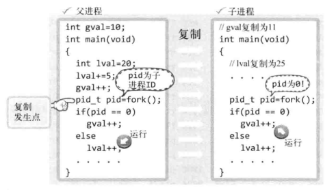

fork.c

```c
#include <stdio.h>
#include <unistd.h>
int gval=10;

int main(int argc, char *argv[])
{
	pid_t pid;
	int lval=20;
	gval++, lval+=5;
	
	pid=fork();		
	if(pid==0)	// if Child Process
		gval+=2, lval+=2;
	else			// if Parent Process
		gval-=2, lval-=2;
	
	if(pid==0)
		printf("Child Proc: [%d, %d] \n", gval, lval);
	else
		printf("Parent Proc: [%d, %d] \n", gval, lval);
	return 0;
}
```

### 10.2 进程和僵尸进程

> 应该向创建子进程的而父进程传递子进程的exit参数值或return语句的返回值。

操作系统不会主动把这些值传递给父进程。只有父进程主动发起请求(函数调用)时，操作系统才会传递该值。换言之，如果父进程未主动要求获得子进程的结束值，操作系统将一直保存，并让子进程长时间处于僵尸进程状态。也就是说，父进程要负责创建的子进程。

**僵尸进程示例：**

zombie.c

```c
#include <stdio.h>
#include <unistd.h>

int main(int argc, char *argv[])
{
	pid_t pid=fork();
	
	if(pid==0)     // if Child Process
	{
		puts("Hi I'am a child process");
	}
	else
	{
		printf("Child Process ID: %d \n", pid);
		sleep(30);     // Sleep 30 sec.
	}

	if(pid==0)
		puts("End child process");
	else
		puts("End parent process");
	return 0;
}
```

可以看到pid(6922)，就是僵尸进程。经过30秒的等待时间后，pid为6921的父进程和之前的僵尸进程同时销毁。

> 后台处理是指将控制台窗口的指令放到后台运行的方式，如：`./zombie &`

```shell
cjt@DESKTOP-10IHDHO:~/c++/socket$ ps au
USER       PID %CPU %MEM    VSZ   RSS TTY      STAT START   TIME COMMAND
cjt       6921  0.0  0.0  10536   568 pts/1    S    18:20   0:00 ./zombie
cjt       6922  0.0  0.0      0     0 pts/1    Z    18:20   0:00 [zombie] <defunct>
```

### 10.3 wait函数

```c
#include <sys/wait.h>

pid_t wait(int *statloc);
```

调用wait函数，成功时返回终止的子进程ID，失败时返回-1。

调用此函数时**如果已有子进程终止**，那么子进程终止时传递的返回值(exit函数的参数值、main函数的return返回值)将保存到该函数的参数所指向内存空间。但函数参数指向的单元中还包括含其他信息，因此需要通过下列宏进行分离。

* WIFEXITED进程正常终止时返回"真"(true)。
* WEXITSTATUS返回子进程的返回值。

也就是说，向wait函数传递变量status的地址时，调用wait函数后应编写如下代码：

```c
//是否时正常终止的？
if(WIFEXITED(status)) {
	puts("Normal termination!");

	//打印进程终止的返回值
	printf("Child pass num: %d", WEXITSTATUS(status));
}
```

wait.c

```c
#include <stdio.h>
#include <stdlib.h>
#include <unistd.h>
#include <sys/wait.h>

int main(int argc, char *argv[])
{
	int status;
	pid_t pid = fork();

	if (pid == 0)
	{
		//子线程的执行流程
		return 3;
	}
	else
	{
		printf("Child1 PID: %d \n", pid);
		pid = fork();
		if (pid == 0)
		{
			//子线程的执行流程
			exit(7);
		}
		else
		{
			printf("Child2 PID: %d \n", pid);
			wait(&status);
			if (WIFEXITED(status))
				printf("Child send one: %d \n", WEXITSTATUS(status));

			wait(&status);
			if (WIFEXITED(status))
				printf("Child send two: %d \n", WEXITSTATUS(status));
			sleep(30); // Sleep 30 sec.
		}
	}
	return 0;
}
```

## 11. 进程间通信

## 12. I/O复用

复用：
* 在1个通信频道中传递多个数据(信号)的技术。
* 为了提高物理设备的效率，用最少的物理要素传递最多数据时使用的技术。

### 12.1 select函数

select函数的调用过程：

&emsp;&emsp;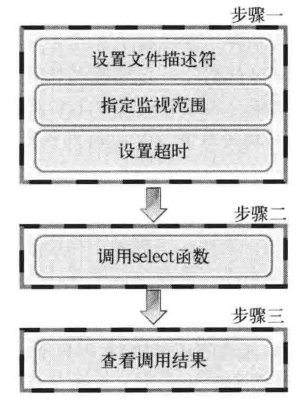

**设置文件描述符**

&emsp;&emsp;利用select函数可以同时监视多个文件描述符。当然，监视文件描述符可以视为监视套接字。首先需要将要监视的文件描述符集中到一起，按照监视项(接收、传输、异常)进行区分，将上述3种监视项分成3类。

&emsp;&emsp;使用fd_set数组变量执行此项操作，数组是存有0和1的位数组。

&emsp;&emsp;&emsp;&emsp;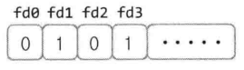

最左端的位表示文件描述符0(所在位置)。如果该位设置为1，则表示该文件描述符是监视对象。上图中，文件描述符1和3就是要监控的对象。

在fd_set变量中注册或更改值的操作都是由下列宏完成的：
* FD_ZERO(fd_set *fdest)：将fd_set变量的所有位初始化为0。
* FD_SET(int fd, fd_set *fdset)：在参数fdset指向的变量中注册文件描述符fd的信息。
* FD_CLR(int fd, fd_set *fdset)：从参数fdset指向的变量中清除文件描述符fd的信息。
* FD_ISSET(int fd, fd_set *fdset)若参数fdset指向的变量中包含文件描述符fd的信息，则返回"真"。

&emsp;&emsp;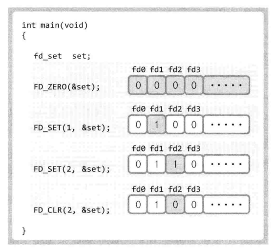

```c
#include <sys/select.h>
#include <sys/time.h>

int select(int maxfd, fd_set *readset, fd_set *writeset, fd_set *exceptset, const struct timeval *timeout);
```

调用select函数，成功时返回大于0的值，失败时返回-1。
* maxfd：监视对象文件描述符数量。
* readset：将所有关注 "是否存在待读取数据" 的文件描述符注册到fd_set型变量，并传递其地址值。
* writeset：将所有关注 "是否可传输无阻塞数据" 的文件描述符注册到fd_set型变量，并传递其地址值。
* exceptset：将所有关注 "是否发生异常" 的文件描述符注册到fd_set型变量，并传递其地址值。
* timeout：调用select函数后，为防止陷入无限阻塞的状态，传递超时(time-out)信息。
* 返回值：发生错误时返回-1，超时返回时返回0。因发生关注的事件返回时，返回大于0的值，该值是发生事件的文件描述符数。

timeval结构体定义如下：

```c
struct timeval {
	long tv_sec;	//seconds
	long tv_usec;	//microseconds
}
```

&emsp;&emsp;本例select函数只有在监视的文件描述符发生变化时才返回。如果未发生变化，就会进入阻塞状态。指定超时时间就是为了防止这种情况的发生。通过声明上述结构体变量，将秒数填入tv_sec成员，将毫秒数填入tv_usec成员，然后将结构体的地址值传递到select函数的最后一个参数。此时，即使文件秒师傅中未发生变化，只要过了指定时间，也可以从函数中返回。不过这种情况下，select函数返回0。因此，可以通过返回值了解返回原因。如果不想设置超时，则传递NULL作为参数。

**select函数示例：**

select.c

```c
#include <stdio.h>
#include <unistd.h>
#include <sys/time.h>
#include <sys/select.h>

#define BUF_SIZE 30

int main(int argc, char *argv[])
{
	fd_set reads, temps;
	int result, str_len;
	char buf[BUF_SIZE];
	struct timeval timeout;

	FD_ZERO(&reads);
	FD_SET(0, &reads); // 0 is standard input(console)

	/*
	timeout.tv_sec=5;
	timeout.tv_usec=5000;
	*/

	while(1)
	{
		temps = reads;
		timeout.tv_sec=5;
		timeout.tv_usec=0;

		//设置监听文件描述符0(标准输入)的可读事件，并设置超时时间
		result = select(1, &temps, 0, 0, &timeout);
		if(result==-1)
		{
			puts("select() error!");
			break;
		}
		else if(result==0)
		{
			puts("Time-out!");
		}
		else 
		{
			if(FD_ISSET(0, &temps)) 
			{
				//从标准输入流中去读数据，并打印
				str_len = read(0, buf, BUF_SIZE);
				buf[str_len]=0;
				printf("message from console: %s", buf);
			}
		}
	}
	return 0;
}
```

### 12.2 基于select的I/O复用实例

echo_selectserv.c

```c
#include <stdio.h>
#include <stdlib.h>
#include <string.h>
#include <unistd.h>
#include <arpa/inet.h>
#include <sys/socket.h>
#include <sys/time.h>
#include <sys/select.h>

#define BUF_SIZE 100
void error_handling(char *buf);

int main(int argc, char *argv[])
{
	int serv_sock, clnt_sock;
	struct sockaddr_in serv_adr, clnt_adr;
	struct timeval timeout;
	fd_set reads, cpy_reads;

	socklen_t adr_sz;
	int fd_max, str_len, fd_num, i;
	char buf[BUF_SIZE];
	if (argc != 2)
	{
		printf("Usage : %s <port>\n", argv[0]);
		exit(1);
	}

	serv_sock = socket(PF_INET, SOCK_STREAM, 0);
	memset(&serv_adr, 0, sizeof(serv_adr));
	serv_adr.sin_family = AF_INET;
	serv_adr.sin_addr.s_addr = htonl(INADDR_ANY);
	serv_adr.sin_port = htons(atoi(argv[1]));

	if (bind(serv_sock, (struct sockaddr *)&serv_adr, sizeof(serv_adr)) == -1)
		error_handling("bind() error");
	if (listen(serv_sock, 5) == -1)
		error_handling("listen() error");

	FD_ZERO(&reads);
	FD_SET(serv_sock, &reads);
	fd_max = serv_sock;

	while (1)
	{
		cpy_reads = reads;
		timeout.tv_sec = 5;
		timeout.tv_usec = 5000;

		//只监听了可读事件
		if ((fd_num = select(fd_max + 1, &cpy_reads, 0, 0, &timeout)) == -1)
			break;

		//超时未得到可读事件
		if (fd_num == 0)
			continue;

		//需要进一步优化
		for (i = 0; i < fd_max + 1; i++)
		{
			if (FD_ISSET(i, &cpy_reads))
			{
				//发生建立连接的事件
				if (i == serv_sock) // connection request!
				{
					adr_sz = sizeof(clnt_adr);
					clnt_sock =
						accept(serv_sock, (struct sockaddr *)&clnt_adr, &adr_sz);
					FD_SET(clnt_sock, &reads);
					if (fd_max < clnt_sock)
						fd_max = clnt_sock;
					printf("connected client: %d \n", clnt_sock);
				}
				//可读事件
				else // read message!
				{
					str_len = read(i, buf, BUF_SIZE);
					if (str_len == 0) // close request!
					{
						FD_CLR(i, &reads);
						close(i);
						printf("closed client: %d \n", i);
					}
					else
					{
						write(i, buf, str_len); // echo!
					}
				}
			}
		}
	}
	close(serv_sock);
	return 0;
}

void error_handling(char *buf)
{
	fputs(buf, stderr);
	fputc('\n', stderr);
	exit(1);
}
```

echo.server.c

```c
#include <stdio.h>
#include <stdlib.h>
#include <string.h>
#include <unistd.h>
#include <arpa/inet.h>
#include <sys/socket.h>

#define BUF_SIZE 1024
void error_handling(char *message);

int main(int argc, char *argv[])
{
	int sock;
	char message[BUF_SIZE];
	int str_len;
	struct sockaddr_in serv_adr;

	if(argc!=3) {
		printf("Usage : %s <IP> <port>\n", argv[0]);
		exit(1);
	}
	
	sock=socket(PF_INET, SOCK_STREAM, 0);   
	if(sock==-1)
		error_handling("socket() error");
	
	memset(&serv_adr, 0, sizeof(serv_adr));
	serv_adr.sin_family=AF_INET;
	serv_adr.sin_addr.s_addr=inet_addr(argv[1]);
	serv_adr.sin_port=htons(atoi(argv[2]));
	
	if(connect(sock, (struct sockaddr*)&serv_adr, sizeof(serv_adr))==-1)
		error_handling("connect() error!");
	else
		puts("Connected...........");
	
	while(1) 
	{
		fputs("Input message(Q to quit): ", stdout);
		fgets(message, BUF_SIZE, stdin);
		
		if(!strcmp(message,"q\n") || !strcmp(message,"Q\n"))
			break;

		write(sock, message, strlen(message));
		str_len=read(sock, message, BUF_SIZE-1);
		message[str_len]=0;
		printf("Message from server: %s", message);
	}
	
	close(sock);
	return 0;
}

void error_handling(char *message)
{
	fputs(message, stderr);
	fputc('\n', stderr);
	exit(1);
}
```

## 13. 多种I/O函数

## 14. 多播与广播

## 15. 套接字和标准I/O

&emsp;&emsp;使用标准I/O函数时会得到额外的缓冲支持。创建套接字时，操作系统将生成用于套接字的缓冲。此缓冲在执行TCP协议时发挥着非常重要的作用。若此时使用标准I/O函数，将得到额外的另一缓冲的支持。

&emsp;&emsp;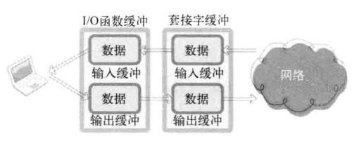

&emsp;&emsp;如上图，使用标准I/O函数传输数据时，经过2个缓冲。设置缓冲的主要目的是为了提高性能，但套接字中的缓冲主要是为了实现TCP协议而设立的。例如，TCP传输中丢失数据时将再次传递，而再次发生数据则保存在套接字的输出缓冲中。与之相反，使用标准I/O函数缓冲的主要目的是为了提高性能。

### 15.1 标准I/O函数

创建套接字时返回文件描述符，而为了使用标准I/O函数，只能将其转换为FILE结构体指针。

```c
#include <stdio.h>

FILE *fdopen(int fildes, const char *mode);
```

调用fdopen函数，成功时返回转换的FILE结构体指针，失败时返回NULL。

* fildes：需要转换的文件描述符。
* mode：将要创建的FILE结构体指针的模式(mode)信息。

desto.c

```c
#include <stdio.h>
#include <fcntl.h>	//open函数的头文件

int main(void)
{
   FILE *fp;
   int fd = open("./file/file.txt", O_WRONLY | O_CREAT | O_TRUNC);
   if (fd == -1)
   {
      fputs("file open error", stdout);
      return -1;
   }

   //将fd文件描述符转换为写模式的FILE指针
   fp = fdopen(fd, "w");
   fputs("Network C programming \n", fp);
   fclose(fp);

   return 0;
}
```

也可以利用fileno函数将FILE指针转换为文件描述符

```c
#include <stdio.h>

int fileno(FILE *stream);
```

调用fileno函数，成功时返回转换后的文件描述符，失败时返回-1。

todes.c

```c
#include <stdio.h>
#include <fcntl.h>

int main(void)
{
   FILE *fp;
   int fd = open("data.dat", O_WRONLY | O_CREAT | O_TRUNC);
   if (fd == -1)
   {
      fputs("file open error", stdout);
      return -1;
   }

   printf("First file descriptor: %d \n", fd);
   fp = fdopen(fd, "w");
   fputs("TCP/IP SOCKET PROGRAMMING \n", fp);
   printf("Second file descriptor: %d \n", fileno(fp));
   fclose(fp);
   
   return 0;
}
```

### 15.2 基于套接字的标准I/O函数使用

标准I/O函数为了提高性能，内部提供额外的缓冲。因此，若不调用fflush函数则无法保证立即将数据传输到客户端。

echo_stdserv.c

```c
#include <stdio.h>
#include <stdlib.h>
#include <string.h>
#include <unistd.h>
#include <arpa/inet.h>
#include <sys/socket.h>

#define BUF_SIZE 1024
void error_handling(char *message);

int main(int argc, char *argv[])
{
	int serv_sock, clnt_sock;
	char message[BUF_SIZE];
	int str_len, i;
	
	struct sockaddr_in serv_adr;
	struct sockaddr_in clnt_adr;
	socklen_t clnt_adr_sz;
	FILE * readfp;
	FILE * writefp;
	
	if(argc!=2) {
		printf("Usage : %s <port>\n", argv[0]);
		exit(1);
	}
	
	serv_sock=socket(PF_INET, SOCK_STREAM, 0);   
	if(serv_sock==-1)
		error_handling("socket() error");
	
	memset(&serv_adr, 0, sizeof(serv_adr));
	serv_adr.sin_family=AF_INET;
	serv_adr.sin_addr.s_addr=htonl(INADDR_ANY);
	serv_adr.sin_port=htons(atoi(argv[1]));

	if(bind(serv_sock, (struct sockaddr*)&serv_adr, sizeof(serv_adr))==-1)
		error_handling("bind() error");
	
	if(listen(serv_sock, 5)==-1)
		error_handling("listen() error");
	
	clnt_adr_sz=sizeof(clnt_adr);

	for(i=0; i<5; i++)
	{
		clnt_sock=accept(serv_sock, (struct sockaddr*)&clnt_adr, &clnt_adr_sz);
		if(clnt_sock==-1)
			error_handling("accept() error");
		else
			printf("Connected client %d \n", i+1);
	
		readfp=fdopen(clnt_sock, "r");
		writefp=fdopen(clnt_sock, "w");
	
		while(!feof(readfp))
		{
			fgets(message, BUF_SIZE, readfp);
			fputs(message, writefp);
			fflush(writefp);
		}
		fclose(readfp);
		fclose(writefp);
	}
	close(serv_sock);
	return 0;
}

void error_handling(char *message)
{
	fputs(message, stderr);
	fputc('\n', stderr);
	exit(1);
}
```

echo_stdclnt.c

```c
#include <stdio.h>
#include <stdlib.h>
#include <string.h>
#include <unistd.h>
#include <arpa/inet.h>
#include <sys/socket.h>

#define BUF_SIZE 1024
void error_handling(char *message);

int main(int argc, char *argv[])
{
	int sock;
	char message[BUF_SIZE];
	int str_len;
	struct sockaddr_in serv_adr;
	FILE * readfp;
	FILE * writefp;

	if(argc!=3) {
		printf("Usage : %s <IP> <port>\n", argv[0]);
		exit(1);
	}
	
	sock=socket(PF_INET, SOCK_STREAM, 0);   
	if(sock==-1)
		error_handling("socket() error");
	
	memset(&serv_adr, 0, sizeof(serv_adr));
	serv_adr.sin_family=AF_INET;
	serv_adr.sin_addr.s_addr=inet_addr(argv[1]);
	serv_adr.sin_port=htons(atoi(argv[2]));
	
	if(connect(sock, (struct sockaddr*)&serv_adr, sizeof(serv_adr))==-1)
		error_handling("connect() error!");
	else
		puts("Connected...........");

	readfp=fdopen(sock, "r");
	writefp=fdopen(sock, "w");	

	while(1) 
	{
		fputs("Input message(Q to quit): ", stdout);
		fgets(message, BUF_SIZE, stdin);
		if(!strcmp(message,"q\n") || !strcmp(message,"Q\n"))
			break;

		fputs(message, writefp);
		fflush(writefp);
 		fgets(message, BUF_SIZE, readfp);
		printf("Message from server: %s", message);
	}	
	fclose(writefp);
	fclose(readfp);
	return 0;
}

void error_handling(char *message)
{
	fputs(message, stderr);
	fputc('\n', stderr);
	exit(1);
}
```

## 16. 分离I/O流

前面已经介绍的基于文件描述符的分离流(shutdown函数)的目的：
* 通过分开输入过程(代码)和输出过程降低实现难度。
* 与输入无关的输出操作可以提高速度。

基于FILE指针的分离流的目的：
* 为了将FILE指针按读模式和写模式加以区分。
* 可以通过区分读写模式降低实现难度。
* 通过区分I/O缓冲提高缓冲性能。

### 16.1 文件描述符的复制和半关闭

sep_serv.c

```c
#include <stdio.h>
#include <stdlib.h>
#include <string.h>
#include <unistd.h>
#include <arpa/inet.h>
#include <sys/socket.h>
#define BUF_SIZE 1024

int main(int argc, char *argv[])
{
	int serv_sock, clnt_sock;
	FILE * readfp;
	FILE * writefp;
	
	struct sockaddr_in serv_adr, clnt_adr;
	socklen_t clnt_adr_sz;
	char buf[BUF_SIZE]={0,};

	serv_sock=socket(PF_INET, SOCK_STREAM, 0);
	memset(&serv_adr, 0, sizeof(serv_adr));
	serv_adr.sin_family=AF_INET;
	serv_adr.sin_addr.s_addr=htonl(INADDR_ANY);
	serv_adr.sin_port=htons(atoi(argv[1]));
	
	bind(serv_sock, (struct sockaddr*) &serv_adr, sizeof(serv_adr));
	listen(serv_sock, 5);
	clnt_adr_sz=sizeof(clnt_adr); 
	clnt_sock=accept(serv_sock, (struct sockaddr*)&clnt_adr,&clnt_adr_sz);
	
	//通过同一文件描述符(clnt_sock)，创建读和写模式的FILE指针。
	readfp=fdopen(clnt_sock, "r");
	writefp=fdopen(clnt_sock, "w");
	
	fputs("FROM SERVER: Hi~ client? \n", writefp);
	fputs("I love all of the world \n", writefp);
	fputs("You are awesome! \n", writefp);
	fflush(writefp);//通过fflush发生完写缓冲区的数据
	
	fclose(writefp);//看着像是关闭写的流，其实不是	
	fgets(buf, sizeof(buf), readfp); fputs(buf, stdout); 
	fclose(readfp);//看着像是关闭读的流，其实不是
	return 0;
}
```

sep_clnt.c

```c
#include <stdio.h>
#include <stdlib.h>
#include <string.h>
#include <unistd.h>
#include <arpa/inet.h>
#include <sys/socket.h>
#define BUF_SIZE 1024

int main(int argc, char *argv[])
{
	int sock;
	char buf[BUF_SIZE];
	struct sockaddr_in serv_addr;

	FILE * readfp;
	FILE * writefp;
	
	sock=socket(PF_INET, SOCK_STREAM, 0);
	memset(&serv_addr, 0, sizeof(serv_addr));
	serv_addr.sin_family=AF_INET;
	serv_addr.sin_addr.s_addr=inet_addr(argv[1]);
	serv_addr.sin_port=htons(atoi(argv[2]));
  
	connect(sock, (struct sockaddr*)&serv_addr, sizeof(serv_addr));
	readfp=fdopen(sock, "r");
	writefp=fdopen(sock, "w");
  
	while(1)
	{
		if(fgets(buf, sizeof(buf), readfp)==NULL) 
			break;
		fputs(buf, stdout);
		fflush(stdout);
	 }  

	fputs("FROM CLIENT: Thank you! \n", writefp);
	fflush(writefp);
	fclose(writefp); fclose(readfp);
	return 0;
}
```

&emsp;&emsp;通过上述代码可以知道，调用fclose函数完全终止了套接字，而不是半关闭。

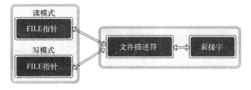

&emsp;&emsp;上述示例sep_serv.c中的读模式FILE指针和写模式FILE指针都是基于同一个文件描述符创建的。因此，针对任意一个FILE指针调用fclose函数时都会关闭文件描述符，也就是终止套接字。

&emsp;&emsp;可以通过复制创建另外一个文件描述符，然后利用各自的文件描述符生成读模式和写模式的FILE指针。如此套接字和文件描述符之间具有关系：**销毁所有文件描述符后才能销毁套接字。**

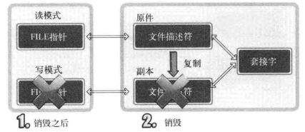


下面给出文件描述符的复制方法，通过下列2个函数之一完成：

```c
#include <unistd.h>

int dup(int fildes);
int dup2(int fildes, int fildes2);
```

调用上述任意一个函数，成功时返回复制的文件描述符，失败时返回-1。
* fildes：需要复制的文件描述符。
* fildes2：明确指定的文件描述符整数值。

dup2函数明确指定复制的文件描述符整数值。向其传递大于0且小于进程生成的最大文件描述符值时，该值将成为复制出的文件描述符值。

dup.c

```c
#include <stdio.h>
#include <unistd.h>

int main(int argc, char *argv[])
{
	int cfd1, cfd2;
	char str1[]="Hi~ \n";
	char str2[]="It's nice day~ \n";

	cfd1=dup(1);//标准输出
	cfd2=dup2(cfd1, 7);
	
	printf("fd1=%d, fd2=%d \n", cfd1, cfd2);
	write(cfd1, str1, sizeof(str1));
	write(cfd2, str2, sizeof(str2));
	
	close(cfd1);
	close(cfd2);

	//继续向标准输出流写数据
	write(1, str1, sizeof(str1));

	close(1);//关闭，此时已经关闭所有的标准输出流的套接字了
	
	//关闭后，继续向标准输入流中写数据，不起效果了
	write(1, str2, sizeof(str2));
	return 0;
}
```

复制文件描述符后"流"的分离，修改sep_serv.c。

sep_serv2.c

```c
#include <stdio.h>
#include <stdlib.h>
#include <string.h>
#include <unistd.h>
#include <arpa/inet.h>
#include <sys/socket.h>
#define BUF_SIZE 1024

int main(int argc, char *argv[])
{
	int serv_sock, clnt_sock;
	FILE * readfp;
	FILE * writefp;
	
	struct sockaddr_in serv_adr, clnt_adr;
	socklen_t clnt_adr_sz;
	char buf[BUF_SIZE]={0,};

	serv_sock=socket(PF_INET, SOCK_STREAM, 0);
	memset(&serv_adr, 0, sizeof(serv_adr));
	serv_adr.sin_family=AF_INET;
	serv_adr.sin_addr.s_addr=htonl(INADDR_ANY);
	serv_adr.sin_port=htons(atoi(argv[1]));
	
	bind(serv_sock, (struct sockaddr*) &serv_adr, sizeof(serv_adr));
	listen(serv_sock, 5);
	clnt_adr_sz=sizeof(clnt_adr); 
	clnt_sock=accept(serv_sock, (struct sockaddr*)&clnt_adr,&clnt_adr_sz);
	
	readfp=fdopen(clnt_sock, "r");
	writefp=fdopen(dup(clnt_sock), "w");
	
	fputs("FROM SERVER: Hi~ client? \n", writefp);
	fputs("I love all of the world \n", writefp);
	fputs("You are awesome! \n", writefp);
	fflush(writefp);
	
	//针对fileno函数返回的文件描述符调用shutdown函数，服务器端进入半关闭状态，并向客户端发送EOF。
	shutdown(fileno(writefp), SHUT_WR);

	/**
	 * 针对上述操作，调用close函数EOF不能成功发送到客户端。
	 * 原因：销毁所有文件描述符后才能销毁套接字；如此才发送EOF
	 */
	// close(fileno(writefp));

	fclose(writefp);//这个方法只是关闭套接字而已
	
	fgets(buf, sizeof(buf), readfp); fputs(buf, stdout); 
	fclose(readfp);
	return 0;
}
```

> 调用shutdown函数时，无论复制出多少文件描述符都进入半关闭状态，同时传递EOF。

## 17. 优于select的epoll

### 17.1 实现epoll时必要的函数和结构体

* epoll_create：创建保存epoll文件描述符的空间。
* epoll_ctl：向空间注册并注销文件描述符。
* epoll_wait：与select函数类似，等待文件描述符发送变化。

**epoll_create函数：**

```c
#include <sys/epoll.h>

int epoll_create(int size);
```

调用epoll_create函数，成功时返回epoll文件描述符，失败返回-1。
* size：epoll实例的大小。

&emsp;&emsp;调用epoll_create函数时创建的文件描述符保存空间称为"epoll例程"。通过参数size传递的值决定epoll例程的大小，但该值只是向操作系统提的建议。换言之，size并非用来决定epoll例程的大小，而仅供操作系统参考。

&emsp;&emsp;epoll_create函数创建的资源与套接字相同，也由操作系统管理。因此，该函数和创建套接字的情况相同，也会返回文件描述符。也就是说，该函数返回的文件描述符主要与于区别epoll例程。需要终止时，与其他文件描述符相同，也要调用close函数。

**epoll_ctl函数：**

&emsp;&emsp;生成epoll例程后，应在其内部注册监视对象文件描述符，此时使用epoll_ctl函数。

```c
#include <sys/epoll.h>

int epoll_ctl(int epfd, int op, int fd, struct epoll_event *event);
```

调用epoll_ctl函数，成功时返回0，失败返回-1。

* epfd：用于注册监视器对象的epoll例程的文件描述符。
* op：用于指定监视对象的添加、删除或更改等操作。
* fd：需要注册的监视对象文件描述符。
* event：监视对象的事件类型。

epoll_ctl函数，第二个参数op传递的常量及含义：

* EPOLL_CTL_ADD：将文件描述符注册到epoll例程。
* EPOLL_CTL_DEL：从epoll例程中删除文件描述符。
* EPOLL_CTL_MOD：更改注册的文件描述符的关注事件发生情况。

epoll_event的成员events中可以保存的常量及所指的事件类型：

* EPOLLIN：需要读取数据的情况。
* EPOLLOUT：输出缓冲为空，可以立即发送数据的情况。
* EPOLLPRI：收到OOB数据的情况
* EPOLLRDHUP：断开连接或半关闭的情况，这在边缘触发方式下非常有用。
* EPOLLERR：发送错误的情况。
* EPOLLET：以边缘触发的方式得到事件通知。
* EPOLLONESHOT：发生一次事件后，相关文件描述符不再收到事件通知。因此需要向epoll_ctl函数的第二个参数传递EPOLL_CTL_MOD，再次设置事件。

epoll通过结构体epoll_event将发送变化的(发生事件的)文件描述符单独集中到一起。

```c
struct epoll_event {
	__uint32_t events;
	epoll_data_t data;
}

typedef union epoll_data {
	void *ptr;
	int fd;
	__uint32_t u32;
	__uint64_t u64;
} epoll_data_t;
```

声明足够大的epoll_event结构体数组后，传递给epoll_wait函数时，发生变化的文件描述符信息将被填入该数组。

**epoll_wait函数：**

```c
#include <sys/epoll.h>

int epoll_wait(int epfd, struct epoll_event *events, int maxevents, int timeout);
```

调用epoll_wait函数，成功时返回发生事件的文件描述符数量，失败时返回-1。

* epfd：表示事件发生监视范围的epoll例程的文件描述符。
* events：保存发生事件的文件描述符集合的结构体地址值。
* maxevents：第二个参数中可以保存的最大事件数。
* timeout：以1/1000秒为单位的等待时间，传递-1时，一直等待直到发生事件。

&emsp;

**基于epoll的回声服务器端：**

echo_epollserv.c

```c
#include <stdio.h>
#include <stdlib.h>
#include <string.h>
#include <unistd.h>
#include <arpa/inet.h>
#include <sys/socket.h>
#include <sys/epoll.h>

#define BUF_SIZE 100
#define EPOLL_SIZE 50
void error_handling(char *buf);

int main(int argc, char *argv[])
{
	int serv_sock, clnt_sock;
	struct sockaddr_in serv_adr, clnt_adr;
	socklen_t adr_sz;
	int str_len, i;
	char buf[BUF_SIZE];

	struct epoll_event *ep_events;
	struct epoll_event event;
	int epfd, event_cnt;

	if (argc != 2)
	{
		printf("Usage : %s <port>\n", argv[0]);
		exit(1);
	}

	serv_sock = socket(PF_INET, SOCK_STREAM, 0);
	memset(&serv_adr, 0, sizeof(serv_adr));
	serv_adr.sin_family = AF_INET;
	serv_adr.sin_addr.s_addr = htonl(INADDR_ANY);
	serv_adr.sin_port = htons(atoi(argv[1]));

	if (bind(serv_sock, (struct sockaddr *)&serv_adr, sizeof(serv_adr)) == -1)
		error_handling("bind() error");
	if (listen(serv_sock, 5) == -1)
		error_handling("listen() error");

	//创建epoll例程
	epfd = epoll_create(EPOLL_SIZE);
	//监听的事件个数
	ep_events = malloc(sizeof(struct epoll_event) * EPOLL_SIZE);

	//注册serv_sock的可读事件(建立连接的请求)
	event.events = EPOLLIN;
	event.data.fd = serv_sock;
	epoll_ctl(epfd, EPOLL_CTL_ADD, serv_sock, &event);

	while (1)
	{
		//一直等待直到发生事件才返回
		event_cnt = epoll_wait(epfd, ep_events, EPOLL_SIZE, -1);
		if (event_cnt == -1)
		{
			puts("epoll_wait() error");
			break;
		}

		//处理发生的事件
		for (i = 0; i < event_cnt; i++)
		{
			//建立连接事件
			if (ep_events[i].data.fd == serv_sock)
			{
				adr_sz = sizeof(clnt_adr);
				clnt_sock =
					accept(serv_sock, (struct sockaddr *)&clnt_adr, &adr_sz);
				
				//注册刚建立连接的客户端的可读事件
				event.events = EPOLLIN;
				event.data.fd = clnt_sock;
				epoll_ctl(epfd, EPOLL_CTL_ADD, clnt_sock, &event);

				printf("connected client: %d \n", clnt_sock);
			}
			//客户端(clnt_sock)的可读事件
			else
			{
				str_len = read(ep_events[i].data.fd, buf, BUF_SIZE);
				if (str_len == 0) // close request!
				{
					//将clnt_sock从epoll例程中移除
					epoll_ctl(
						epfd, EPOLL_CTL_DEL, ep_events[i].data.fd, NULL);

					close(ep_events[i].data.fd);
					printf("closed client: %d \n", ep_events[i].data.fd);
				}
				else
				{
					write(ep_events[i].data.fd, buf, str_len); // echo!
				}
			}
		}
	}
	
	//移除serv_sock，没必要
	epoll_ctl(epfd, EPOLL_CTL_DEL, serv_sock, NULL);

	close(serv_sock);
	close(epfd);
	return 0;
}

void error_handling(char *buf)
{
	fputs(buf, stderr);
	fputc('\n', stderr);
	exit(1);
}
```

客户端继续使用之前的。

echo_client.c

```c
#include <stdio.h>
#include <stdlib.h>
#include <string.h>
#include <unistd.h>
#include <arpa/inet.h>
#include <sys/socket.h>

#define BUF_SIZE 1024
void error_handling(char *message);

int main(int argc, char *argv[])
{
	int sock;
	char message[BUF_SIZE];
	int str_len;
	struct sockaddr_in serv_adr;

	if(argc!=3) {
		printf("Usage : %s <IP> <port>\n", argv[0]);
		exit(1);
	}
	
	sock=socket(PF_INET, SOCK_STREAM, 0);   
	if(sock==-1)
		error_handling("socket() error");
	
	memset(&serv_adr, 0, sizeof(serv_adr));
	serv_adr.sin_family=AF_INET;
	serv_adr.sin_addr.s_addr=inet_addr(argv[1]);
	serv_adr.sin_port=htons(atoi(argv[2]));
	
	if(connect(sock, (struct sockaddr*)&serv_adr, sizeof(serv_adr))==-1)
		error_handling("connect() error!");
	else
		puts("Connected...........");
	
	while(1) {
		fputs("Input message(Q to quit): ", stdout);
		fgets(message + 4, BUF_SIZE - 4 - 1, stdin);
		
		if(!strcmp(message + 4,"q\n") || !strcmp(message + 4,"Q\n"))
			break;

		// *((int *)message) = strlen(message + 4);

		int message_len = strlen(message + 4);
		message[0] = (message_len >> 24) & 0xFF;
		message[1] = (message_len >> 16) & 0xFF;
		message[2] = (message_len >> 8) & 0xFF;
		message[3] = (message_len >> 0) & 0xFF;
		
		//发生数据给服务端
		write(sock, message, message_len + 4);

		// printf("%d %d %d %d\n", message[0],message[1],message[2],message[3]);
		// printf("%s\n", message + 4);

		//先接收客户端一次发送的数据长度
		int size = 0;
		while(size != 4) {
			int len = read(sock, message + size, 4 - size);
			if(len == -1) {
				error_handling("read() error!");
			}
			size += len;
		}

		int str_size = (message[0] << 24) + (message[1] << 16) + (message[2] << 8) + (message[3] << 0);

		str_len = 0;
		while(str_len != str_size) {
			int len = read(sock, message + size + str_len, str_size - str_len);
			if(len == -1) {
				error_handling("read() error!");
			}
			str_len += len;
		}
		
		message[str_size + 4] = 0;
		printf("Message from server: %s", message + 4);
	}
	
	close(sock);
	return 0;
}

void error_handling(char *message)
{
	fputs(message, stderr);
	fputc('\n', stderr);
	exit(1);
}
```

### 17.2 条件触发和边缘触发

假设监听的是某个文件描述符的可读事件，在条件触发方式中，只要输入缓冲中还剩有数据，就将以事件方式再次注册；而在边缘触发中输入缓冲收到到数据时仅注册1次该事件，即使输入缓冲中还留由数据，也不会再进行注册。

> epoll默认以条件触发方式工作。

**条件触发方式工作：**

echo_EPLTserv.c

```c
#include <stdio.h>
#include <stdlib.h>
#include <string.h>
#include <unistd.h>
#include <fcntl.h>
#include <arpa/inet.h>
#include <sys/socket.h>
#include <sys/epoll.h>

#define BUF_SIZE 4
#define EPOLL_SIZE 50
void error_handling(char *buf);

int main(int argc, char *argv[])
{
	int serv_sock, clnt_sock;
	struct sockaddr_in serv_adr, clnt_adr;
	socklen_t adr_sz;
	int str_len, i;
	char buf[BUF_SIZE];

	struct epoll_event *ep_events;
	struct epoll_event event;
	int epfd, event_cnt;

	if (argc != 2)
	{
		printf("Usage : %s <port>\n", argv[0]);
		exit(1);
	}

	serv_sock = socket(PF_INET, SOCK_STREAM, 0);
	memset(&serv_adr, 0, sizeof(serv_adr));
	serv_adr.sin_family = AF_INET;
	serv_adr.sin_addr.s_addr = htonl(INADDR_ANY);
	serv_adr.sin_port = htons(atoi(argv[1]));

	if (bind(serv_sock, (struct sockaddr *)&serv_adr, sizeof(serv_adr)) == -1)
		error_handling("bind() error");
	if (listen(serv_sock, 5) == -1)
		error_handling("listen() error");

	epfd = epoll_create(EPOLL_SIZE);
	ep_events = malloc(sizeof(struct epoll_event) * EPOLL_SIZE);

	event.events = EPOLLIN; //默认条件触发
	event.data.fd = serv_sock;
	epoll_ctl(epfd, EPOLL_CTL_ADD, serv_sock, &event);

	while (1)
	{
		event_cnt = epoll_wait(epfd, ep_events, EPOLL_SIZE, -1);
		if (event_cnt == -1)
		{
			puts("epoll_wait() error");
			break;
		}

		puts("return epoll_wait");
		for (i = 0; i < event_cnt; i++)
		{
			if (ep_events[i].data.fd == serv_sock)
			{
				adr_sz = sizeof(clnt_adr);
				clnt_sock = accept(serv_sock, (struct sockaddr *)&clnt_adr, &adr_sz);
				event.events = EPOLLIN;
				event.data.fd = clnt_sock;
				epoll_ctl(epfd, EPOLL_CTL_ADD, clnt_sock, &event);
				printf("connected client: %d \n", clnt_sock);
			}
			else
			{
				/**
				 * 减小缓冲大小，阻止一次性读取接收的数据；
				 * 这个就不会一次性把读缓冲区的数据处理完
				 */
				str_len = read(ep_events[i].data.fd, buf, BUF_SIZE);
				if (str_len == 0) // close request!
				{
					epoll_ctl(epfd, EPOLL_CTL_DEL, ep_events[i].data.fd, NULL);
					close(ep_events[i].data.fd);
					printf("closed client: %d \n", ep_events[i].data.fd);
				}
				else
				{
					write(ep_events[i].data.fd, buf, str_len); // echo!
				}
			}
		}
	}

	close(serv_sock);
	close(epfd);
	free(ep_events);

	return 0;
}

void error_handling(char *buf)
{
	fputs(buf, stderr);
	fputc('\n', stderr);
	exit(1);
}
```

**边缘触发方式工作：**

echo_EPETserv.c

```c
#include <stdio.h>
#include <stdlib.h>
#include <string.h>
#include <unistd.h>
#include <fcntl.h>
#include <arpa/inet.h>
#include <sys/socket.h>
#include <sys/epoll.h>

#define BUF_SIZE 4
#define EPOLL_SIZE 50
void error_handling(char *buf);

int main(int argc, char *argv[])
{
	int serv_sock, clnt_sock;
	struct sockaddr_in serv_adr, clnt_adr;
	socklen_t adr_sz;
	int str_len, i;
	char buf[BUF_SIZE];

	struct epoll_event *ep_events;
	struct epoll_event event;
	int epfd, event_cnt;

	if (argc != 2)
	{
		printf("Usage : %s <port>\n", argv[0]);
		exit(1);
	}

	serv_sock = socket(PF_INET, SOCK_STREAM, 0);
	memset(&serv_adr, 0, sizeof(serv_adr));
	serv_adr.sin_family = AF_INET;
	serv_adr.sin_addr.s_addr = htonl(INADDR_ANY);
	serv_adr.sin_port = htons(atoi(argv[1]));

	if (bind(serv_sock, (struct sockaddr *)&serv_adr, sizeof(serv_adr)) == -1)
		error_handling("bind() error");
	if (listen(serv_sock, 5) == -1)
		error_handling("listen() error");

	epfd = epoll_create(EPOLL_SIZE);
	ep_events = malloc(sizeof(struct epoll_event) * EPOLL_SIZE);

	event.events = EPOLLIN; //默认条件触发
	event.data.fd = serv_sock;
	epoll_ctl(epfd, EPOLL_CTL_ADD, serv_sock, &event);

	while (1)
	{
		event_cnt = epoll_wait(epfd, ep_events, EPOLL_SIZE, -1);
		if (event_cnt == -1)
		{
			puts("epoll_wait() error");
			break;
		}

		puts("return epoll_wait");
		for (i = 0; i < event_cnt; i++)
		{
			if (ep_events[i].data.fd == serv_sock)
			{
				adr_sz = sizeof(clnt_adr);
				clnt_sock = accept(serv_sock, (struct sockaddr *)&clnt_adr, &adr_sz);
				event.events = EPOLLIN | EPOLLET;	//设置客户端为边缘触发
				event.data.fd = clnt_sock;
				epoll_ctl(epfd, EPOLL_CTL_ADD, clnt_sock, &event);
				printf("connected client: %d \n", clnt_sock);
			}
			else
			{
				/**
				 * 减小缓冲大小，阻止一次性读取接收的数据；
				 * 这个就不会一次性把读缓冲区的数据处理完
				 */
				str_len = read(ep_events[i].data.fd, buf, BUF_SIZE);
				if (str_len == 0) // close request!
				{
					epoll_ctl(epfd, EPOLL_CTL_DEL, ep_events[i].data.fd, NULL);
					close(ep_events[i].data.fd);
					printf("closed client: %d \n", ep_events[i].data.fd);
				}
				else
				{
					write(ep_events[i].data.fd, buf, str_len); // echo!
				}
			}
		}
	}

	close(serv_sock);
	close(epfd);
	free(ep_events);

	return 0;
}

void error_handling(char *buf)
{
	fputs(buf, stderr);
	fputc('\n', stderr);
	exit(1);
}
```

### 17.3 基于边缘触发的回声服务器端

**实现边缘触发的必知内容：**

* 通过errno变量验证错误原因。
* 为了完成非阻塞(Non-blocking)I/O，更改套接字特性。

&emsp;&emsp;Linux的套接字相关函数一般公共返回-1通知发生了错误。虽然知道发生了错误，但仅凭这些内容无法得知产生错误的原因。因此，为了在发生错误时提供额外的信息，Linux声明了一个全局变量：`int errno;`

&emsp;&emsp;为了访问该变量，需要引用`error.h`头文件，因为此头文件中有变量extern的声明。每种函数发生错误时，保存到errno变量中的值都不同。如：

&emsp;&emsp;*"read函数发现输入缓冲中没有数据可读时，返回-1，同时在errno中保存EAGAIN变量。"*

**Linux提供更改或读取文件属性的方法：**

```c
#include <fcntl.h>

int fcntl(int filedes, int cmd, ...);
```

调用fcntl函数，成功时返回cmd参数相关值，失败返回-1。

* filedes：属性更改目标的文件描述符。
* cmd：表示函数调用的目的。

从上述声明中可以看到，fcntl具有可变参数的新式。如果向第二个参数传递`F_GETFL`，可以获得第一个参数所指向的文件描述符属性(int类型)。反之，如果传递`F_SETFL`，可以更改文件描述符属性。如下，将文件(套接字)改成非阻塞模式：

```c
int flag = fcntl(fd, F_GETFL, 0);	//获取之前设置的属性信息
fcntl(fd, F_SETFL, flag | O_NONBLCOK);	//在原有的属性(flag)的基础上加上非阻塞(O_NONBLCOK)标记
```

实现边缘触发的回声服务器端：

```c
#include <stdio.h>
#include <stdlib.h>
#include <string.h>
#include <unistd.h>
#include <fcntl.h>
#include <errno.h>
#include <arpa/inet.h>
#include <sys/socket.h>
#include <sys/epoll.h>

#define BUF_SIZE 4	//为了验证边缘触发的工作方式，将缓冲区设置小一点
#define EPOLL_SIZE 50
void setnonblockingmode(int fd);
void error_handling(char *buf);

int main(int argc, char *argv[])
{
	int serv_sock, clnt_sock;
	struct sockaddr_in serv_adr, clnt_adr;
	socklen_t adr_sz;
	int str_len, i;
	char buf[BUF_SIZE];

	struct epoll_event *ep_events;
	struct epoll_event event;
	int epfd, event_cnt;

	if (argc != 2)
	{
		printf("Usage : %s <port>\n", argv[0]);
		exit(1);
	}

	serv_sock = socket(PF_INET, SOCK_STREAM, 0);
	memset(&serv_adr, 0, sizeof(serv_adr));
	serv_adr.sin_family = AF_INET;
	serv_adr.sin_addr.s_addr = htonl(INADDR_ANY);
	serv_adr.sin_port = htons(atoi(argv[1]));

	if (bind(serv_sock, (struct sockaddr *)&serv_adr, sizeof(serv_adr)) == -1)
		error_handling("bind() error");
	if (listen(serv_sock, 5) == -1)
		error_handling("listen() error");

	epfd = epoll_create(EPOLL_SIZE);
	ep_events = malloc(sizeof(struct epoll_event) * EPOLL_SIZE);

	setnonblockingmode(serv_sock);
	event.events = EPOLLIN;
	event.data.fd = serv_sock;
	epoll_ctl(epfd, EPOLL_CTL_ADD, serv_sock, &event);

	while (1)
	{
		event_cnt = epoll_wait(epfd, ep_events, EPOLL_SIZE, -1);
		if (event_cnt == -1)
		{
			puts("epoll_wait() error");
			break;
		}

		puts("return epoll_wait");
		for (i = 0; i < event_cnt; i++)
		{
			if (ep_events[i].data.fd == serv_sock)
			{
				adr_sz = sizeof(clnt_adr);
				clnt_sock = accept(serv_sock, (struct sockaddr *)&clnt_adr, &adr_sz);
				setnonblockingmode(clnt_sock);	//将客户端描述符(clnt_sock)设置为非阻塞
				event.events = EPOLLIN | EPOLLET;//设置为可读的边缘触发方式
				event.data.fd = clnt_sock;
				epoll_ctl(epfd, EPOLL_CTL_ADD, clnt_sock, &event);
				printf("connected client: %d \n", clnt_sock);
			}
			else
			{
				//每次触发边缘可读事件，都发客户端描述符(clnt_sock)中缓冲区的数据读完(read() < 0)
				while (1)
				{
					str_len = read(ep_events[i].data.fd, buf, BUF_SIZE);
					if (str_len == 0) // close request!
					{
						epoll_ctl(epfd, EPOLL_CTL_DEL, ep_events[i].data.fd, NULL);
						close(ep_events[i].data.fd);
						printf("closed client: %d \n", ep_events[i].data.fd);
						break;
					}
					else if (str_len < 0)
					{
						//read函数返回-1，变量errno中的值为EAGAIN时，说明没有数据可读。
						if (errno == EAGAIN)
							break;
					}
					else
					{
						write(ep_events[i].data.fd, buf, str_len); // echo!
					}
				}
			}
		}
	}
	close(serv_sock);
	close(epfd);
	return 0;
}

void setnonblockingmode(int fd)
{
	int flag = fcntl(fd, F_GETFL, 0);
	fcntl(fd, F_SETFL, flag | O_NONBLOCK);
}
void error_handling(char *buf)
{
	fputs(buf, stderr);
	fputc('\n', stderr);
	exit(1);
}
```

> 边缘触发方式可以做到："可以分离接收数据和处理数据的时间点！"

## 18. 多线程服务器端的实现

### 18.1 线程的创建即运行

**pthread_create函数：**

```c
#include <pthread.h>

int pthread_create(
	pthread_t * restrict thread, const pthread_attr_t * restrict attr, 
	void * (* start_routine)(void *), void * restrict arg
);
```

调用pthread_create函数，成功时返回0，失败时返回其他值。

* thread：保存新创建线程ID的变量地址值。线程与进程相同，也需要用于区别不同线程的ID。
* attr：用于传递进程属性的参数，传递NULL时，创建默认属性的线程。
* start_routine：先当与线程main函数的、在单独执行流中执行的函数地址值(函数指针)。
* arg：通过第三个参数传递调用函数时包含传递参数信息的变量地址值。

**简单示例：**

thread1.c

```c
#include <stdio.h>
#include <pthread.h>

void *thread_main(void *arg);

int main(int argc, char *argv[])
{
	pthread_t t_id;
	int thread_param = 5;

	if (pthread_create(&t_id, NULL, thread_main, (void *)&thread_param) != 0)
	{
		puts("pthread_create() error");
		return -1;
	};

	sleep(10);

	puts("end of main");
	return 0;
}

void *thread_main(void *arg)
{
	int i;
	int cnt = *((int *)arg);
	for (i = 0; i < cnt; i++)
	{
		sleep(1);
		puts("running thread");
	}

	return NULL;
}
```

> 由于pthread库不是标准linux库，所有线程线管代码在编译时需要添加`-lpthread`选项声明需要连接线程库，只有这样才能调用头文件pthread.h中声明的函数。

**pthread_join函数：**

可以通过调用pthread函数，调用函数的进程(或线程)将进入等待状态，知道第一个参数为ID的线程终止为止。

```c
#include <pthread.h>

int pthread_join(pthread_t thread, void **status);
```

调用pthread_join函数，成功时返回0，失败时返回其他值。

* thread：该参数值ID的线程终止后才会从该函数返回。
* status：保存线程的main函数返回值的指针变量地址值。

thread2.c

```c
#include <stdio.h>
#include <stdlib.h>
#include <string.h>
#include <pthread.h>
void* thread_main(void *arg);

int main(int argc, char *argv[]) 
{
	pthread_t t_id;
	int thread_param=5;
	void * thr_ret;
	
	if(pthread_create(&t_id, NULL, thread_main, (void*)&thread_param)!=0)
	{
		puts("pthread_create() error");
		return -1;
	}; 	

	//thr_ret保存的是线程函数thread_main的返回值
	if(pthread_join(t_id, &thr_ret)!=0)
	{
		puts("pthread_join() error");
		return -1;
	};

	printf("Thread return message: %s \n", (char*)thr_ret);
	free(thr_ret);
	return 0;
}

void* thread_main(void *arg) 
{
	int i;
	int cnt=*((int*)arg);
	char * msg=(char *)malloc(sizeof(char)*50);
	strcpy(msg, "Hello, I'am thread~ \n");

	for(i=0; i<cnt; i++)
	{
		sleep(1);  puts("running thread");	 
	}
	return (void*)msg;
}
```

### 18.2 线程同步

需要同步的情况可以从如下两个方面考虑：

* 同时访问同一内存空间时发生的情况。
* 需要指定访问同一内存空间的线程执行顺序的情况。

**互斥量：**

> 同时访问的线程同步。

```c
#include <pthread.h>

int pthread_mutex_init(pthread_mutex_t *mutex, const pthread_mutexattr_t *attr);
int pthread_mutex_destroy(pthread_mutex_t *mutex);
```

调用上面两个函数，成功时返回0，失败时返回其他值。

* mutex：创建互斥量时传递保护互斥量的变量地址值，销毁时传递需要销毁的互斥量地址值。
* attr：传递即将创建的互斥量属性，**没有特别需要指定的属性时传递NULL。**

从上述函数声明中可以看出，为了创建相当于锁系统的互斥量，需要声明pthread_mutex_t型变量：`pthread_mutex_t mutex;`

该变量的地址将传递给pthread_mutex_init函数，用来保存操作系统创建的互斥量(锁系统)。调用pthread_mutex_destroy函数时同样需要该信息。如果不需要配置特殊的互斥量属性，则向第二个参数传递NULL时，可以利用PTHREAD_MUTEX_INITLALIZER宏进行声明：`pthread_mutex_t mutex = PTHREAD_MUTEX_INITLALIZER;`

推荐使用pthread_mutex_init函数进行初始化，因为通过宏进行初始化时很难发现发生的错误。

```c
#include <pthread.h>

int pthread_mutex_lock(pthread_mutex_t *mutex);
int pthread_mutex_unlock(pthread_mutex_t *mutex);
```

调用上面两个函数，成功时返回0，失败时返回其他值。

> 进入临界区前调用的函数就是pthread_mutex_lock。调用该函数时，发现其他线程进入临界区，则pthread_mutex_lock函数不会返回，直到里面的线程调用pthread_mutex_unlock函数退出临界区为止。

**创建好互斥量的前提下，可以通过如下结构保护临界区：**

```c
pthread_mutex_lock(&mutex);
//临界区的开始
//......
//临界区的结束
pthread_mutex_unlock(&mutex);
```

如果未能即使的调用pthread_mutex_unlock函数，那么其他为了进入临界区而调用pthread_mutex_lock函数的线程就无法摆脱阻塞状态。这种情况称为"死锁"(Dead-lock)。

mutex.c

```c
#include <stdio.h>
#include <unistd.h>
#include <stdlib.h>
#include <pthread.h>
#define NUM_THREAD 100

void *thread_inc(void *arg);
void *thread_des(void *arg);

long long num = 0;
pthread_mutex_t mutex;//互斥量

int main(int argc, char *argv[])
{
	//创建NUM_THREAD个线程id
	pthread_t thread_id[NUM_THREAD];
	int i;

	//初始化互斥量(mutex)
	pthread_mutex_init(&mutex, NULL);

	for (i = 0; i < NUM_THREAD; i++)
	{
		if (i % 2)
			pthread_create(&(thread_id[i]), NULL, thread_inc, NULL);
		else
			pthread_create(&(thread_id[i]), NULL, thread_des, NULL);
	}

	for (i = 0; i < NUM_THREAD; i++)
		pthread_join(thread_id[i], NULL);

	printf("result: %lld \n", num);
	pthread_mutex_destroy(&mutex);
	return 0;
}

void *thread_inc(void *arg) {

	pthread_mutex_lock(&mutex);
	for (int i = 0; i < 50000000; i++) {
		num += 1;
	}
	pthread_mutex_unlock(&mutex);

	return NULL;
}

void *thread_des(void *arg) {

	pthread_mutex_lock(&mutex);
	for (int i = 0; i < 50000000; i++) {
		num -= 1;
	}
	pthread_mutex_unlock(&mutex);

	return NULL;
}
```

> 互斥量lock、unlock函数的调用过程要比想象中花费更长时间。最大限度减少互斥量lock、unlock函数的调用次数。

**信号量：**

> 控制顺序的线程同步。

```c
#include <semaphore.h>

int sem_init(sem_t *sem, int pshared, unsigned int value);
int sem_destroy(sem_t *sem);
```

调用上面两个函数，成功时返回0，失败时返回其他值。

* sem：创建信号量时传递保存信号量的变量地址值，销毁时传递需要销毁的信号量变量地址值。
* pshared：传递其他值时，创建可由多个进程共享的信号量；传递0时，创建只允许1个进程内部使用的信号量。**我们需要完成同一进程内的线程同步，故传递0。**
* value：指定新创建的信号量初始值。

```c
#include <semaphore.h>

int sem_post(sem_t *sem);
int sem_wait(sem_t *sem);
```

调用上面两个函数时，成功返回0，失败时返回其他值。

* sem：传递保存信号量读取值的变量地址值，传递给sem_post时信号量增1，传递给sem_wait时信号量减1。

调用sem_init函数时，操作系统将创建信号量对象，此对象中记录着"信号量值"(Semaphore Value)整数。该值在调用sem_post函数时曾1，调用sem_wait函数时减1。但信号量的值不能小于0，因此，在信号量为0的情况下调用sem_wait函数时，调用函数的线程将进入阻塞状态(因为函数未返回)。当然，此时如果有其他线程调用sem_post函数，信号量的值将变为1，而原本阻塞的线程可以将该信号量重新减为0并跳出阻塞状态。

```c
sem_wait(&sem);	//信号量变为0...
//临界区的开始
//....
//临界区的结束
sem_post(&sem);	//信号量变为1...
```

示例场景如下：

&emsp;&emsp;"线程A从用户输入得到值后存入全局变量num，此时线程B将取走该值并累加。该过程共进行5次，完成后输出总和并退出程序。"

semaphore.c

```c
#include <stdio.h>
#include <pthread.h>
#include <semaphore.h>

void * read(void * arg);
void * accu(void * arg);

static sem_t sem_put;
static sem_t sem_get;
static int num;

int main(int argc, char *argv[])
{
	pthread_t id_t1, id_t2;
	sem_init(&sem_put, 0, 0);
	sem_init(&sem_get, 0, 1);

	pthread_create(&id_t1, NULL, read, NULL);
	pthread_create(&id_t2, NULL, accu, NULL);

	pthread_join(id_t1, NULL);
	pthread_join(id_t2, NULL);

	sem_destroy(&sem_put);
	sem_destroy(&sem_get);
	return 0;
}

void * read(void * arg)
{
	int i;
	for(i=0; i<5; i++)
	{
		fputs("Input num: ", stdout);

		sem_wait(&sem_get);	//减1
		scanf("%d", &num);
		sem_post(&sem_put);	//加1
	}
	return NULL;	
}

void * accu(void * arg)
{
	int sum=0, i;
	for(i=0; i<5; i++)
	{
		sem_wait(&sem_put);//减1
		sum+=num;
		sem_post(&sem_get);//加1
	}
	printf("Result: %d \n", sum);
	return NULL;
}
```

### 18.3 线程的销毁和多线程并发服务器端的实现

通常通过如下函数进行引导线程销毁：

```c
#include <pthread.h>

int pthread_detach(pthread_t thread);
```

调用pthread_detach函数，成功时返回0，失败时返回其他值。

* thread：终止的同时需要销毁的线程ID。

调用pthread_detach函数不会引起线程终止或进入阻塞状态，可以通过该函数引导销毁线程创建的内存空间。**调用该函数后，不能再针对相应线程调用pthread_join函数**

> 将线程的状态设置为detached，则该线程运行结束后会自动释放所有资源。 

**多线程并发的实现：**

chat_server.c

```c
#include <stdio.h>
#include <stdlib.h>
#include <unistd.h>
#include <string.h>
#include <arpa/inet.h>
#include <sys/socket.h>
#include <netinet/in.h>
#include <pthread.h>

#define BUF_SIZE 100
#define MAX_CLNT 256

void *handle_clnt(void *arg);
void send_msg(char *msg, int len, int clnt_sock);
void error_handling(char *msg);

int clnt_cnt = 0;
int clnt_socks[MAX_CLNT];
pthread_mutex_t mutx;

int main(int argc, char *argv[])
{
	int serv_sock, clnt_sock;
	struct sockaddr_in serv_adr, clnt_adr;
	int clnt_adr_sz;
	pthread_t t_id;
	if (argc != 2)
	{
		printf("Usage : %s <port>\n", argv[0]);
		exit(1);
	}

	pthread_mutex_init(&mutx, NULL);
	serv_sock = socket(PF_INET, SOCK_STREAM, 0);

	memset(&serv_adr, 0, sizeof(serv_adr));
	serv_adr.sin_family = AF_INET;
	serv_adr.sin_addr.s_addr = htonl(INADDR_ANY);
	serv_adr.sin_port = htons(atoi(argv[1]));

	if (bind(serv_sock, (struct sockaddr *)&serv_adr, sizeof(serv_adr)) == -1)
		error_handling("bind() error");
	if (listen(serv_sock, 5) == -1)
		error_handling("listen() error");

	while (1)
	{
		clnt_adr_sz = sizeof(clnt_adr);
		clnt_sock = accept(serv_sock, (struct sockaddr *)&clnt_adr, &clnt_adr_sz);

		//保存clnt_sock
		pthread_mutex_lock(&mutx);
		clnt_socks[clnt_cnt++] = clnt_sock;
		pthread_mutex_unlock(&mutx);

		pthread_create(&t_id, NULL, handle_clnt, (void *)&clnt_sock);
		pthread_detach(t_id);
		printf("Connected client IP: %s \n", inet_ntoa(clnt_adr.sin_addr));
	}
	close(serv_sock);
	return 0;
}

void *handle_clnt(void *arg)
{
	int clnt_sock = *((int *)arg);
	int str_len = 0, i;
	char msg[BUF_SIZE];

	while ((str_len = read(clnt_sock, msg, sizeof(msg))) != 0)
		send_msg(msg, str_len, clnt_sock);

	pthread_mutex_lock(&mutx);
	for (i = 0; i < clnt_cnt; i++) // remove disconnected client
	{
		if (clnt_sock == clnt_socks[i])
		{
			while (i++ < clnt_cnt - 1)
				clnt_socks[i] = clnt_socks[i + 1];
			break;
		}
	}
	clnt_cnt--;
	pthread_mutex_unlock(&mutx);
	close(clnt_sock);
	return NULL;
}

void send_msg(char *msg, int len, int clnt_sock) // send to all
{
	int i;
	pthread_mutex_lock(&mutx);

	for (i = 0; i < clnt_cnt; i++) {
		if(clnt_socks[i] != clnt_sock) {
			write(clnt_socks[i], msg, len);
		}
	}

	pthread_mutex_unlock(&mutx);
}

void error_handling(char *msg)
{
	fputs(msg, stderr);
	fputc('\n', stderr);
	exit(1);
}
```

chat_clnt.c

```c
#include <stdio.h>
#include <stdlib.h>
#include <unistd.h>
#include <string.h>
#include <arpa/inet.h>
#include <sys/socket.h>
#include <pthread.h>

#define BUF_SIZE 100
#define NAME_SIZE 20

void *send_msg(void *arg);
void *recv_msg(void *arg);
void error_handling(char *msg);

char name[NAME_SIZE] = "[DEFAULT]";
char msg[BUF_SIZE];

int main(int argc, char *argv[])
{
	int sock;
	struct sockaddr_in serv_addr;
	pthread_t snd_thread, rcv_thread;
	void *thread_return;

	if (argc != 4)
	{
		printf("Usage : %s <IP> <port> <name>\n", argv[0]);
		exit(1);
	}

	sprintf(name, "[%s]", argv[3]);
	sock = socket(PF_INET, SOCK_STREAM, 0);

	memset(&serv_addr, 0, sizeof(serv_addr));
	serv_addr.sin_family = AF_INET;
	serv_addr.sin_addr.s_addr = inet_addr(argv[1]);
	serv_addr.sin_port = htons(atoi(argv[2]));

	if (connect(sock, (struct sockaddr *)&serv_addr, sizeof(serv_addr)) == -1)
		error_handling("connect() error");

	//开启两个线程，一个用于读数据，一个用于写数据
	pthread_create(&snd_thread, NULL, send_msg, (void *)&sock);
	pthread_create(&rcv_thread, NULL, recv_msg, (void *)&sock);

	pthread_join(snd_thread, &thread_return);
	pthread_join(rcv_thread, &thread_return);
	close(sock);
	return 0;
}

void *send_msg(void *arg) // send thread main
{
	int sock = *((int *)arg);
	char name_msg[NAME_SIZE + BUF_SIZE];

	while (1) {
		fgets(msg, BUF_SIZE, stdin);
		if (!strcmp(msg, "q\n") || !strcmp(msg, "Q\n"))
		{
			close(sock);
			exit(0);
		}
		sprintf(name_msg, "%s：%s", name, msg);
		write(sock, name_msg, strlen(name_msg));
	}

	return NULL;
}

void *recv_msg(void *arg) // read thread main
{
	int sock = *((int *)arg);
	char name_msg[NAME_SIZE + BUF_SIZE];
	int str_len;
	while (1)
	{
		str_len = read(sock, name_msg, NAME_SIZE + BUF_SIZE - 1);
		if (str_len == -1)
			return (void *)-1;
		name_msg[str_len] = 0;
		fputs(name_msg, stdout);
	}
	return NULL;
}

void error_handling(char *msg)
{
	fputs(msg, stderr);
	fputc('\n', stderr);
	exit(1);
}
```

## 19. 制作HTTP服务器端

**请求消息的结构：**


请求信息：

```txt
GET /index.html HTTP/1.1
Accept: text/html,application/xhtml+xml,application/xml;q=0.9,image/avif,image/webp,image/apng,*/*;q=0.8,application/signed-exchange;v=b3;q=0.9
Accept-Encoding: gzip, deflate, br
Accept-Language: zh-CN,zh;q=0.9,en-US;q=0.8,en;q=0.7
Cache-Control: max-age=0
Connection: keep-alive
DNT: 1
Host: localhost:8088
Sec-Fetch-Dest: document
Sec-Fetch-Mode: navigate
Sec-Fetch-Site: none
Sec-Fetch-User: ?1
Upgrade-Insecure-Requests: 1
User-Agent: Mozilla/5.0 (Windows NT 10.0; Win64; x64) AppleWebKit/537.36 (KHTML, like Gecko) Chrome/106.0.0.0 Safari/537.36
sec-ch-ua: "Chromium";v="106", "Google Chrome";v="106", "Not;A=Brand";v="99"
sec-ch-ua-mobile: ?0
sec-ch-ua-platform: "Windows"
```

**响应消息的结构：**

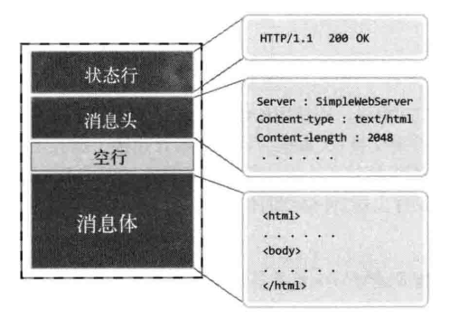

响应信息：

```txt
HTTP/1.1 200 OK
Server:Linux Web Server 
Content-length:2048
Content-type:text/html
```

**一个简单的HTTP服务器：**

```c
#include <stdio.h>
#include <stdlib.h>
#include <unistd.h>
#include <string.h>
#include <arpa/inet.h>
#include <sys/socket.h>
#include <pthread.h>

#define BUF_SIZE 1024
#define SMALL_BUF 100

void *request_handler(void *arg);
void send_data(FILE *fp, char *ct, char *file_name);
char *content_type(char *file);
void send_error(FILE *fp);
void error_handling(char *message);

int main(int argc, char *argv[])
{
	int serv_sock, clnt_sock;
	struct sockaddr_in serv_adr, clnt_adr;
	int clnt_adr_size;
	char buf[BUF_SIZE];
	pthread_t t_id;
	if (argc != 2)
	{
		printf("Usage : %s <port>\n", argv[0]);
		exit(1);
	}

	serv_sock = socket(PF_INET, SOCK_STREAM, 0);
	memset(&serv_adr, 0, sizeof(serv_adr));
	serv_adr.sin_family = AF_INET;
	serv_adr.sin_addr.s_addr = htonl(INADDR_ANY);
	serv_adr.sin_port = htons(atoi(argv[1]));
	if (bind(serv_sock, (struct sockaddr *)&serv_adr, sizeof(serv_adr)) == -1)
		error_handling("bind() error");
	if (listen(serv_sock, 20) == -1)
		error_handling("listen() error");

	while (1)
	{
		clnt_adr_size = sizeof(clnt_adr);
		clnt_sock = accept(serv_sock, (struct sockaddr *)&clnt_adr, &clnt_adr_size);
		printf("Connection Request : %s:%d\n",
			   inet_ntoa(clnt_adr.sin_addr), ntohs(clnt_adr.sin_port));
		pthread_create(&t_id, NULL, request_handler, &clnt_sock);
		pthread_detach(t_id);
	}
	close(serv_sock);
	return 0;
}

void *request_handler(void *arg)
{
	int clnt_sock = *((int *)arg);
	char req_line[SMALL_BUF] = {0};
	FILE *clnt_read;
	FILE *clnt_write;

	char method[10];
	char ct[15];
	char file_name[30];

	clnt_read = fdopen(clnt_sock, "r");
	clnt_write = fdopen(dup(clnt_sock), "w");

	fgets(req_line, SMALL_BUF, clnt_read); //会阻塞

	if (strstr(req_line, "HTTP/") == NULL)
	{
		printf("1111\n");
		send_error(clnt_write);
		fclose(clnt_read);
		fclose(clnt_write);
		return;
	}

	printf("%s", req_line);

	strcpy(method, strtok(req_line, " /"));
	strcpy(file_name, strtok(NULL, " /"));
	strcpy(ct, content_type(file_name));
	if (strcmp(method, "GET") != 0)
	{
		send_error(clnt_write);
		fclose(clnt_read);
		fclose(clnt_write);
		return;
	}

	fclose(clnt_read);
	send_data(clnt_write, ct, file_name);
}

void send_data(FILE *fp, char *ct, char *file_name)
{
	char protocol[] = "HTTP/1.1 200 OK\r\n";
	char server[] = "Server:Linux Web Server \r\n";
	char cnt_len[] = "Content-length:2048\r\n";
	char cnt_type[SMALL_BUF];
	char buf[BUF_SIZE];
	FILE *send_file;

	sprintf(cnt_type, "Content-type:%s\r\n\r\n", ct);

	send_file = fopen(file_name, "r");
	if (send_file == NULL)
	{
		send_error(fp);
		return;
	}

	//发送状态行、消息头和空行
	fputs(protocol, fp);
	fputs(server, fp);
	fputs(cnt_len, fp);
	fputs(cnt_type, fp);
	
	//发送消息体(index.html)
	while (fgets(buf, BUF_SIZE, send_file) != NULL)
	{
		fputs(buf, fp);
		fflush(fp);
	}
	fflush(fp);
	fclose(fp);
}

//确认要发送的文件格式
char *content_type(char *file)
{
	char extension[SMALL_BUF];
	char file_name[SMALL_BUF];
	strcpy(file_name, file);
	strtok(file_name, ".");
	strcpy(extension, strtok(NULL, "."));

	if (!strcmp(extension, "html") || !strcmp(extension, "htm"))
		return "text/html";
	else
		return "text/plain";
}

//错误页面
void send_error(FILE *fp)
{
	char protocol[] = "HTTP/1.1 400 Bad Request\r\n";
	char server[] = "Server:Linux Web Server \r\n";
	char cnt_len[] = "Content-length:2048\r\n";
	char cnt_type[] = "Content-type:text/html\r\n\r\n";
	char content[] = "<html><head><title>Error</title></head>"
					 "<body><p>错误页面！！！</p></body></html>";
	FILE *send_err_file;
	char buf[BUF_SIZE];

	fputs(protocol, fp);
	fputs(server, fp);
	fputs(cnt_len, fp);
	fputs(cnt_type, fp);

	send_err_file = fopen("./err.html", "r");
	while (fgets(buf, BUF_SIZE, send_err_file) != NULL)
	{
		fputs(buf, fp);
	}

	fflush(fp);
}

void error_handling(char *message)
{
	fputs(message, stderr);
	fputc('\n', stderr);
	exit(1);
}
```

---

> Author: cjt  
> URL: https://cui-jiang-tao.github.io/posts/tcpip%E7%BD%91%E7%BB%9C%E7%BC%96%E7%A8%8B/  

