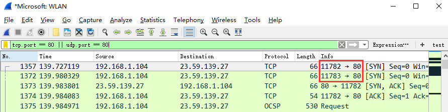

# wireshark抓包


## 1. 开始前的准备

1. 首先在cmd窗口执行`ifconfig`命令，查看主机ip地址：

```cmd
C:\Users\Administrator>ipconfig

Windows IP 配置

以太网适配器 以太网:

   连接特定的 DNS 后缀 . . . . . . . :
   本地链接 IPv6 地址. . . . . . . . : fe80::5c0e:5588:3612:7a99%14
   IPv4 地址 . . . . . . . . . . . . : 192.168.3.28
   子网掩码  . . . . . . . . . . . . : 255.255.254.0
   默认网关. . . . . . . . . . . . . : 192.168.2.1
```

&emsp;&emsp;得到主机地址：192.168.3.28

2. 然后启动wireshark工具开始在网卡(因特网)开始抓包。

3. 继续在cmd窗口执行`ping`命令：

```cmd
C:\Users\Administrator>ping www.baidu.com

正在 Ping www.a.shifen.com [14.215.177.39] 具有 32 字节的数据:
来自 14.215.177.39 的回复: 字节=32 时间=7ms TTL=56
来自 14.215.177.39 的回复: 字节=32 时间=6ms TTL=56
来自 14.215.177.39 的回复: 字节=32 时间=6ms TTL=56
来自 14.215.177.39 的回复: 字节=32 时间=7ms TTL=56

14.215.177.39 的 Ping 统计信息:
    数据包: 已发送 = 4，已接收 = 4，丢失 = 0 (0% 丢失)，
往返行程的估计时间(以毫秒为单位):
    最短 = 6ms，最长 = 7ms，平均 = 6ms
```

&emsp;&emsp;可以清楚的知道目标主机ip地址：14.215.177.39

4. 操作完成后相关数据包就抓取到了，可以通过在过滤栏设置过滤条件进行数据包列表过滤：

```cmd
//说明：只显示ICPM协议且源主机IP或者目的主机IP为192.168.3.28的数据包，协议名称icmp要小写。
ip.addr == 192.168.3.28 and icmp
```

## 2. wireshark界面

WireShark 主要分为这几个界面：

1. Display Filter(显示过滤器)，  用于设置过滤条件进行数据包列表过滤。

2. Packet List Pane(数据包列表)， 显示捕获到的数据包，每个数据包包含编号，时间戳，源地址，目标地址，协议，长度，以及数据包信息。 不同协议的数据包使用了不同的颜色区分显示。

3. Packet Details Pane(数据包详细信息), 在数据包列表中选择指定数据包，在数据包详细信息中会显示数据包的所有详细信息内容。数据包详细信息面板是最重要的，用来查看协议中的每一个字段。各行信息分别为：

    * Frame：物理层的数据帧概况
    * Ethernet II：数据链路层以太网帧头部信息
    * Internet Protocol Version 4：互联网层IP包头部信息
    * Transmission Control Protocol：传输层T的数据段头部信息，此处是TCP
    * Hypertext Transfer Protocol：应用层的信息，此处是HTTP协议


## 3. wireshark过滤器表达式的规则

### 3.1 抓包过滤器语法和实例

&emsp;&emsp;抓包过滤器类型Type（host、net、port）、方向Dir（src、dst）、协议Proto（ether、ip、tcp、udp、http、icmp、ftp等）、逻辑运算符（&& 与、|| 或、！非）

**1. 协议过滤**

比较简单，直接在抓包过滤框中直接输入协议名即可:

* TCP，只显示TCP协议的数据包列表
* HTTP，只查看HTTP协议的数据包列表
* ICMP，只显示ICMP协议的数据包列表

**2. IP过滤**

  * `host 192.168.1.104`：主机IP为192.168.1.104的地址
  * `src host 192.168.1.104`：源主机IP为192.168.1.104的地址
  * `dst host 192.168.1.104`：目标主机IP为192.168.1.104的地址

**3. 端口过滤**

* `port 80`：端口为80
* `src port 80`：源端口为80
* `dst port 80`：目标端口为80

**4. 逻辑运算符&& 与、|| 或、！非**

* `src host 192.168.1.104 && dst port 80`：抓取主机地址为192.168.1.80、目的端口为80的数据包
* `host 192.168.1.104 || host 192.168.1.102`：抓取主机为192.168.1.104或者192.168.1.102的数据包
* `！broadcast`：不抓取广播数据包

### 3.2 显示过滤器语法和实例

**1. 比较操作符**

比较操作符有== 等于、！= 不等于、> 大于、< 小于、>= 大于等于、<=小于等于。

**2. 协议过滤**

比较简单，直接在Filter框中直接输入协议名即可。**注意：协议名称需要输入小写。**

* tcp：只显示TCP协议的数据包列表
* http：只查看HTTP协议的数据包列表
* icmp：只显示ICMP协议的数据包列表


**3. ip过滤**

* `ip.src == 192.168.1.104`：显示源地址为192.168.1.104的数据包列表
* `ip.dst == 192.168.1.104`：显示目标地址为192.168.1.104的数据包列表
* `ip.addr == 192.168.1.104`：显示源IP地址或目标IP地址为192.168.1.104的数据包列表


**4. 端口过滤**

* `tcp.port == 80`：显示源主机或者目的主机端口为80的数据包列表。
* `tcp.srcport == 80`：只显示TCP协议的源主机端口为80的数据包列表。
* `tcp.dstport == 80`：只显示TCP协议的目的主机端口为80的数据包列表。



**5. Http模式过滤**

* `http.request.method == "GET"`：只显示HTTP GET方法的。

**6. 逻辑运算符为 and/or/not**

&emsp;&emsp;过滤多个条件组合时，使用and/or。比如获取IP地址为192.168.1.104的ICMP数据包表达式为：`ip.addr == 192.168.1.104 and icmp`


**7. 按照数据包内容过滤**

&emsp;&emsp;假设我要以IMCP层中的内容进行过滤，可以单击选中界面中的码流，在下方进行选中数据。如下：


右键单击选中后出现如下界面：


选中Select后在过滤器中显示如下：


后面条件表达式就需要自己填写。如下我想过滤出data数据包中包含"abcd"内容的数据流。包含的关键词是contains 后面跟上内容：


## 4. 传输层

### 4.1 TCP协议

&emsp;&emsp;TCP连接必须要经历三次握手，而释放一个TCP连接需要四次握手，这是由TCP的半关闭特性造成的。因为TCP连接时全双工的，因此，需要TCP两端要单独执行关闭。值得注意的是，主动关闭的一端在发送FIN之后，依然还能正常接收对方的数据，只是通知对方它已经没有数据需要发送了，同理，被动关闭的一端在收到FIN之后，仍然可以发送数据，直到它自身同样发出FIN之后，才停止发送数据。

**TCP报文格式：**


* Source Port和Destination Port：分别占用16位，表示源端口号和目的端口号；用于区别主机中的不同进程，而IP地址是用来区分不同的主机的，源端口号和目的端口号配合上IP首部中的源IP地址和目的IP地址就能唯一的确定一个TCP连接；
* Sequence Number：用来标识从TCP发端向TCP收端发送的数据字节流，它表示在这个报文段中的的第一个数据字节在数据流中的序号；主要用来解决网络报乱序的问题；
* Acknowledgment Number：32位确认序列号包含发送确认的一端所期望收到的下一个序号，因此，确认序号应当是上次已成功收到数据字节序号加1。不过，只有当标志位中的ACK标志（下面介绍）为1时该确认序列号的字段才有效。主要用来解决不丢包的问题；
* Offset：给出首部中32 bit字的数目，需要这个值是因为任选字段的长度是可变的。这个字段占4bit（最多能表示15个32bit的的字，即4*15=60个字节的首部长度），因此TCP最多有60字节的首部。然而，没有任选字段，正常的长度是20字节；
* TCP Flags：TCP首部中有6个标志比特，它们中的多个可同时被设置为1，主要是用于操控TCP的状态机的，依次为`URG`，`ACK`，`PSH`，`RST`，`SYN`，`FIN`。每个标志位的意思如下：
    * URG：此标志表示TCP包的紧急指针域（后面马上就要说到）有效，用来保证TCP连接不被中断，并且督促中间层设备要尽快处理这些数据；
    * ACK：此标志表示应答域有效，就是说前面所说的TCP应答号将会包含在TCP数据包中；有两个取值：0和1，为1的时候表示应答域有效，反之为0； TCP协议规定，只有ACK=1时有效，也规定连接建立后所有发送的报文的ACK必须为1
    * PSH：这个标志位表示Push操作。所谓Push操作就是指在数据包到达接收端以后，立即传送给应用程序，而不是在缓冲区中排队；
    * RST：这个标志表示连接复位请求。用来复位那些产生错误的连接，也被用来拒绝错误和非法的数据包；
    * SYN：表示同步序号，用来建立连接。SYN标志位和ACK标志位搭配使用，当连接请求的时候，`SYN=1`，`ACK=0`；连接被响应的时候，`SYN=1`，`ACK=1`；这个标志的数据包经常被用来进行端口扫描。扫描者发送一个只有SYN的数据包，如果对方主机响应了一个数据包回来 ，就表明这台主机存在这个端口；但是由于这种扫描方式只是进行TCP三次握手的第一次握手，因此这种扫描的成功表示被扫描的机器不很安全，一台安全的主机将会强制要求一个连接严格的进行TCP的三次握手；
    * FIN： 表示发送端已经达到数据末尾，也就是说双方的数据传送完成，没有数据可以传送了，发送FIN标志位的TCP数据包后，连接将被断开。这个标志的数据包也经常被用于进行端口扫描。
* Window：窗口大小

编写如下代码进行测试：

sayHello_server.c

```c
#include <stdio.h>
#include <stdlib.h>
#include <string.h>
#include <unistd.h>
#include <arpa/inet.h>
#include <sys/socket.h>

void error_handling(char *message);

int main(int argc, char *argv[])
{
	int serv_sock;
	int clnt_sock;

	struct sockaddr_in serv_addr;
	struct sockaddr_in clnt_addr;
	socklen_t clnt_addr_size;

	char message[]="Hello World!";
	
	if(argc!=2){
		printf("Usage : %s <port>\n", argv[0]);
		exit(1);
	}
	
	//创建服务端socket，通过serv_sock创建与客户端连接的socket
	serv_sock=socket(PF_INET, SOCK_STREAM, 0);
	if(serv_sock == -1)
		error_handling("socket() error");
	
	//设置描述的地址和端口号
	memset(&serv_addr, 0, sizeof(serv_addr));
	serv_addr.sin_family=AF_INET;
	serv_addr.sin_addr.s_addr=htonl(INADDR_ANY);
	serv_addr.sin_port=htons(atoi(argv[1]));
	
	//将socket_fd 和serv_addr进行绑定
	if(bind(serv_sock, (struct sockaddr*) &serv_addr, sizeof(serv_addr))==-1 )
		error_handling("bind() error"); 
	
	//设置排队建立3次握手队列和刚刚建立3次握手队列的连接上限和
	if(listen(serv_sock, 5)==-1)
		error_handling("listen() error");
	
	while(1) {
		//阻塞，与客户端建立连接，三次握手 =》 client_fd
		clnt_addr_size=sizeof(clnt_addr);  
		clnt_sock=accept(serv_sock, (struct sockaddr*)&clnt_addr,&clnt_addr_size);
		if(clnt_sock==-1)
			error_handling("accept() error");  
		
		//给clnt_sock客户连接发送数据: Hello World!
		write(clnt_sock, message, sizeof(message));

		//关闭连接，close fd
		close(clnt_sock);	
	}
	
	close(serv_sock);
	return 0;
}

void error_handling(char *message)
{
	//将错误信息写入到标准错误流
	fputs(message, stderr);
	fputc('\n', stderr);
	exit(1);
}
```

功能说明：该服务程序，每次有客户端建立了连接，将发送"Hello World!"数据给客户端，然后主动关闭连接。

查看主机ip为：192.168.88.129

```shell
cjt@cjt-virtual-machine:~/Desktop$ ifconfig
ens33: flags=4163<UP,BROADCAST,RUNNING,MULTICAST>  mtu 1500
        inet 192.168.88.129  netmask 255.255.255.0  broadcast 192.168.88.255
        inet6 fe80::8c62:ec9c:c28d:2b05  prefixlen 64  scopeid 0x20<link>
        ether 00:0c:29:94:b9:cb  txqueuelen 1000  (Ethernet)
        RX packets 31660  bytes 41281586 (41.2 MB)
        RX errors 0  dropped 0  overruns 0  frame 0
        TX packets 3930  bytes 289516 (289.5 KB)
        TX errors 0  dropped 0 overruns 0  carrier 0  collisions 0

lo: flags=73<UP,LOOPBACK,RUNNING>  mtu 65536
        inet 127.0.0.1  netmask 255.0.0.0
        inet6 ::1  prefixlen 128  scopeid 0x10<host>
        loop  txqueuelen 1000  (Local Loopback)
        RX packets 6178  bytes 505457 (505.4 KB)
        RX errors 0  dropped 0  overruns 0  frame 0
        TX packets 6178  bytes 505457 (505.4 KB)
        TX errors 0  dropped 0 overruns 0  carrier 0  collisions 0
```

启动服务：

```shell
gcc sayHello_server.c -o sayHello_server
./sayHello_server &
```

开始监听网卡，然后客户端连接：

```cmd
cjt@cjt-virtual-machine:~/Desktop$ telnet 192.168.88.129 8888
Trying 192.168.88.129...
Connected to 192.168.88.129.
Escape character is '^]'.
Hello World!Connection closed by foreign host.
```

抓包数据：[sayHello_tcp.pcapng](https://github.com/Cui-Jiang-Tao/resource/blob/master/wireshark/sayHello_tcp.pcapng)

> 如果无法远程连接23端口，关闭防火墙：`sudo ufw disable`


---

> Author: cjt  
> URL: https://cui-jiang-tao.github.io/posts/wireshark/  

