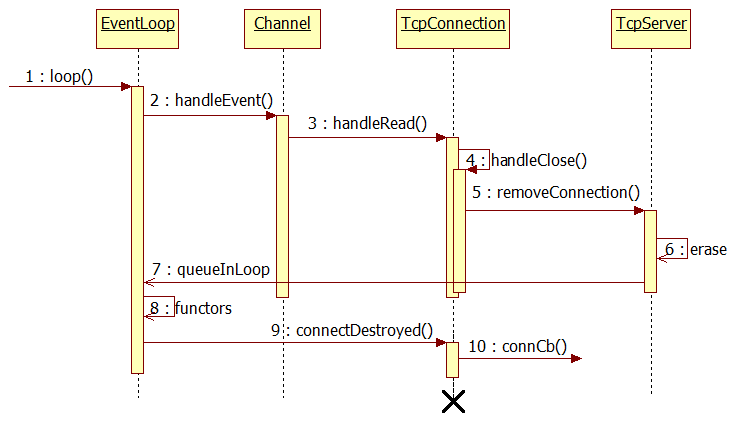

# 大并发服务器开发


## 前言

服务器设计的目的

1. 高性能

2. 高可用

    * 故障转移(failover)

3. 伸缩性

**library和framework：**

* 库中类相对比较独立，我们编写应用的时候需要编写一些"胶水代码"来粘合。
* 框架是能够应用于特定应用领域的，不需要编写过多的"胶水代码"来粘合。
* 框架提供用户注册一些回调函数，使得框架能够调用我们所编写的回调函数，这就使得控制反转了。

第一部分：Muduo基础库
=

## 1. 编程风格

1. C编程风格：注册三个全局函数到网络库，网络库通过函数指针来回调。
2. 面向对象风格：用一个EchoServer继承TcpServer(抽象类)，实现三个接口OnConnection、OnMessage和OnClose。
3. 基于对象风格：用一个EchoServer包含一个TcpServer(具体类)对象，在构造函数中用boost::bind来注册三个成员函数OnConnection、OnMessage和OnClose。

简单的Thread类的编程风格，Thread类的结构树如下：

```tree
├── CMakeLists.txt
├── include
│   ├── MyThread.h
│   └── Thread.h
│── src
│   ├── MyThread.cpp
│   └── Thread.cpp
├── main
```

### 1.1 面向对象的Thread类

面向对象的Thread类：<https://github.com/Cui-Jiang-Tao/large_concurrency/tree/master/Thread_oo>

### 1.2 基于对象的Thread类

基于对象的Thread类：<https://github.com/Cui-Jiang-Tao/large_concurrency/tree/master/Thread_ob>

## 2. Timestamp类

Timestamp类：<https://github.com/Cui-Jiang-Tao/large_concurrency/tree/master/Timestamp>

* 值语义：可以拷贝的，拷贝之后，与原对象脱离关系。
* 对象语义：要么是不能拷贝的，要么可以拷贝，拷贝之后与原对象仍然存在一定的关系，比如共享底层资源(要实现自己的拷贝构造函数)。
* 宏`BOOST_STATIC_ASSERT`：编译时断言。
* `assert`：是在运行时断言的。

* `muduo::copyable`：空基类，标识类，值类型。
* `boost::equality_comparable`：
* `less_than_comparable`：要求实现<，可自动实现>,<=,>=

使用`PRId64`，int64_t用来表示64位整数，在32位系统中是long long int，在64位系统中是long int,所以打印int64_t的格式化方法是：

```c++
printf(“%ld”, value);  // 64bit OS
printf("%lld", value); // 32bit OS
```

跨平台的做法：

```c++
#define __STDC_FORMAT_MACROS
#include <inttypes.h>
#undef __STDC_FORMAT_MACROS

printf("%" PRId64 "\n", value);  
```

## 3. 原子操作

### 3.1 提供加减和逻辑运算的原子操作

gcc从4.1.2提供了__sync_*系列的built-in函数，用于提供加减和逻辑运算的原子操作。gcc原子性操作其声明如下：

```c
/*返回更新前的值*/
type __sync_fetch_and_add (type *ptr, type value, ...); // 将value加到*ptr上，结果更新到*ptr，并返回操作之前*ptr的值
type __sync_fetch_and_sub (type *ptr, type value, ...); // 从*ptr减去value，结果更新到*ptr，并返回操作之前*ptr的值
type __sync_fetch_and_or (type *ptr, type value, ...);  // 将*ptr与value相或，结果更新到*ptr， 并返回操作之前*ptr的值
type __sync_fetch_and_and (type *ptr, type value, ...); // 将*ptr与value相与，结果更新到*ptr，并返回操作之前*ptr的值
type __sync_fetch_and_xor (type *ptr, type value, ...); // 将*ptr与value异或，结果更新到*ptr，并返回操作之前*ptr的值
type __sync_fetch_and_nand (type *ptr, type value, ...);  // 将*ptr取反后，与value相与，结果更新到*ptr，并返回操作之前*ptr的值

/*返回更新后的值*/
type __sync_add_and_fetch (type *ptr, type value, ...); // 将value加到*ptr上，结果更新到*ptr，并返回操作之后新*ptr的值
type __sync_sub_and_fetch (type *ptr, type value, ...); // 从*ptr减去value，结果更新到*ptr，并返回操作之后新*ptr的值
type __sync_or_and_fetch (type *ptr, type value, ...);  // 将*ptr与value相或， 结果更新到*ptr，并返回操作之后新*ptr的值
type __sync_and_and_fetch (type *ptr, type value, ...); // 将*ptr与value相与，结果更新到*ptr，并返回操作之后新*ptr的值
type __sync_xor_and_fetch (type *ptr, type value, ...); // 将*ptr与value异或，结果更新到*ptr，并返回操作之后新*ptr的值
type __sync_nand_and_fetch (type *ptr, type value, ...);  // 将*ptr取反后，与value相与，结果更新到*ptr，并返回操作之后新*ptr的值
```

type可以是1,2,4或8字节长度的int类型，即：

```c
int8_t / uint8_t
int16_t / uint16_t
int32_t / uint32_t
int64_t / uint64_t
```

后面的可扩展参数(...)用来指出哪些变量需要memory barrier(全屏障),因为目前gcc实现的是full barrier(类似于linux kernel 中的mb(),**表示这个操作之前的所有内存操作不会被重排序到这个操作之后**),所以可以略掉这个参数。

`__sync_synchronize (...)`：发出一个full barrier(完整内存栅栏)。

关于memory barrier,cpu会对我们的指令进行排序，一般说来会提高程序的效率，但有时候可能造成我们不希望得到的结果，举一个例子，比如我们有一个硬件设备，它有4个寄存器，当你发出一个操作指令的时候，一个寄存器存的是你的操作指令(比如READ)，两个寄存器存的是参数(比如是地址和size)，最后一个寄存器是控制寄存器，在所有的参数都设置好之后向其发出指令，设备开始读取参数，执行命令，程序可能如下：

```c
write1(dev.register_size,size);
write1(dev.register_addr,addr);
write1(dev.register_cmd,READ);
write1(dev.register_control,GO);
```

如果最后一条write1被换到了前几条语句之前，那么肯定不是我们所期望的，这时候我们可以在最后一条语句之前加入一个memory barrier,强制cpu执行完前面的写入以后再执行最后一条：

```c
write1(dev.register_size,size);
write1(dev.register_addr,addr);
write1(dev.register_cmd,READ);
__sync_synchronize();
write1(dev.register_control,GO);
```

memory barrier有几种类型：

* acquire barrier : 不允许将barrier之后的内存读取指令移到barrier之前(linux kernel中的wmb())。
* release barrier : 不允许将barrier之前的内存读取指令移到barrier之后 (linux kernel中的rmb())。
* full barrier    : 以上两种barrier的合集(linux kernel中的mb())。

示例如下：

```c
#include <stdio.h>
#include <pthread.h>
#include <stdlib.h>

static int count = 0;


void *test_func(void *arg)
{
  int i=0;
  for(i=0;i<20000;++i){
          __sync_fetch_and_add(&count,1);
  }
  return NULL;
}

int main(int argc, const char *argv[])
{
  pthread_t id[20];
  int i = 0;

  //开启20个线程
  for(i=0;i<20;++i){
          pthread_create(&id[i],NULL,test_func,NULL);
  }

  //等待
  for(i=0;i<20;++i){
          pthread_join(id[i],NULL);
  }

  printf("%d\n",count);
  return 0;
}
```

### 3.2 原子比较和交换(设置)操作

&emsp;&emsp;CAS是compare and swap,   简单来说就是，在写入新值之前，读出旧值，当且仅当旧值与存储中的当前值(*ptr)一致时，才把新值写入存储。

```c
bool __sync_bool_compare_and_swap (type *ptr, type oldval type newval, ...);  // 比较*ptr与oldval的值，如果两者相等，则将newval更新到*ptr并返回true
type __sync_val_compare_and_swap (type *ptr, type oldval type newval, ...); // 比较*ptr与oldval的值，如果两者相等，则将newval更新到*ptr并返回操作之前*ptr的值
```

这两个函数提供原子的比较和交换，如果`*ptr == oldval`,就将`newval`写入`*ptr`：

* 第一个函数在相等并写入的情况下返回true.
* 第二个函数在返回操作之前的值。

### 3.3 原子赋值操作

```c
type __sync_lock_test_and_set (type *ptr, type value, ...); // 将value写入*ptr，对*ptr加锁，并返回操作之前*ptr的值。即，try spinlock语义
void __sync_lock_release (type *ptr, ...);  // 将0写入到*ptr，并对*ptr解锁。即，unlock spinlock语义
```

### 3.4 无锁队列的实现

参考：<https://coolshell.cn/articles/8239.html>

## 4. 原子类

### 4.1 AtomicIntegerT类

AtomicIntegerT类：<https://github.com/Cui-Jiang-Tao/large_concurrency/tree/master/Atomic>

### 4.2 volatile关键字

* volatile的作用：作为指令关键字，确保本条指令不会因编译器的优化而省略，且要求每次直接读值。简单地说就是防止编译器对代码进行优化。
* **当要求使用volatile 声明的变量的值的时候，系统总是重新从它所在的内存读取数据，而不是使用保存在寄存器中的备份**。即使它前面的指令刚刚从该处读取过数据。而且读取的数据立刻被保存。

## 5. 编译选项

```cmake
-Wall			// 大部分警告 
-Wextra			// 一些额外的警告
-Werror			// 当出现警告时转为错误，停止编译
-Wconversion		// 一些可能改变值的隐式转换，给出警告。
-Wno-unused-parameter	// 函数中出现未使用的参数，不给出警告。
-Wold-style-cast		// C风格的转换，给出警告
-Woverloaded-virtual	// 如果函数的声明隐藏住了基类的虚函数，就给出警告。
-Wpointer-arith		// 对函数指针或者void *类型的指针进行算术操作时给出警告
-Wshadow		// 当一个局部变量遮盖住了另一个局部变量，或者全局变量时，给出警告。
-Wwrite-strings		// 规定字符串常量的类型是const char[length]，因此，把这样的地址复制给 non-const char *指针将产生警告.这些警告能够帮助你在编译期间发现企图写入字符串常量 的代码
-march=native		// 指定cpu体系结构为本地平台
```

## 6. 向上转型

```c++
#include <stdio.h>

void foo(int x) {}

class B {
public:
  virtual void foo() {}
};

class D : public B {
public:
  void foo(int x) {}
};

template <typename To, typename From> inline To implicit_cast(From const &f) {
  return f;
}

int main(void) {
  int n;
  double d = 1.23;
  n = d;

  B *pb;
  D *pd = NULL;

  pb = pd;
  pb = implicit_cast<B *, D *>(pd);
  return 0;
}
```

## 7. Exception类

Exception类：<https://github.com/Cui-Jiang-Tao/large_concurrency/tree/master/Exception>

* backtrace函数：栈回溯，保存各个栈帧的地址。
* backtrace_symbols函数：根据地址，转成相应的函数符号。
* abi::__cxa_demangle函数：将编译器翻译的函数名称转换为自己编写的实际函数名，方便查看。

## 8. 线程类

### 8.1 线程标识(线程ID)

**一、线程标识**

* 和进程的pid一样，每个线程也有对应的id即tid。
* 在线程中，线程ID的类型是pthread_t类型，由于在Linux下线程采用POSIX标准，所以，在不同的系统下，pthread_t的类型是不同的，比如在ubuntn下，是unsigned long类型，而在solaris系统中，是unsigned int类型。而在FreeBSD上才用的是结构体指针。 所以不能直接使用==判读，而应该使用pthread_equal来判断。

**二、获取线程ID的方法**

* gettid或者类似gettid的方法(使用系统调用)
* 直接调用pthread_self()函数

**获取线程ID的方法说明：**

1、使用gettid方法

&emsp;&emsp;gettid并没有直接在glibc中实现，因此无法在程序中直接使用这个函数，与之类似的方法是执行系统调用。

* a.首先查询该系统调用的调用号(在文件arch/arm64/Include/Asm/Unistd32.h中)
* b.使用系统调用来获取内核线程ID

```c
#include <sys/syscall.h>  
printf("The ID of this thread is: %ld\n", (long int)syscall(224));
```

2、直接调用pthread_self()函数获取id

```c
#include <stdio.h>
#include <pthread.h>
printf("pthread_self: %ld\n", pthread_self());
```

**三、知识点补充**

* 线程的标识有两个【内核中的线程ID】【posix描述的线程ID(也就是用户层glibc库中的线程ID)】
* gettid 获取的是内核中真实线程ID, 对于多线程进程来说，每个tid实际是不一样的。而pthread_self获取的是相对于进程的线程控制块的首地址， 只是用来描述同一进程中的不同线程。
* gettid及使用系统调用方法获取到的id是内核中的线程id，pthread_self()获取到的是posix描述的ID
* 对于单线程的进程，内核中的tid==pid。对于多线程的进程，他们拥有相同的pid和不同的tid。
* pthread_self()返回的id和内核中线程的id是不一样的，当一个线程退出后，新创建的线程可以复用原来的id

**四、分为两个线程id的原因**

&emsp;&emsp;因为线程库实际上由两部分组成：内核的线程支持+用户态的库支持(glibc)，linux上的线程实现就是在内核支持的基础上以POSIX thread的方式对外封装了接口，所以才会有两个ID的问题。

**五、总结**

* Linux中，每个进程有一个pid，类型pid_t，由getpid()取得。Linux下的POSIX线程也有一个id，类型 pthread_t，由pthread_self()取得，该id由线程库维护，其id空间是各个进程独立的(即不同进程中的线程可能有相同的id)。Linux中的POSIX线程库实现的线程其实也是一个进程(LWP)，只是该进程与主进程(启动线程的进程)共享一些资源而已，比如代码段，数据段等。
* 有时候我们可能需要知道线程的真实pid。比如进程P1要向另外一个进程P2中的某个线程发送信号时，既不能使用P2的pid，更不能使用线程的pthread id，而只能使用该线程的真实pid，称为tid。
* 有一个函数gettid()可以得到tid，但glibc并没有实现该函数，只能通过Linux的系统调用syscall来获取。
    * `return syscall(SYS_gettid)`


### 8.2 __thread关键字

&emsp;&emsp;__thread是GCC内置的线程局部存储设施，存取效率可以和全局变量相比。**__thread变量每一个线程有一份独立实体，各个线程的值互不干扰**。可以用来修饰那些带有全局性且值可能变，但是又不值得用全局变量保护的变量。

&emsp;&emsp;__thread使用规则：只能修饰POD类型(类似整型指针的标量，不带自定义的构造、拷贝、赋值、析构的类型，二进制内容可以任意复制memset,memcpy,且内容可以复原)，不能修饰class类型，因为无法自动调用构造函数和析构函数，可以用于修饰全局变量，函数内的静态变量，不能修饰函数的局部变量或者class的普通成员变量，**且__thread变量值只能初始化为编译器常量**(值在编译器就可以确定const int i=5,运行期常量是运行初始化后不再改变const int i=rand()).

```c++
#include <iostream>
#include <pthread.h>
#include <unistd.h>
using namespace std;

const int i = 5;
__thread int var = i; //两种方式效果一样
//__thread int var=5;//

void *worker1(void *arg);
void *worker2(void *arg);

int main() {
  pthread_t pid1, pid2;
  //__thread int temp=5;
  static __thread int temp = 10; //修饰函数内的static变量

  pthread_create(&pid1, NULL, worker1, NULL);
  pthread_create(&pid2, NULL, worker2, NULL);
  pthread_join(pid1, NULL);
  pthread_join(pid2, NULL);

  cout << temp << endl; //输出10

  return 0;
}

void *worker1(void *arg) {
  cout << ++var << endl; //输出 6
}

void *worker2(void *arg) {
  sleep(1);              //等待线程1改变var值，验证是否影响线程2
  cout << ++var << endl; //输出6
}
```

### 8.3 std::is_same和std::decay

可参考：<https://blog.csdn.net/czyt1988/article/details/52812797>

> C++11的模板类型判断：std::is_same和std::decay


### 8.4 pthread_atfork()函数

可参考：<https://blog.csdn.net/chdhust/article/details/38436153>

```c++
#include <pthread.h>
int pthread_atfork(void (*prepare)(void), void (*parent)(void), void (*child)(void));
```

&emsp;&emsp;调用fork时，内部创建子进程前在父进程中会调用prepare，内部创建子进程成功后，父进程会调用parent ，子进程会调用child。也就是说：最先调用prepare函数，只存在下面两种进程调度组合：

* prepare() -> parent() -> child()
* prepare() -> child() -> parent()

例子：

```c++
#include <stdio.h>
#include <time.h>
#include <pthread.h>
#include <unistd.h>

void prepare(void)
{
	printf("pid = %d prepare ...\n", static_cast<int>(getpid()));
}

void parent(void)
{
	printf("pid = %d parent ...\n", static_cast<int>(getpid()));
}

void child(void)
{
	printf("pid = %d child ...\n", static_cast<int>(getpid()));
}


int main(void)
{
	printf("pid = %d Entering main ...\n", static_cast<int>(getpid()));

	pthread_atfork(prepare, parent, child);

	fork();

	printf("pid = %d Exiting main ...\n",static_cast<int>(getpid()));

	return 0;
}
```

### 8.5 fork造成死锁的例子

deadLock_test.cpp

```c++
// 一个在多线程程序里fork造成死锁的例子
// 一个输出示例：
/*

pid = 19445 Entering main ...
pid = 19445 begin doit ...
pid = 19447 begin doit ...
pid = 19445 end doit ...
pid = 19445 Exiting main ...

父进程在创建了一个线程，并对mutex加锁，
父进程创建一个子进程，在子进程中调用doit，由于子进程会复制父进程的内存，这时候mutex处于锁的状态，
父进程在复制子进程的时候，只会复制当前线程的执行状态，其它线程不会复制。因此子进程会处于死锁的状态。
*/
#include <stdio.h>
#include <time.h>
#include <pthread.h>
#include <unistd.h>


pthread_mutex_t mutex = PTHREAD_MUTEX_INITIALIZER;

void* doit(void* arg)
{
	printf("pid = %d begin doit ...\n",static_cast<int>(getpid()));
	pthread_mutex_lock(&mutex);
	struct timespec ts = {2, 0};
	nanosleep(&ts, NULL);
	pthread_mutex_unlock(&mutex);
	printf("pid = %d end doit ...\n",static_cast<int>(getpid()));

	return NULL;
}

int main(void)
{
	printf("pid = %d Entering main ...\n", static_cast<int>(getpid()));
	pthread_t tid;
	pthread_create(&tid, NULL, doit, NULL);
	struct timespec ts = {1, 0};
	nanosleep(&ts, NULL);
	if (fork() == 0)
	{
		doit(NULL);
	}
	pthread_join(tid, NULL);
	printf("pid = %d Exiting main ...\n",static_cast<int>(getpid()));

	return 0;
}
```

deadLock_test2.cpp

```c++
#include <stdio.h>
#include <time.h>
#include <pthread.h>
#include <unistd.h>


pthread_mutex_t mutex = PTHREAD_MUTEX_INITIALIZER;

void* doit(void* arg)
{
	printf("pid = %d begin doit ...\n",static_cast<int>(getpid()));
	pthread_mutex_lock(&mutex);
	struct timespec ts = {2, 0};
	nanosleep(&ts, NULL);
	pthread_mutex_unlock(&mutex);
	printf("pid = %d end doit ...\n",static_cast<int>(getpid()));

	return NULL;
}

void prepare(void)
{
	pthread_mutex_unlock(&mutex);
}

void parent(void)
{
	pthread_mutex_lock(&mutex);
}

int main(void)
{
	pthread_atfork(prepare, parent, NULL);
	printf("pid = %d Entering main ...\n", static_cast<int>(getpid()));
	pthread_t tid;
	pthread_create(&tid, NULL, doit, NULL);
	struct timespec ts = {1, 0};
	nanosleep(&ts, NULL);
	if (fork() == 0)
	{
		doit(NULL);
	}
	pthread_join(tid, NULL);
	printf("pid = %d Exiting main ...\n",static_cast<int>(getpid()));

	return 0;
}
```

### 8.6 Thread类

Thread类：<https://github.com/Cui-Jiang-Tao/large_concurrency/tree/master/Thread>

## 9. linux同步机制

### 9.1 MutexLock/MutexLockGuard类

MutexLock/MutexLockGuard类：<https://github.com/Cui-Jiang-Tao/large_concurrency/tree/master/Mutex>

MutexLockGuard(使用RAII技法封装)不管理MutexLock对象的生命周期，它们之间只是关联关系。

* 聚合：存在与整体与局部的关系。
* 组合：不仅存在与整体与局部的关系，还负责对象的声明周期。

RAII技法：<https://github.com/Cui-Jiang-Tao/large_concurrency/tree/master/RAII>

> RAII技法参考：[借刀杀对象--Raii技法](https://blog.csdn.net/u013700510/article/details/49253381)

### 9.2 Condition类

Condition类：<https://github.com/Cui-Jiang-Tao/large_concurrency/tree/master/Condition>

> unix条件变量参考：[unix同步——条件变量](https://blog.csdn.net/yixianfeng41/article/details/50458041)，
[linux条件变量](https://blog.csdn.net/qq_18998145/article/details/99646973)

### 9.3 CountDownLatch类

CountDownLatch类：<https://github.com/Cui-Jiang-Tao/large_concurrency/tree/master/CountDownLatch>

&emsp;&emsp;CountDownLatch中count down是倒数的意思，latch则是门闩的含义。整体含义可以理解为倒数的门栓，似乎有一点“三二一，芝麻开门”的感觉。CountDownLatch的作用也是如此，在构造CountDownLatch的时候需要传入一个整数n，在这个整数“倒数”到0之前，主线程需要等待在门口，而这个“倒数”过程则是由各个执行线程驱动的，每个线程执行完一个任务“倒数”一次。总结来说，CountDownLatch的作用就是等待其他的线程都执行完任务，必要时可以对各个任务的执行结果进行汇总，然后主线程才继续往下执行。

* 即可以用于所有子线程等待主线程发起"起跑"。
* 也可以用于主线程等待子线程初始化完毕才开始工作。

## 10. 队列类的实现

### BlockinngQueue类

BlockinngQueue类：<https://github.com/Cui-Jiang-Tao/large_concurrency/tree/master/BlockingQueue>

`BlockinngQueue<T>`：无界缓冲区。

### BoundedBlockingQueue类

BoundedBlockingQueue类：<https://github.com/Cui-Jiang-Tao/large_concurrency/tree/master/BoundedBlockingQueue>

`BoundedBlockingQueue<T>`：有界缓冲区，使用的是环形缓冲区(循环利用，读写覆盖)。

## 11. 线程池ThreadPool的实现

ThreadPool类：<https://github.com/Cui-Jiang-Tao/large_concurrency/tree/master/ThreadPool>

线程池问题本质上也是生产者和消费者的问题。ThreadPool存在两个队列：
1. 线程队列：一旦任务队列有任务就唤醒线程队列中的线程(可以理解为消费者线程)来执行这些任务。
2. 任务队列：外部线程(可以认为是生产者线程)可以向任务队列添加任务。

## 12. 线程安全Singleton类

Singleton类：<https://github.com/Cui-Jiang-Tao/large_concurrency/tree/master/Singleton>

* `pthread_once`：某个函数只能被执行一次，这样就能保存对象只能是一个，并且是线程安全的。
* `atexit`：注册一个销毁的函数，让程序结束的时候自动调用该函数来销毁对象。在`stdlib.h`头文件中。
* `typedef char T_must_be_complete_type[sizeof(T) == 0 ? -1 : 1];`：能保证我们取地址的时候，如果是一个不完全类型的指针在编译期就会报错，而不是警告。

### 12.1 `pthread_once()`函数详解

&emsp;在多线程环境中，有些事仅需要执行一次。通常当初始化应用程序时，可以比较容易地将其放在main函数中。但当你写一个库时，就不能在main里面初始化了，你可以用静态初始化，但使用一次初始化(pthread_once)会比较容易些。

`int pthread_once(pthread_once_t *once_control, void (*init_routine) (void))`

* 功能：本函数使用初值为PTHREAD_ONCE_INIT的once_control变量保证init_routine()函数在本进程执行序列中仅执行一次。

* 在多线程编程环境下，尽管pthread_once()调用会出现在多个线程中，init_routine()函数仅执行一次，究竟在哪个线程中执行是不定的，是由内核调度来决定。
* Linux Threads使用互斥锁和条件变量保证由pthread_once()指定的函数执行且仅执行一次，而once_control表示是否执行过。
* 如果once_control的初值不是PTHREAD_ONCE_INIT(Linux Threads定义为0)，pthread_once() 的行为就会不正常。
* 在LinuxThreads中，实际"一次性函数"的执行状态有三种：NEVER(0)、IN_PROGRESS(1)、DONE (2)，如果once初值设为1，则由于所有pthread_once()都必须等待其中一个激发"已执行一次"信号，因此所有pthread_once ()都会陷入永久的等待中；如果设为2，则表示该函数已执行过一次，从而所有pthread_once()都会立即返回0。

### 12.2 `atexit()`函数详解

&emsp;&emsp;对C语言有所了解的人都知道main函数是整个程序的入口，但是其实不然，在内核中可以使用链接器来设置程序的开始地方。当内核使⽤⼀个exec函数执⾏C程序时，在调⽤main函数之前先调⽤⼀个特殊的启动例程，可执⾏程序将此例程指定为程序的起始地址。启动例程从内核获取命令⾏参数和环境变量，然后为调⽤main函数做好准备。

&emsp;&emsp;前面我们关注的是程序开始进入时的调用函数，而atexit函数是一个特殊的函数，它是在正常程序退出时调用的函数，我们把他叫为**登记函数**。

`int atexit (void (*)(void))`

&emsp;&emsp;⼀个进程可以登记若⼲个(具体⾃⼰验证⼀下)个函数，这些函数由exit⾃动调⽤，这些函数被称为终⽌处理函数，atexit函数可以登记这些函数。 **exit调⽤终⽌处理函数的顺序和atexit登记的顺序相反**(网上很多说造成顺序相反的原因是参数压栈造成的，参数的压栈是先进后出，和函数的栈帧相同)，如果⼀个函数被多次登记，也会被多次调⽤。

atexit函数调用时机：

进程终⽌的⽅式有8种，前5种为正常终⽌，后三种为异常终⽌：
1. 从main函数返回；
2. 调⽤exit函数；
3. 调⽤_exit或_Exit；
4. 最后⼀个线程从启动例程返回；
5. 最后⼀个线程调⽤pthread_exit；
6. 调⽤abort函数；
7. 接到⼀个信号并终⽌；
8. 最后⼀个线程对取消请求做出响应。

exit()和_exit()以及_Exit()函数的本质区别是是否立即进入内核，_exit()以及_Exit()函数都是在调用后立即进入内核，而不会执行一些清理处理，但是exit()则会执行一些清理处理，这也是为什么会存在atexit()函数的原因，因为exit()函数需要执行清理处理，需要执行一系列的操作，这些终止处理函数实际上就是完成各种所谓的清除操作的实际执行体。

下面我们来验证atexit的调用顺序和退出顺序：

```c++
#include<stdio.h> 
#include<stdlib.h>  //atexit函数所属头文件
   
void func1() 
{ 
    printf("The process is done...\n"); 
} 
void func2() 
{ 
    printf("Clean up the processing\n"); 
} 
void func3() 
{ 
    printf("Exit sucessful..\n"); 
} 
int main() 
{ 
　　//其作用是注册某一个函数，当进程执行结束时，会自动调用注册的函数
　　//注册几次，就执行几次
    atexit(func1); 
    atexit(func2); 
    atexit(func3); 
    exit(0); 
} 
```
&emsp;&emsp;**我们可以看到atexit函数的调用顺序是和登记顺序相反的。**

&emsp;&emsp;atexit函数的用途也是比较广泛的：可以按照你予设的顺序摧毁全局变量(类)，例如有个log类，你在其它的全局类里也有可能调用到Log类写日志。所以log 类必须最后被析构 。假如没有规定析构顺序，那么程序在退出时将有可能首先析构log类，那么其它的全局类在此时将无法正确写日志。 把数据写回文件, 删除临时文件, 这才是真正有用的.

### 12.3 不完全类型检测

Boost库，在头文件checked_delete.hpp中的用于释放空间的类模板函`checked_array_delete(T * x)`：

```c++
template<class T> inline void checked_array_delete(T * x) {
    typedef char type_must_be_complete[sizeof(T) ? 1: -1];  
    (void) sizeof(type_must_be_complete);  
    delete [] x;  
}
```

这是一种不完全类型检测：T如果不是不完全类型那么`sizeof(T)`就应该是`type_must_be_complete[-1]`，数组是不能为负数的，所以就会报错；

什么又是不完全类型呢？简单理解就是类型的定义不完整，比如只对类进行了声明，却未定义；

我们应该尽量让错误在编译时出现，而不是在执行时，所用可以用到不完全类型检测的方法，在编译的时候就会对这种情况报错；

可以通过`size_t temp = sizeof(T)`来判断，但是这个只能在运行期发现错误。

> typedef关键字参考：[关键字Typedef深入了解](https://thinkerou.com/post/typedef-keyword/)
> * 关键字 typedef 是在编译阶段有效，因此 typedef 有类型检查的功能。

> sizeof(T)疑问参考：[关于ThreadLocalSingleton.h中判断complete type的疑问](https://github.com/chenshuo/muduo/issues/301)
> * sizeof(T)虽然在编译器完成了计算，但是不一定会报错，不一定~~

## 13. 线程本地存储ThreadLock类

线程特定数据：

* 在单线程程序中，我们经常要用到"全局变量"以实现多个函数间共享数据。
* 在多线程环境下，由于数据空间是共享的，因此全局变量也为所有线程所共有。 
* 但有时应用程序设计中有必要提供线程私有的全局变量，仅在某个线程中有效，但却可以跨多个函数访问。
* POSIX线程库通过维护一定的数据结构来解决这个问题，这个些数据称为(Thread-specific Data，或 TSD)。
* 线程特定数据也称为线程本地存储TLS(Thread-local storage)。
* 对于POD类型的线程本地存储，可以用`__thread`关键字。

```c++
#include <pthread.h>

int pthread_key_create (pthread_key_t *__key, void (*__destr_function) (void *));
int pthread_key_delete (pthread_key_t __key);

void *pthread_getspecific (pthread_key_t __key);
int pthread_setspecific (pthread_key_t __key, const void *__pointer);
```

说明：

* 函数 `pthread_key_create()`用来创建线程私有数据。该函数从 TSD 池中分配一项，将其地址值赋给 key 供以后访问使用。第 2 个参数是一个销毁函数，它是可选的，可以为 NULL，为 NULL 时，则系统调用默认的销毁函数进行相关的数据注销。如果不为空，则在线程退出时(调用`pthread_exit()`函数)时将以 key 锁关联的数据作为参数调用它，以释放分配的缓冲区，或是关闭文件流等。
* 不论哪个线程调用了`pthread_key_create()`，所创建的 key 都是所有线程可以访问的，但各个线程可以根据自己的需要往 key 中填入不同的值，相当于提供了一个同名而不同值的全局变量(这个全局变量相对于拥有这个变量的线程来说)。
* 注销一个 TSD 使用`pthread_key_delete()` 函数。该函数并不检查当前是否有线程正在使用该 TSD，也不会调用清理函数(destructor function)，而只是将 TSD 释放以供下一次调用`pthread_key_create()`使用。在 LinuxThread 中，它还会将与之相关的线程数据项设置为 NULL。

> pthread_key_delete()：销毁线程特定数据键。由于键已无效，因此将释放与该键关联的所有内存。**在调用该函数之前必须释放所有线程的特定资源，该函数不会调用任何析构函数**。反复调用pthread_key_create与pthread_key_delete可能会产生问题。对于每个所需的键，应当只调用pthread_key_create一次。

&emsp;&emsp;在多线程程序中，经常要用全局变量来实现多个函数间的数据共享。由于数据空间是共享的，因此全局变量也为所有进程共有。但有时应用程序设计中必要提供线程私有的全局变量，这个变量仅在线程中有效，但却可以跨过多个函数访问。

&emsp;&emsp;比如在程序里可能需要每个线程维护一个链表，而会使用相同的函数来操作这个链表，最简单的方法就是使用同名而不同变量地址的线程相关数据结构。这样的数据结构可以由 Posix 线程库维护，成为线程私有数据 (Thread-specific Data，或称为 TSD)。

**示例一，线程私有数据：**

```c++
#include <pthread.h>
#include <stdio.h>
#include <stdlib.h>
#include <unistd.h>

pthread_key_t key;

struct test_struct {
  int i;
  float k;
};

void *child1(void *arg) {
  struct test_struct struct_data;
  struct_data.i = 10;
  struct_data.k = 3.1415;

  pthread_setspecific(key, &struct_data);
  printf("结构体struct_data的地址为 0x%p\n", &(struct_data));
  printf("child1 中 pthread_getspecific(key)返回的指针为:0x%p\n",
         (struct test_struct *)pthread_getspecific(key));
  printf(
      "利用 pthread_getspecific(key)打印 child1 "
      "线程中与key关联的结构体中成员值:\nstruct_data.i:%d\nstruct_data.k: %f\n",
      ((struct test_struct *)pthread_getspecific(key))->i,
      ((struct test_struct *)pthread_getspecific(key))->k);
  printf("------------------------------------------------------\n");
}

void *child2(void *arg) {
  int temp = 20;
  sleep(2);
  printf("child2 中变量 temp 的地址为 0x%p\n", &temp);
  pthread_setspecific(key, &temp);
  printf("child2 中 pthread_getspecific(key)返回的指针为:0x%p\n",
         (int *)pthread_getspecific(key));
  printf("利用 pthread_getspecific(key)打印 child2 "
         "线程中与key关联的整型变量temp 值:%d\n",
         *((int *)pthread_getspecific(key)));
}

int main(void) {
  pthread_t tid1, tid2;

  //创建线程私有数据
  pthread_key_create(&key, NULL);

  pthread_create(&tid1, NULL, child1, NULL);
  pthread_create(&tid2, NULL, child2, NULL);

  pthread_join(tid1, NULL);
  pthread_join(tid2, NULL);

  //将TSD释放以供下一次调用
  pthread_key_delete(key);

  return (0);
}
```

output：

```txt
结构体struct_data的地址为 0x0x7ffff7a57ea0
child1 中 pthread_getspecific(key)返回的指针为:0x0x7ffff7a57ea0
利用 pthread_getspecific(key)打印 child1 线程中与key关联的结构体中成员值:
struct_data.i:10
struct_data.k: 3.141500
------------------------------------------------------
child2 中变量 temp 的地址为 0x0x7ffff7256ea4
child2 中 pthread_getspecific(key)返回的指针为:0x0x7ffff7256ea4
利用 pthread_getspecific(key)打印 child2 线程中与key关联的整型变量temp 值:20
```

&emsp;&emsp;由输出可见，pthread_getspecific() 返回的是与key 相关联数据的指针。需要注意的是，在利用这个返回的指针时，它首先是 void 类型的，它虽然指向关联的数据地址处，但并不知道指向的数据类型，所以在具体使用时，要对其进行强制类型转换。

&emsp;&emsp;其次，两个线程对自己的私有数据操作是互相不影响的。也就是说哦，虽然 key 是同名且全局，但访问的内存空间并不是相同的一个。key 就像是一个数据管理员，线程的私有数据只是到他那去注册，让它知道你这个数据的存在。

**示例二，线程与私有数据：**

```c++
#include <pthread.h>
#include <iostream>

pthread_key_t thread_log_key;

/*通用函数里可以利用 pthread_getspecific() 处理线程各自的私有数据*/
void write_to_thread_log(const char *message) {
  FILE *thread_log = (FILE *)pthread_getspecific(thread_log_key);
  fprintf(thread_log, "%s \n ", message);
}

void close_thread_log(void *thread_log) { fclose((FILE *)thread_log); }

void *thread_function(void *args) {
  char thread_log_filename[128];
  char thread_start_message[128];
  FILE *thread_log;

  sprintf(thread_log_filename, "thread_%u.log", pthread_self());
  thread_log = fopen(thread_log_filename, "w");
  pthread_setspecific(thread_log_key,
                      thread_log); //每个线程都设置自己的私有数据

  sprintf(thread_start_message, "thread %u starting", pthread_self());
  write_to_thread_log(thread_start_message);
  pthread_exit(NULL);
}

int main() {
  pthread_t threads[5];

  /*创建私有数据键,close_thread_log 在线程退出时对 key 关联数据进行清理*/
  pthread_key_create(&thread_log_key, close_thread_log);

  for (int i = 0; i < 5; i++)
    pthread_create(&threads[i], NULL, thread_function, NULL); //创建多线程

  for (int i = 0; i < 5; i++)
    pthread_join(threads[i], NULL); //等待各个线程结束

  return (0);
}
```

C++全局对象的初始化和销毁：[C++全局对象的初始化顺序问题思考](https://blog.csdn.net/veghlreywg/article/details/103293482)

ThreadLocal类：<https://github.com/Cui-Jiang-Tao/large_concurrency/tree/master/ThreadLocal>

Singleton 和 ThreadLocal的配合使用：<https://github.com/Cui-Jiang-Tao/large_concurrency/tree/master/Singleton_And_ThreadLocal>

值得注意的是：`#define STL muduo::Singleton<muduo::ThreadLocal<Test>>::instance().value()`

> STL宏简要分析：muduo::ThreadLocal对象只被构造了一次，而Test对象，有几个线程使用STL就存在几个构造；因为ThreadLocal对象保证了Test对象每个线程独有一份。

## 14. ThreadLocalSingleton类

ThreadLocalSingleton类：<https://github.com/Cui-Jiang-Tao/large_concurrency/tree/master/ThreadLocalSingleton>

## 15. 日志

### 15.1 日志

> 参考：[muduo网络库学习](https://blog.csdn.net/sinat_35261315/article/details/78387011)

**日志作用：**

开发过程中：

 * 调试错误
 * 更好的理解程序

运行过程中：

 * 诊断系统故障并处理
 * 记录系统运行状态

> 建议在实际开发更多使用日志进行调试，而不是GDB。

**日志级别：**

* TRACE：指出比DEBUG粒度更细的一些信息事件(开发过程中使用)
* DEBUG：指出细粒度信息事件对调试应用程序是非常有帮助的。(开发过程中使用)
* INFO：表明消息在粗粒度级别上突出强调应用程序的运行过程。
* WARN：系统能正常运行，但可能会出现潜在错误的情形。
* ERROR：指出虽然发生错误事件，但仍然不影响系统的继续运行。
* FATAL：指出每个严重的错误事件将会导致应用程序的退出。

**Logger使用时序图：**


> Logger => Impl => LogStream => operator<< FixedBuffer => g_output => g_flush(FATAL级别时调用，也就是说日志的打印不是实时的)

安装boost测试框架：`sudo apt-get install libboost-test-dev`

test库必须依赖两个动态库，分别是`boost_unit_test_framework`和`boost_test_exec_monitor`

比较运算符：
```txt
<,<
abcd abcdefg

<,<
abcdx abcdefg
```


`__type_traits`：类型特性类

### 15.2 日志滚动

I/O总线，能不能并行？

* 多个线程对于同一个文件进行写入，效率可能不如单个线程对同一个文件写入的效率高。
* 异步日志：多个线程写入的数据发送给另一个线程，进行排队写入，如此就是线程安全的。

日志滚动条件：

* 文件大小(例如每写满1G换下一个文件)
* 时间(每天零点新建一个日志文件，不论前一个文件是否写满)

一个典型的日志文件名：`logfile_test.20130411-115604.popo.7743.log`


第二部分：Muduo网络库
=

## 16. 多线程与并发服务器设计

iterative服务器：

* 短链接，单线程，可以处理多个客户端。每次处理完就断开连接。
* 长连接，单线程，每次只能处理一个客户端。一直read 和 write。


multiple reactors：

round robin(轮叫)，均匀调用。

## 17. TCP网络编程本质

TCP网络编程最本质是的处理三个半事件：
* 连接建立：服务器accept(被动)接受连接，客户端connect(主动)发起连接
* 连接断开：主动断开(close、shutdown)，被动断开(read返回0)
* 消息到达：文件描述符可读
* 消息发送完毕：这算半个。对于低流量的服务，可不必关心这个事件;这里的发送完毕是指数据写入操作系统缓冲区，将由TCP协议栈负责数据的发送与重传，不代表对方已经接收到数据。

&emsp;&emsp;网络库事件循环中的可读事件触发，将数据从内核缓冲区移动到应用缓冲区中。并且网络库会回调函数，如：OnMessage。由于TCP接收到的数据可能是宕包，OnMessage这个函数会根据协议判断这个数据包是否是完整的数据包，如果不是完整的数据OnMessage立刻返回，直到内核当中又有数据接收，进行下一次循环操作；如果读到完整的数据，将进行常规处理(read->decode->compute->encode->write->进行下一次事件循环)。

&emsp;&emsp;调用write(buf,..)函数：如果数据全部填充到了内核缓冲区，网络库回调一个函数，如：OnWriteComplete函数。如果内核缓冲区的不足以容纳buf数据，就会将buf部分的数据放入进来，不足以容纳的数据存放到应用层的发送缓冲区当中。内核的发送缓冲区的数据发送完成后会触发可写事件，继续下一次的事件循环。

## 18. Reactor模式

### 18.1 简介

&emsp;&emsp;Reactor 最核心的事件就是事件分发机制，即将IO multiplexing 拿到的IO事件分发给各个文件描述符(fd)的事件处理函数(handle);

`multiple reactors + threadpool (one loop per thread + threadpool)`

Muduo网络库的类图：


&emsp;&emsp;白色部分是外部类，对外可见的。灰色部分是内部类，对外不可见。黑色尖头是组合关系，负责生命周期。白色是聚合关系不负责生命周期。

* EventLoop是对事件的抽象。
* Poller 是对IO 复用的抽象，有两个派生类，PollPoller 对poll 的封装，EPollPoller对epoll的封装 。这个地方是muduo 唯一使用面向对象封装的。
* Channel 是对IO事件的注册和响应的封装 。Channel 的Update成员函数负责注册和更新IO的可读可写等事件。Channel 的handleEvent()成员函数是对所发生的IO事件进行处理。一个EventLoop 包含多个Channel，也就是说可以扑捉多个Channel的多个可读可写事件。
* Accept 被动连接，Connector主动连接，连接成功后都会创建一个TcpConnection。
* Channel是selectable IO channel，负责注册与响应IO 事件，它不拥有file descriptor。
* Channel是Acceptor、Connector、EventLoop、TimerQueue、TcpConnection的成员，生命期由后者控制。EventLoop 有一个特殊的Channel 用来唤醒loop 这个特殊的Channel的生命期由EventLoop负责。

&emsp;&emsp;EventLoop与Poller的关系是组合，一个EventLoop包含一个Poller，并且Poller的生命周期由EventLoop控制，EventLoop::loop()函数实际是通过Poller::poll()函数来实现的。

&emsp;&emsp;Channel是对I/O事件的注册与响应的封装，Channel::update()函数负责注册或更新I/O的可读和可写事件，同时会调用到EventLoop::updateChannel()函数，这个函数又会调用Poller::updateChannel()函数，相当于将这个Channle这个对象注册到Poller对象中，或者说将Channel对象中的fd(文件描述符)的可读、可写事件注册到Poller对象中；Channel::handleEvent()函数负责对所发生的I/O事件进行处理。
一个EventLoop对象包含多个Channel对象，也就是说EventLoop可捕获多个Channel(通道)的可读、可写事件。一对多，且是聚合的关系。也就是说EventLoop不负责Channel的生命周期。Channel的生命周期由TcpConnection、Acceptor、Connector等等这些类来控制。
Channel对象不拥有fd(文件描述符)，也就是说当Channel对象销毁的时候不关闭文件描述符。Channel对象和文件描述符是关联关系，一个Channel有一个fd，一个EventLoop有多个fd，而这个fd是被套接字(Socket)所拥有的。也就是说fd的生命周期由套接字来控制，当套接字对象销毁时，文件描述符对象就会销毁(Socket::close)。

&emsp;&emsp;Channel对象又是TcpConnection、Acceptor、Connector类的成员，它们与Channel对象之间也是组合关系，Channel的生命周期由它们来控制。

&emsp;&emsp;Acceptor是对被动连接的抽象，它关心的是监听事件的可读事件，监听事件的可读事件是由Channel来注册，触发事件调用Channel::handleEvent()函数，这个函数通过回调从而调用Acceptor::handleRead()函数来响应事件。这样的手法是基于对象的编程思想。

&emsp;&emsp;TcpConnection是对已连接套接字的抽象。

&emsp;&emsp;一旦被动连接(Acceptor)或主动连接(Connector)建立，就会得到一个已连接的套接字。即获得TcpConnection。

&emsp;&emsp;TcpServer和Acceptor是组合关系，TcpServer控制着Acceptor的生命周期。

&emsp;&emsp;TcpClient和Connector是组合关系，TcpClient控制着Connector的生命周期。

&emsp;&emsp;TcpServer与TcpConnection是聚合关系，一个TcpServer包含多个TcpConnection，但不控制TcpConnection的生命周期。


### 18.2 EventLoop类

**EventLoop概述：**

&emsp;&emsp;Poller是封装了和事件监听有关的方法和成员，调用一次Poller::poll方法它就能给你返回事件监听器的监听结果(发生事件的fd及其发生的事件)。作为一个网络服务器，需要有持续监听、持续获取监听结果、持续处理监听结果对应的事件的能力，也就是我们需要循环的去调用Poller:poll方法获取实际发生事件的Channel集合，然后调用这些Channel里面保管的不同类型事件的处理函数(调用Channel::HandlerEvent方法)。

&emsp;&emsp;EventLoop就是负责实现"循环”，负责驱动“循环”的重要模块！！Channel和Poller提供接口供EventLoop的使用，EventLoop整合封装了二者并向上提供了更方便的接口来使用。

&emsp;&emsp;EventLoop起到一个驱动循环的功能，Poller负责从事件监听器上获取监听结果。而Channel类则在其中起到了将fd及其相关属性封装的作用，将fd及其感兴趣事件和发生的事件以及不同事件对应的回调函数封装在一起，这样在各个模块中传递更加方便。

**EventLoop类重要的成员变量：**

```c++
//说明：在linux中对bool类型的操作都是原子性的
bool looping_;         //判断EventLoop是否在事件循环中
bool quit_;             //判断是否停止事件循环(不是立刻停止)
bool eventHandling_;   //判断是否处于处理事件中
const pid_t threadId_; // 当前对象所属线程ID
Timestamp pollReturnTime_;//执行完Poller::poll()的时间
boost::scoped_ptr<Poller> poller_; 
boost::scoped_ptr<TimerQueue> timerQueue_;
ChannelList activeChannels_;    // Poller返回的活动通道
Channel *currentActiveChannel_; // 当前正在处理的活动通道
```

**One Loop Per Thread 含义介绍：**

&emsp;&emsp;每一个EventLoop都绑定了一个线程(一对一绑定)，这种运行模式是Muduo库的特色！！充份利用了多核cpu的能力，每一个核的线程负责循环监听一组文件描述符的集合。

**EventLoop类最重要的两个方法：**

```c++
void EventLoop::loop() { 
    //..............
    //EventLoop 所属线程执行
    while(!quit_) {
        activeChannels_.clear();
        pollReturnTime_ = poller_->poll(kPollTimeMs, &activeChannels_);//此时activeChannels已经填好了事件发生的channel
        for(Channel *channel : activeChannels_)
            channel->HandlerEvent(pollReturnTime_);
        //..............
    }
    //..............
}
```

&emsp;&emsp;每个EventLoop对象都唯一绑定了一个线程，这个线程其实就在一直执行这个函数里面的while循环，这个while循环的大致逻辑比较简单。就是调用Poller::poll方法获取事件监听器上的监听结果。接下来在loop里面就会调用监听结果中每一个Channel的处理函数HandlerEvent()。每一个Channel的处理函数会根据Channel类中封装的实际发生的事件，执行Channel类中封装的各事件处理函数。(比如一个Channel发生了可读事件，可写事件，则这个Channel的HandlerEvent()就会在调用提前注册好这个Channel的可读、可写事件处理函数，又比如另一个Channel只发生了可读事件，那么HandlerEvent()就只会调用提前注册在这个Channel中的可读事件处理函数)。

> EventLoop的主要功能就是持续循环的获取监听结果并且根据结果调用处理函数。

```c++
void EventLoop::runInLoop(const Functor &cb) {
  if (isInLoopThread()) {
    cb();
  } else {
    queueInLoop(cb);
  }
}

void EventLoop::queueInLoop(const Functor &cb) {
  {
    MutexLockGuard lock(mutex_);
    pendingFunctors_.push_back(cb);
  }

  if (!isInLoopThread() || callingPendingFunctors_) {
    wakeup();
  }
}
```

此函数的作用是为外部线程提供接口，将函数注入到EventLoop所属的线程中执行。

### 18.3 Channel类

**Channel类概述：**

Channel类其实相当于一个文件描述符的保姆！一个Channel对象关联一个文件描述符，但不拥有它(不负责这个文件描述符的生命周期)。Channel类则封装了一个fd和这个fd感兴趣事件，以及事件监听器监听到该fd实际发生的事件。
 
在TCP网络编程中，我们可以通过I/O复用，将这个fd和fd感兴趣的事情通过epoll_ctl注册到IO多路复用模块(事件监视器)。当事件监听器监听到该fd发生了某个事件。事件监听器返回 所有发生事件的fd集合以及每个fd都发生了什么事件。

实际上Channel类就是将上述操作进行封装。

* Channel是selectable IO channel，负责注册与响应IO事件，它不拥有file descriptor。
* Channel是Acceptor、Connector、EventLoop、TimerQueue、TcpConnection的成员，生命期由后者控制。

**Channel类重要的成员变量：**

```c++
EventLoop *loop_; // 所属EventLoop
const int fd_; // Channel对象绑定的文件描述符，但不负责关闭该文件描述符
int events_; // 关注的事件
int revents_; // poll/epoll返回的事件，即实际监听到发生的事件类型
int index_; // used by Poller.表示在poll的事件数组中的序号，初始值为-1
bool logHup_; // for POLLHUP  对方描述符挂起

boost::weak_ptr<void> tie_;
bool tied_;
bool eventHandling_; // 是否处于处理事件中
ReadEventCallback readCallback_;
EventCallback writeCallback_;
EventCallback closeCallback_;
EventCallback errorCallback_;
```

* loop：就是这个Channel所属的EventLoop对象
* fd_：Channel对象所关联的文件描述符
* events_：fd_所关注的事件
* revents_：fd_实际发生的事件
* index_：表示在poll的事件数组中的序号，初始值为-1
* readCallback_、writeCallback_、closeCallback_、errorCallback_：代表着这个Channel为这个文件描述符保存的各事件类型发生时的处理函数。

**Channel类重要的成员方法：**

向Channel对象注册各类事件的处理函数：

```c++
void setReadCallback(const ReadEventCallback &cb) { readCallback_ = cb; }
void setWriteCallback(const EventCallback &cb) { writeCallback_ = cb; }
void setCloseCallback(const EventCallback &cb) { closeCallback_ = cb; }
void setErrorCallback(const EventCallback &cb) { errorCallback_ = cb; }
```

&emsp;&emsp;一个文件描述符会发生可读、可写、关闭、错误事件。当发生这些事件后，就需要调用相应的处理函数来处理。外部通过调用上面这四个函数可以将事件处理函数放进Channel类中，当需要调用的时候就可以直接拿出来调用了。

将Channel中的文件描述符及其感兴趣事件注册事件监听器上或从事件监听器上移除：

```c++
void enableReading() {events_ |= kReadEvent; upadte();}
void disableReading() {events_ &= ~kReadEvent; update();}
void enableWriting() {events_ |= kWriteEvent; update();}
void disableWriting() {events_ &= ~kWriteEvent; update();}
void disableAll() {events_ |= kNonEvent; update();}
```

&emsp;&emsp;外部通过这几个函数来告知Channel你所监管的文件描述符都对哪些事件类型感兴趣，并把这个文件描述符及其感兴趣事件注册到事件监听器(IO多路复用模块)上。这些函数里面都有一个update()私有成员方法，这个update其实本质上就是调用了epoll_ctl()。

&emsp;&emsp;当事件监听器监听到某个文件描述符发生了什么事件，通过如下函数可以将这个文件描述符实际发生的事件封装进这个Channel中。

```c++
int set_revents(int revt) {revents_ = revt;}
```

当调用epoll_wait()后，可以得知事件监听器上哪些Channel(文件描述符)发生了哪些事件，事件发生后就可以调用这些Channel对应的处理函数。`Channel::HandleEvent`，让每个发生了事件的Channel调用自己保管的事件处理函数。每个Channel会根据自己文件描述符实际发生的事件(通过Channel中的revents_变量得知)和感兴趣的事件(通过Channel中的events_变量得知)来选择调用read_callback_和/或write_callback_和/或close_callback_和/或error_callback_。

```c++
void HandlerEvent(TimeStamp receive_time);
```

### 18.4 Poller类

**Poller概述:**

负责监听文件描述符事件是否触发以及返回发生事件的文件描述符以及具体事件的模块就是Poller。所以可以理解为一个Poller对象对应一个事件监听器。

muduo提供了epoll和poll两种IO多路复用方法来实现事件监听。不过默认是使用epoll来实现，也可以通过选项选择poll。

这个Poller是个抽象虚类，由EpollPoller和PollPoller继承实现，与监听文件描述符和返回监听结果的具体方法是在这两个派生类中实现。EpollPoller就是封装了用epoll方法实现的与事件监听有关的各种方法，PollPoller就是封装了poll方法实现的与事件监听有关的各种方法。

**Poller派生类的重要成员：**

```c++
EventLoop *ownerLoop_; // Poller所属EventLoop
int epollfd_;
EventList events_;
ChannelMap channels_; //文件标识符与Channel对象的映射关系
```

* ownerLoop_：Poller所属的EventLoop对象
* epollfd_：用epoll_create方法返回的epoll句柄
* events_：监听事件的集合，通过vector容器实现动态扩容
* channels_：文件描述符与Channel对象的映射关系，通过map容器来管理

**Poller派生类给外部提供的最重要的方法：**

```c++
TimeStamp poll(int timeoutMs, ChannelList *activeChannels);
```

&emsp;&emsp;这个函数可以说是Poller的核心，当外部调用poll方法的时候，该方法底层其实是通过epoll_wait获取这个事件监听器上发生事件的fd及其对应发生的事件，我们知道每个fd都是由一个Channel封装的，通过哈希表channels_可以根据fd找到封装这个fd的Channel。将事件监听器监听到该fd发生的事件写进这个Channel中的revents成员变量中。然后再把这个Channel装进activeChannels中(它是一个`vector<Channel*>`)。这样，当外部调用完poll之后就能拿到事件监听器的**监听结果**(`activeChannels_`容器)。

### 18.5 定时器

定时函数，用于让程序等待一段时间或安排计划任务：
* `sleep` 
* `alarm` 
* `usleep` 
* `nanosleep` 
* `clock_nanosleep`
* `getitimer` / `setitimer`
* `timer_create` / `timer_settime` / `timer_gettime` / `timer_delete`
* `timerfd_create` / `timerfd_gettime` / `timerfd_settime`

`timerfd_*` 入选的原因：

* sleep / alarm / usleep 在实现时有可能用了信号 SIGALRM，在多线程程序中处理信号是个相当麻烦的事情，应当尽量避免
* nanosleep 和 clock_nanosleep 是线程安全的，但是在非阻塞网络编程中，绝对不能用让线程挂起的方式来等待一段时间，程序会失去响应。正确的做法是注册一个时间回调函数。 
* getitimer 和 timer_create 也是用信号来 deliver 超时，在多线程程序中也会有麻烦。
* timer_create 可以指定信号的接收方是进程还是线程，算是一个进步，不过在信号处理函数(signal handler)能做的事情实在很受限。 
* timerfd_create 把时间变成了一个文件描述符，该“文件”在定时器超时的那一刻变得可读，这样就能很方便地融入到 select/poll 框架中，用统一的方式来处理 IO 事件和超时事件，这也正是 Reactor 模式的长处。

**信号转换成文件描述符来处理：**

如果要处理信号的话，也可以让信号转换成文件描述符来处理，signalfd

```c++
#include <sys/timerfd.h>

int timerfd_create(int clockid, int flags);
int timerfd_settime(int fd, int flags, const struct itimerspec *new_value, struct itimerspec *old_value);
int timerfd_gettime(int fd, struct itimerspec *curr_value)
```

示例：

```c++
#include "Channel.h"
#include "EventLoop.h"

#include <boost/bind.hpp>

#include <stdio.h>
#include <sys/timerfd.h>

using namespace muduo;
using namespace muduo::net;

EventLoop *g_loop;
int timerfd;

void timeout(Timestamp receiveTime) {
  printf("Timeout!\n");
  uint64_t howmany;
  ::read(timerfd, &howmany,
         sizeof howmany); // 这里一定要读走，不然处于高电平状态一直触发
  g_loop->quit();
}

int main(void) {
  EventLoop loop;
  g_loop = &loop;

  timerfd = ::timerfd_create(CLOCK_MONOTONIC, TFD_NONBLOCK | TFD_CLOEXEC);
  Channel channel(&loop, timerfd);
  channel.setReadCallback(boost::bind(timeout, _1));
  channel.enableReading();

  struct itimerspec howlong;
  bzero(&howlong, sizeof howlong);
  howlong.it_value.tv_sec = 1;
  ::timerfd_settime(timerfd, 0, &howlong, NULL);

  loop.loop();

  ::close(timerfd);
}
```

muduo的定时器由三个类实现，TimerId、Timer、TimerQueue，用户只能看到第一个类，其它两个都是内部实现细节。

TimerQueue的接口很简单，只有两个函数addTimer和cancel。调用addTimer 返回timerld。添加定时器， timerld 是外部类。调用cancel 传递timerld 取消定时器。实际使用也不用TimerQueue的方法，使用的时候用EventLoop提供的函数。TimerQueue 会调用实际的定时器函数。

EventLoop：

* runAt		在某个时刻运行定时器
* runAfter		过一段时间运行定时器
* runEvery		每隔一段时间运行定时器
* cancel		取消定时器

TimerQueue数据结构的选择，能快速根据当前时间找到已到期的定时器，也要高效的添加和删除Timer，因而可以用二叉搜索树，用map或者set：

```c++
typedef std::pair<Timestamp, Timer*> Entry;
typedef std::set<Entry> TimerList;
```

> 以Entry作为key时，存在Timestamp对象是相同的，只需保证pair的first(Timestamp)或second(Timer)其中一个不相等就可以。


### 18.6 `lower_bound()` 和 `upper_bound()`

参考：[C++ lower_bound 与upper_bound函数的使用](https://cc321.ltd/2021/07/25/C-lower-bound-%E4%B8%8Eupper-bound%E5%87%BD%E6%95%B0%E7%9A%84%E4%BD%BF%E7%94%A8/)

lower_bound在set中用法：二分查找一个有序数列，返回第一个大于等于x的数，如果没找到，返回末尾的迭代器位置。

lower_bound()函数与upper_bound()函数都是基于二分搜索操作的函数，其操作对象是有序的。lower_bound()函数返回指向第一个不小于给定值的元素的迭代器，upper_bound()函数返回指向第一个大于给定值的元素的迭代器。

**lower_bound函数：**

对lower_bound函数而言，其默认的比较函数是operator<。下面是一个简单的示例。例子中，data中存储的是按照非严格递增的方式存储的数据。

```c++
#include <algorithm>
#include <iostream>
#include <vector>

int main() {
  std::vector<int> data = {1, 2, 4, 5, 5, 6};

  for (int i = 0; i < 8; i++) {
    auto iter = lower_bound(data.begin(), data.end(), i);

    if (iter != data.end()) {
      std::cout << "首个不小于" << i << "的元素的索引为："
                << distance(data.begin(), iter);
      std::cout << " 该元素为：" << *iter << '\n';
    } else {
      std::cout << "data中不存在不小于" << i << "的元素" << std::endl;
    }
  }
}
```

output：

```txt
首个不小于0的元素的索引为：0 该元素为：1
首个不小于1的元素的索引为：0 该元素为：1
首个不小于2的元素的索引为：1 该元素为：2
首个不小于3的元素的索引为：2 该元素为：4
首个不小于4的元素的索引为：2 该元素为：4
首个不小于5的元素的索引为：3 该元素为：5
首个不小于6的元素的索引为：5 该元素为：6
data中不存在不小于7的元素
```

**upper_bound函数：**

```c++
#include <algorithm>
#include <iostream>
#include <vector>

int main() {
  std::vector<int> data = {1, 2, 4, 5, 5, 6};

  for (int i = 0; i < 8; i++) {
    auto iter = upper_bound(data.begin(), data.end(), i);

    if (iter != data.end()) {
      std::cout << "首个大于" << i << "的元素的索引为："
                << distance(data.begin(), iter);
      std::cout << " 该元素为：" << *iter << '\n';
    } else {
      std::cout << "data中不存在大于" << i << "的元素" << std::endl;
    }
  }
}
```

output：

```txt
首个大于0的元素的索引为：0 该元素为：1
首个大于1的元素的索引为：1 该元素为：2
首个大于2的元素的索引为：2 该元素为：4
首个大于3的元素的索引为：2 该元素为：4
首个大于4的元素的索引为：3 该元素为：5
首个大于5的元素的索引为：5 该元素为：6
data中不存在大于6的元素
data中不存在大于7的元素
```

### 18.7 C++ 编译器优化之 RVO 与 NRVO

> [C++ 编译器优化之 RVO 与 NRVO](https://www.yhspy.com/2019/09/01/C-%E7%BC%96%E8%AF%91%E5%99%A8%E4%BC%98%E5%8C%96%E4%B9%8B-RVO-%E4%B8%8E-NRVO/)

&emsp;&emsp;RVO 即 “Return Value Optimization”，是一种编译器优化技术，通过该技术编译器可以减少函数返回时生成临时值值(对象)的个数，从某种程度上可以提高程序的运行效率，对需要分配大量内存的类对象其值复制过程十分友好。NRVO 全称为 “Named Return Value Optimization”，该优化的大致流程与 RVO 类似。

```c++
#include <iostream>

class A {
public:
  A() { std::cout << "[C] constructor fired." << std::endl; }

  A(const A &a) { std::cout << "[C] copying constructor fired." << std::endl; }

  A(A &&a) {
    std::cout << "[C] moving copying constructor fired." << std::endl;
  }

  ~A() { std::cout << "[C] destructor fired." << std::endl; }
};

A getTempA() { return A(); }

int main(int argc, char **argv) {
  auto x = getTempA();

  return 0;
}
```

output：

```txt
[C] constructor fired.
[C] destructor fired.
```

### 18.8 线程唤醒

**线程唤醒方法：**

一个线程如何通知另一个等待中的线程，可以有三个方法：

1. pipe管道有一对文件描述符。pipe[0] 对应管道的读端，pipe[1] 对应管道的写端，等待的线程关注pipe[0]的读端，通知线程向pipe[1] 写入数据，pipe[0] 就变的可读了，等待线程获得通知就唤醒线程。
2. socketpair 和管道一样有一对文件描述符，不同的是可以双向通信。
3. eventfd。等待线程监听文件描述符可读事件，通知线程只要往这个线程写入数据，等待线程就会获得通知。是一个比 pipe 更高效的线程间事件通知机制，一方面它比 pipe 少用一个 file descripor，节省了资源；另一方面，eventfd 的缓冲区管理也简单得多，全部“buffer” 只有定长8 bytes，不像 pipe 那样可能有不定长的真正 buffer。

```c++
int createEventfd() {
  int evtfd = ::eventfd(0, EFD_NONBLOCK | EFD_CLOEXEC);
  if (evtfd < 0) {
    LOG_SYSERR << "Failed in eventfd";
    abort();
  }
  return evtfd;
}

EventLoop::EventLoop()
    : looping_(false), quit_(false), eventHandling_(false),
      callingPendingFunctors_(false), threadId_(CurrentThread::tid()),
      poller_(Poller::newDefaultPoller(this)),
      timerQueue_(new TimerQueue(this)), wakeupFd_(createEventfd()),
      wakeupChannel_(new Channel(this, wakeupFd_)),
      currentActiveChannel_(NULL) {
  LOG_TRACE << "EventLoop created " << this << " in thread " << threadId_;
  // 如果当前线程已经创建了EventLoop对象，终止(LOG_FATAL)
  if (t_loopInThisThread) {
    LOG_FATAL << "Another EventLoop " << t_loopInThisThread
              << " exists in this thread " << threadId_;
  } else {
    t_loopInThisThread = this;
  }

  wakeupChannel_->setReadCallback(boost::bind(&EventLoop::handleRead, this));
  // we are always reading the wakeupfd
  //这里设置回将wakeupChannel_注册到Poller对象中，实现事件循环
  wakeupChannel_->enableReading();
}

// 唤醒，写uint64_t类型的字节就可产生可读事件，达到唤醒的目的
void EventLoop::wakeup() {
  uint64_t one = 1;
  // ssize_t n = sockets::write(wakeupFd_, &one, sizeof one);
  ssize_t n = ::write(wakeupFd_, &one, sizeof one);
  if (n != sizeof one) {
    LOG_ERROR << "EventLoop::wakeup() writes " << n << " bytes instead of 8";
  }
}

// eventfd 事件处理函数
void EventLoop::handleRead() {
  uint64_t one = 1;
  // ssize_t n = sockets::read(wakeupFd_, &one, sizeof one);
  ssize_t n = ::read(wakeupFd_, &one, sizeof one);
  if (n != sizeof one) {
    LOG_ERROR << "EventLoop::handleRead() reads " << n << " bytes instead of 8";
  }
}
```

&emsp;&emsp;EventLoop中非常有用的一个函数EventLoop::runInLoop：在IO线程中执行某个回调函数，该函数可以跨线程调用。

```c++
// 在I/O线程中执行某个回调函数，该函数可以跨线程调用
void EventLoop::runInLoop(const Functor &cb) {
  if (isInLoopThread()) {
    // 如果是当前IO线程调用runInLoop，则同步调用cb
    cb();
  } else {
    // 如果是其它线程调用runInLoop，则异步地将cb添加到队列，以便让EventLoop所在的线程执行这个回调函数
    queueInLoop(cb);
  }
}

void EventLoop::queueInLoop(const Functor &cb) {
  {
    MutexLockGuard lock(mutex_);
    pendingFunctors_.push_back(cb);
  }

  // 调用queueInLoop的线程不是IO线程需要唤醒
  // 或者调用queueInLoop的线程是IO线程，并且此时正在调用pendingfunctor，需要唤醒。只有IO线程的事件回调中调用queueInLoop才不需要唤醒
  if (!isInLoopThread() || callingPendingFunctors_) {
    wakeup();
  }
}
```

&emsp;&emsp;让IO线程也能执行一些计算任务，其他线程或者本线程添加的一些回调任务，IO不忙的时候，处于阻塞状态。

```c++
// 事件循环，该函数不能跨线程调用
// 只能在创建该对象的线程中调用
void EventLoop::loop() {
  //省略代码***************
  while (!quit_) {
    //省略代码***************

      // 让IO线程也能执行一些计算任务，IO不忙的时候，处于阻塞状态
    doPendingFunctors(); // 其他线程或者本线程添加的一些回调任务
  }
  
  LOG_TRACE << "EventLoop " << this << " stop looping";
  looping_ = false;
}

void EventLoop::doPendingFunctors() {
  std::vector<Functor> functors;
  callingPendingFunctors_ = true;

  {
    MutexLockGuard lock(mutex_);
    functors.swap(pendingFunctors_);
  }

  for (size_t i = 0; i < functors.size(); ++i) {
    functors[i]();
  }
  callingPendingFunctors_ = false;
}
```

* 不是简单地在临界区内依次调用Functor，而是把回调列表swap到functors中，这样一方面减小了临界区的长度(意味着不会阻塞其它线程的queueInLoop())，另一方面，也避免了死锁(因为Functor可能再次调用queueInLoop())。
* 由于doPendingFunctors()调用的Functor可能再次调用queueInLoop(cb)，这时，queueInLoop()就必须wakeup()，否则新增的cb可能就不能及时调用了。
* muduo没有反复执行doPendingFunctors()直到pendingFunctors为空，这是有意的，否则IO线程可能陷入死循环，无法处理IO事件。

## EchoServer类

基于对象的编程思想EchoServer

## EventLoopThread类

Muduo库的设计是基于对象的编程思想。

任何一个线程，只要创建并运行了EventLoop，都称之为IO线程。

一个程序可以有多个IO线程，IO线程不一定是主线程。

muduo并发模型one loop per thread + threadpool。一个线程有且只有一个EventLoop，一个程序可以有多个IO线程，这些IO线程可以用IO线程池来管理。这里有两个线程池，一个IO线程池一个计算线程池主要用于计算任务。IO线程也可以执行计算任务，EventLoop中的runInLoop() 可以执行计算任务。

为了方便今后使用，定义了EventLoopThread类，该类封装了IO线程。

* EventLoopThread创建了一个线程
* 在线程函数中创建了一个EvenLoop对象并调用EventLoop::loop

## Socket类

**Endian.h**

* 封装了字节序转换函数(全局函数，位于muduo::net::sockets名称空间中)。

**SocketsOps.h/ SocketsOps.cpp**

* 封装了socket相关系统调用(全局函数，位于muduo::net::sockets名称空间中)。

**Socket.h/Socket.cc(Socket类)**

* 用RAII方法封装socket file descriptor。

**InetAddress.h/InetAddress.cc(InetAddress类)**

* 网际地址sockaddr_in封装

`VALGRIND`宏：能检测内存泄露的情况，还能检测文件描述符的状态

## Acceptor类

* Acceptor用于accept(2)接受TCP连接
* Acceptor的数据成员包括Socket、Channel，Acceptor的socket是listening socket(即server socket)。Channel用于观察此socket的readable事件，并回调Accptor::handleRead()，后者调用accept(2)来接受新连接，并回调用户callback。

**Acceptor 示例：**

```c++
#include "Acceptor.h"
#include "EventLoop.h"
#include "InetAddress.h"
#include "SocketsOps.h"

#include <stdio.h>

using namespace muduo;
using namespace muduo::net;

void newConnection(int sockfd, const InetAddress &peerAddr) {
  printf("newConnection(): accepted a new connection from %s\n",
         peerAddr.toIpPort().c_str());
  ::write(sockfd, "How are you?\n", 13);
  sockets::close(sockfd);
}

int main() {
  printf("main(): pid = %d\n", getpid());

  InetAddress listenAddr(8888);
  EventLoop loop;

  Acceptor acceptor(&loop, listenAddr);
  acceptor.setNewConnectionCallback(newConnection);
  acceptor.listen();

  loop.loop();
}
```

**模拟客户端：**

```shell
$ telnet 127.0.0.1 8888
Trying 127.0.0.1...
Connected to 127.0.0.1.
Escape character is '^]'.
How are you?
Connection closed by foreign host.
```

## TcpServer/TcpConnection

* Acceptor类的主要功能是socket、bind、listen
* 一般来说，在上层应用程序中，我们不直接使用Acceptor，而是把它作为TcpServer的成员
* TcpServer还包含了一个TcpConnection列表
* TcpConnection与Acceptor类似，有两个重要的数据成员，Socket与Channel


### TcpConnection生存期管理



第5步，在TcpSever中removeConnection 移除掉TcpConnection, 正常应该在移除后销毁掉TcpConnection，但是不能销毁，如果现在销毁了TcpConnection的Channel对象也就跟着销毁了，而这时调用Channel的handleEvent() 函数，就会出现Core Dump，所以说TcpConnection 的生命期应该长于Channel对象。

当连接到来，创建一个TcpConnection对象，立刻用share_ptr 来管理，引用计数为1，

在Channel中维护一个weak_ptr(tie_)，将这个share_ptr 对象赋值给tie_，引用计数仍为1，

当连接关闭，在handleEvent()，将tie_提升，得到一个share_ptr 对象，引用计数就变成了2。

第6步TcpServer 中erase 后引用计数变为1，第七步queueInLoop 加入bind 引用计数变为2，handleEvent 执行完引用计数减1变为1，bind执行完后引用计数变为0，自动销毁。

## muduo库如何支持多线程

由EventLoopThread（IO线程类）、EventLoopThreadPool（IO线程池类）实现

* IO线程池的功能是开启若干个IO线程，并让这些IO线程处于事件循环的状态


## Buffer类

**为什么需要有应用层缓冲区？**

&emsp;&emsp;muduo网络库使用IO复用，并且文件描述符使用非阻塞模式，如果使用阻塞模式那么read、write就会阻塞在这些系统调用之上，这样一来即使其他文件描述符的IO到来也不能立刻去处理，也就不能最大限度的使用IO线程。

&emsp;&emsp;考虑一个常见场景:程序想通过 TCP 连接 发送 100k 字节的数据，但是在 write() 调用中，操作系统只接受了 80k 字节(受 TCP advertised window 的控制，细节见 TCPv1)，你肯定不想在原地等待，因为不知道 会等多久(取决于对方什么时候接受数据，然后滑动 TCP 窗口)。程序应该尽快交出 控制权，返回 event loop。在这种情况下，剩余的 20k 字节数据怎么办? 所以需要一个应用层缓冲区。

&emsp;&emsp;接收到数据，存至input buffer，通知上层的应用程序，OnMessage(Buffer * buff) 回调，根据应用层协议判定是否是一个完整的包，codec,如果不是一条完整的消息，不会取走数据，也不会进行相应的处理，如果是一条完整的消息，将取走这条消息，并进行相应的处理。 怎么判断一条完整的消息是应用层的逻辑.

Buffer 的要求
Muduo Buffer 的设计考虑了常见的网络编程需求，我试图在易用性和性能之间找一个平衡点，目前这个平衡点更偏向于易用性。 Muduo Buffer 的设计要点:

* 对外表现为一块连续的内存 (char*, len)，以方便客户代码的编写。
* 其 size() 可以自动增长，以适应不同大小的消息。它不是一个 fixed size array(即 char buf[8192])。
* 内部以 vector of char 来保存数据，并提供相应的访问函数。

> Buffer 其实像是一个 queue，从末尾写入数据，从头部读出数据。

**epoll使用LT模式的原因：**
* **与poll兼容**
* **LT模式不会发生漏掉事件的BUG**，但POLLOUT事件不能一开始就关注，否则会出现`busy loop`，而应该在write无法完全写入内核缓冲区的时候才关注，将未写入内核缓冲区的数据添加到应用层output buffer，直到应用层output buffer写完，停止关注POLLOUT事件。
* **读写的时候不必等候EAGAIN，可以节省系统调用次数，降低延迟**。（注：如果用ET模式，读的时候读到EAGAIN,写的时候直到output buffer写完或者EAGAIN）

可变类型解决方案：
* void*. 这种方法不是类型安全的
* boost::any

boost::any：
* 任意类型的类型安全存储以及安全的取回
* 在标准库容器中存放不同类型的方法，比如说vector<boost::any>

## TCP客户端的支持

muduo库对编写tcp客户端程序的支持：

* Connector：主动发起连接，带有自动重连功能
* TcpClient：包含了一个Connector对象

测试程序：

* TcpServer_test.cpp	// echo server
* TcpClient_test.cpp	// echo client


---

> Author: cjt  
> URL: https://cui-jiang-tao.github.io/posts/%E5%A4%A7%E5%B9%B6%E5%8F%91%E6%9C%8D%E5%8A%A1%E5%99%A8%E5%BC%80%E5%8F%91/  

